# Puck Blocks — Mobile Reference

> ## ✅ SOURCE OF TRUTH for the mobile converter
>
> Vendored copy of
> `packages/editor-packages/core/config/blocks/BLOCKS-MOBILE.md` from the SOOQ editor repo.
> **Every converter example must be authored from the block set below and nothing else.**
> [BLOCKS.md](./BLOCKS.md) is the wider web reference and is **legacy** for our purposes.
>
> Converter mapping for each of these blocks: [CONVERTER-OUTPUT-SPEC.md § 6A](../CONVERTER-OUTPUT-SPEC.md#6a--mobile-block-set).

Mobile-facing subset of [BLOCKS.md](./BLOCKS.md). Only blocks intended for the mobile converter / mobile Site JSON registry are documented here, plus the site-wide concepts they depend on.

> **Common note — `layout`**  
> Most blocks wrap their props with a `WithLayout` higher-order type that adds a shared `layout` object. The `layout` prop controls advanced positioning (padding, shadow, float, per-breakpoint visibility via `hideOnMobile` / `hideOnTablet` / `hideOnDesktop`, etc.). It is omitted from the examples below for brevity; add it only when you need non-default positioning.

> **Mobile block set**  
> Accordion, Blank, ButtonGroup, Chip, ContentButton, ContentDivider, ContentHeading, ContentIcon, ContentImage, ContentInput, ContentLink, ContentParagraph, ContentSwitch, Flex, Grid, Group, ImageGallery, Section, Testimonials, VideoEmbed, ZoneDrawer, ZoneBottomSheet.

> **Runtime metadata & data binding**  
> Commerce sections use **`Group`** blocks as binding roots. When a product is picked on a Group, the editor auto-populates read-only `metadata` with `apiUrl`. Child blocks (`ContentHeading`, `ContentParagraph`, `ContentImage`, `ContentButton`) resolve live values via optional `valueContext.path` against the Group's bound data. Mobile converters should fetch from `metadata.apiUrl` at render time rather than embedding product payloads in JSON.

> **Site zones**  
> `ZoneDrawer` and `ZoneBottomSheet` are managed via the **المناطق** sidebar plugin — not the blocks palette. They carry fixed permissions `{ insert: false, duplicate: false, drag: false, delete: false }`. See [ZONES.md](./ZONES.md).

---

## Table of Contents

1. [Accordion](#accordion)
2. [Blank](#blank)
3. [ButtonGroup](#buttongroup)
4. [Chip](#chip)
5. [ContentButton](#contentbutton)
6. [ContentDivider](#contentdivider)
7. [ContentHeading](#contentheading)
8. [ContentIcon](#contenticon)
9. [ContentImage](#contentimage)
10. [ContentInput](#contentinput)
11. [ContentLink](#contentlink)
12. [ContentParagraph](#contentparagraph)
13. [ContentSwitch](#contentswitch)
14. [Flex](#flex)
15. [Grid](#grid)
16. [Group](#group)
17. [ImageGallery](#imagegallery)
18. [Section](#section)
19. [Testimonials](#testimonials)
20. [VideoEmbed](#videoembed)
21. [ZoneDrawer](#zonedrawer)
22. [ZoneBottomSheet](#zonebottomsheet)

**Site-wide reference sections**

- [Site JSON (`SiteData`)](#site-json-sitedata)
- [Pages (`SitePage`)](#pages-sitepage)
- [Theme root props (`FullThemeProps`)](#theme-root-props-fullthemeprops)
- [Section preset catalog](#section-preset-catalog)
- [Products page filters](#products-page-filters)
- [Shared Concepts](#shared-concepts)

---

## Accordion

**Label:** أكورديون  
**Description:** Collapsible FAQ / accordion list with a heading, description, and expandable items.

### Properties

| Property | Type | Values / Notes | Default |
|---|---|---|---|
| `heading` | `string` | Section heading | `"الأسئلة الشائعة"` |
| `description` | `string` | Subtitle below heading | `"إجابات مختصرة وعملية لتسهّل على الزائر قراءتها بسرعة."` |
| `variant` | `"soft" \| "outline" \| "minimal"` | Visual style | `"soft"` |
| `backgroundColor` | `string` | CSS color or empty (use theme) | `""` |
| `textColor` | `string` | CSS color or empty | `""` |
| `items` | `AccordionItem[]` | Array of accordion items | see below |
| `items[].title` | `string` | Item question/title | `"سؤال"` |
| `items[].body` | `string` | Item answer/body | `"إجابة"` |
| `items[].open` | `boolean` | Open by default | `false` |

### JSON Example

```json
{
  "type": "Accordion",
  "props": {
    "heading": "الأسئلة الشائعة",
    "description": "إجابات مختصرة وعملية.",
    "variant": "soft",
    "backgroundColor": "",
    "textColor": "",
    "items": [
      { "title": "كم يستغرق التوصيل؟", "body": "معظم الطلبات في سوريا تصل خلال 2-4 أيام عمل حسب المدينة.", "open": true },
      { "title": "هل يمكن الدفع عند الاستلام؟", "body": "نعم، الدفع عند الاستلام متاح لجميع المناطق المؤهلة.", "open": false },
      { "title": "هل تقدّمون إرجاعاً للمنتجات؟", "body": "يمكنك طلب الإرجاع خلال 7 أيام للمنتجات غير المستخدمة بحالتها الأصلية.", "open": false }
    ]
  }
}
```

---

## Blank

**Label:** Placeholder  
**Description:** A simple placeholder block used during development or as a fallback. **Not registered** in the editor config — will not appear in `store_config.json` from merchant stores.

> **Status:** Dev-only. Safe to ignore for mobile conversion unless you encounter legacy data with `"type": "Blank"`.

### Properties

| Property | Type | Values / Notes | Default |
|---|---|---|---|
| `message` | `string` | Display message | `"Placeholder block"` |

### JSON Example

```json
{
  "type": "Blank",
  "props": {
    "message": "Coming soon…"
  }
}
```

---

## ButtonGroup

**Label:** مجموعة أزرار
**Description:** A segmented control — a row of buttons where exactly one is active at a time. Active/inactive styles are shared by the whole group. Each button has its own title, value, and destination (link, action, or zone — same semantics as `ContentButton`). Selecting a button updates the active state, dispatches `sooq:button-group-select`, then runs that button's destination.

When `bindingMode` is `"categories"` or `"pagination"`, items are generated at runtime from `StoreContext.productsPage` (see [Products Page feature](https://github.com/SOOQ/editor/blob/main/docs/products-page-feature.md)).

### Properties

| Property | Type | Values / Notes | Default |
|---|---|---|---|
| `bindingMode` | `"static" \| "categories" \| "pagination"` | `static` = manual items; `categories` = category filters; `pagination` = page numbers | `"static"` |
| `prependAllButton` | `boolean` | Prepend an "All" chip when `bindingMode = "categories"` | `true` |
| `allButtonTitle` | `string` | Label for the All chip | `"الكل"` |
| `items` | `ButtonGroupItem[]` | Array of buttons (see below); hidden when `bindingMode !== "static"` | two default items |
| `inactiveStyle` | `ButtonStyle` | Shared style for non-active buttons | surface / text defaults |
| `activeStyle` | `ButtonStyle` | Shared style for the active button | primary / surface defaults |
| `defaultSelectedValue` | `string` | `value` of the initially active button | `"option-a"` |
| `gap` | `string` | Space between buttons (`"theme-8"` or px) | `"theme-8"` |
| `align` | `"left" \| "center" \| "right"` | Horizontal alignment of the group | `"center"` |

**`ButtonGroupItem`**

| Property | Type | Notes |
|---|---|---|
| `title` | `string` | Button label |
| `value` | `string` | Unique identifier; used for selection state and `sooq:button-group-select` event |
| `destinationType` | `"link" \| "action" \| "zone"` | Same as `ContentButton` |
| `link` | `LinkValue` | When `destinationType = "link"` |
| `buttonAction` | `ButtonAction` | When `destinationType = "action"` |
| `submitRedirectUrl` | `string` | Redirect after successful action |
| `zoneKey` | `string` | When `destinationType = "zone"` |
| `zoneAction` | `"open" \| "close" \| "toggle"` | Zone event action |

**`ButtonStyle`**

| Property | Type | Notes |
|---|---|---|
| `bgColor` | `string` | `"theme-primary"` or hex |
| `textColor` | `string` | Text color token or hex |
| `radius` | `string` | `"theme-md"` or px |
| `buttonSize` | `string` | `"theme-sm"` / `"theme-md"` / `"theme-lg"` or pipe string `height\|padX\|padY\|fontSize` |
| `fontSize` | `string` | Optional override; falls back to `buttonSize` font |

### Behavior

- **Editor:** always shows `defaultSelectedValue` as active; clicks do not change selection or run destinations.
- **Runtime:** click sets active button, fires `CustomEvent("sooq:button-group-select", { detail: { value, blockId } })`, then navigates / runs action / opens zone.
- **Accessibility:** container `role="group"`; each button `aria-pressed`.

### JSON Example

```json
{
  "type": "ButtonGroup",
  "props": {
    "defaultSelectedValue": "option-a",
    "gap": "theme-8",
    "align": "center",
    "inactiveStyle": {
      "bgColor": "theme-surface",
      "textColor": "theme-text",
      "radius": "theme-md",
      "buttonSize": "theme-sm"
    },
    "activeStyle": {
      "bgColor": "theme-primary",
      "textColor": "theme-surface",
      "radius": "theme-md",
      "buttonSize": "theme-sm"
    },
    "items": [
      {
        "title": "الخيار أ",
        "value": "option-a",
        "destinationType": "link",
        "link": { "kind": "page", "pageId": "/" }
      },
      {
        "title": "الخيار ب",
        "value": "option-b",
        "destinationType": "link",
        "link": { "kind": "page", "pageId": "/products" }
      }
    ]
  }
}
```

### JSON Example (zone action)

```json
{
  "type": "ButtonGroup",
  "props": {
    "defaultSelectedValue": "login",
    "inactiveStyle": {
      "bgColor": "theme-surface",
      "textColor": "theme-text",
      "radius": "theme-md",
      "buttonSize": "theme-sm"
    },
    "activeStyle": {
      "bgColor": "theme-primary",
      "textColor": "theme-surface",
      "radius": "theme-md",
      "buttonSize": "theme-sm"
    },
    "items": [
      {
        "title": "تسجيل الدخول",
        "value": "login",
        "destinationType": "zone",
        "zoneKey": "popup-main",
        "zoneAction": "open"
      }
    ]
  }
}
```

---

## Chip

**Label:** شريحة  
**Description:** Data-bound chip list. Reads an array from the nearest bound `Group` via `listValueContext` (e.g. product tags, category names) and renders each entry as a chip. Renders nothing when the list is empty. Two style modes: **theme variant** (semantic color from theme) or **custom** (manual bg / text / radius).

### Properties

| Property | Type | Values / Notes | Default |
|---|---|---|---|
| `chipVariantMode` | `"theme" \| "custom"` | Style source | `"theme"` |
| `chipVariant` | `"primary" \| "secondary" \| "neutral" \| "success" \| "warning" \| "danger"` | Semantic variant (theme mode) | `"neutral"` |
| `shape` | `"pill" \| "rounded" \| "square"` | Corner shape (theme mode) | `"pill"` |
| `size` | `"sm" \| "md" \| "lg"` | Padding + font size | `"sm"` |
| `gap` | `number` | Gap between chips (px, ≥0) | `6` |
| `maxItems` | `number` | Max chips rendered (≥1) | `10` |
| `radius` | `string` | Border radius (custom mode) — theme token or px | `"theme-md"` |
| `bgColor` | `string` | Background (custom mode) | `"theme-neutral"` |
| `textColor` | `string` | Text color (custom mode) | `"theme-text"` |
| `listValueContext` | `ValueContext \| null` | Bound array path (see below) | — |

The `radius` / `bgColor` / `textColor` fields are only exposed in `"custom"` mode; `chipVariant` and `shape` are hidden in `"custom"` mode (via `resolveFields`).

### Bound data shape

`listValueContext.path` must resolve to an array of `{ id?: string, name: string }` (either field alone is fine — the other is used as a fallback). Any other entries are dropped.

### JSON Example (theme mode — product tags)

```json
{
  "type": "Chip",
  "props": {
    "chipVariantMode": "theme",
    "chipVariant": "primary",
    "shape": "pill",
    "size": "sm",
    "gap": 6,
    "maxItems": 5,
    "listValueContext": { "path": "product.tags" }
  }
}
```

### JSON Example (custom mode)

```json
{
  "type": "Chip",
  "props": {
    "chipVariantMode": "custom",
    "size": "md",
    "radius": "theme-md",
    "bgColor": "#eef2ff",
    "textColor": "#3730a3",
    "listValueContext": { "path": "categories" }
  }
}
```

---

## ContentButton

**Label:** زر  
**Description:** A fully customizable button block with theme variants, manual color overrides, and alignment control.

### Properties

| Property | Type | Values / Notes | Default |
|---|---|---|---|
| `label` | `string` | Button text | `"زر"` |
| `align` | `"left" \| "center" \| "right"` | Horizontal alignment | `"center"` |
| `destinationType` | `"link" \| "action" \| "zone"` | Navigate, trigger action, or open/close a zone | `"link"` |
| `link` | `LinkValue` | Navigation target | `EMPTY_LINK` |
| `labelValueContext` | `ValueContext \| null` | Optional path-based label override (e.g. bound product title) | `null` |
| `buttonAction` | `ButtonAction` | In-app action key (when `destinationType = "action"`): `login`, `logout`, `verifyOtp`, `addToCart`, `addToWishlist`, `makeOrder`, `cartQtyIncrease`, `cartQtyDecrease` | `"login"` |
| `submitRedirectUrl` | `string` | Redirect after successful login / OTP / order | `""` |
| `zoneKey` | `string` | Zone event key (when `destinationType = "zone"`) | `"login"` |
| `zoneAction` | `"open" \| "close" \| "toggle"` | Zone event action | `"open"` |
| `buttonVariantMode` | `"variant" \| "fixed"` | Use theme variant or manual colors | `"variant"` |
| `buttonVariant` | `"primary" \| "secondary" \| "error"` | Theme variant | `"primary"` |
| `buttonVariantSize` | `"sm" \| "md" \| "lg"` | Size when using variant mode | `"md"` |
| `radius` | `string` | Border radius (e.g. `"theme-md"` or `"8"`) | `"theme-md"` |
| `bgColor` | `string` | Background color (e.g. `"theme-primary"` or `"#2563eb"`) | `"theme-primary"` |
| `textColor` | `string` | Text color | `"theme-surface"` |
| `buttonSize` | `string` | Size in fixed mode (e.g. `"theme-md"`) | `"theme-md"` |

### JSON Example

```json
{
  "type": "ContentButton",
  "props": {
    "label": "اشتر الآن",
    "align": "center",
    "destinationType": "link",
    "link": { "kind": "page", "pageId": "/products" },
    "buttonVariantMode": "variant",
    "buttonVariant": "primary",
    "buttonVariantSize": "lg"
  }
}
```

### JSON Example (add to cart — inside product-bound Group)

```json
{
  "type": "ContentButton",
  "props": {
    "label": "إضافة إلى السلة",
    "align": "center",
    "destinationType": "action",
    "buttonAction": "addToCart",
    "buttonVariantMode": "variant",
    "buttonVariant": "primary"
  }
}
```

### JSON Example (cart quantity — inside cartLineId Group)

```json
{
  "type": "ContentButton",
  "props": {
    "label": "+",
    "align": "center",
    "destinationType": "action",
    "buttonAction": "cartQtyIncrease",
    "buttonVariantMode": "fixed",
    "buttonVariant": "secondary",
    "buttonVariantSize": "sm"
  }
}
```

### JSON Example (header cart — replaces legacy `CartIconButton`)

```json
{
  "type": "ContentButton",
  "props": {
    "label": "السلة",
    "align": "center",
    "destinationType": "link",
    "buttonAction": "link",
    "link": { "kind": "page", "pageId": "/cart" },
    "buttonVariantMode": "variant",
    "buttonVariant": "secondary",
    "buttonVariantSize": "sm",
    "showCondition": "loggedIn"
  }
}
```

### JSON Example (header orders — replaces legacy `OrdersIconButton`)

`/orders` is a real `apps/store` route (`app/store/[tenantId]/orders`), not a Site JSON page. `link.kind: "page"` still works — `resolveLinkHref` prefixes the tenant base path via `withStoreBasePath`. See `docs/customer-orders-flow.md`.

```json
{
  "type": "ContentButton",
  "props": {
    "label": "طلباتي",
    "align": "center",
    "destinationType": "link",
    "buttonAction": "link",
    "link": { "kind": "page", "pageId": "/orders" },
    "buttonVariantMode": "variant",
    "buttonVariant": "secondary",
    "buttonVariantSize": "sm",
    "showCondition": "loggedIn"
  }
}
```

Canonical header presets: `config/presets/zone-shell.ts` (`CART_ICON_BUTTON`, `ORDERS_ICON_BUTTON`).

---

## ContentDivider

**Label:** فاصل  
**Description:** A horizontal rule / divider line with configurable thickness and color.

### Properties

| Property | Type | Values / Notes | Default |
|---|---|---|---|
| `thickness` | `string` | CSS value e.g. `"1px"`, `"2px"` | `"1px"` |
| `colorMode` | `"theme" \| "fixed"` | Use a theme color token or a fixed hex | `"theme"` |
| `colorTheme` | `ColorKey` | Theme color key (e.g. `"neutral"`, `"primary"`) | `"neutral"` |
| `colorFixed` | `string` | Hex color used when `colorMode = "fixed"` | `"#e5e7eb"` |

### JSON Example

```json
{
  "type": "ContentDivider",
  "props": {
    "thickness": "1px",
    "colorMode": "theme",
    "colorTheme": "neutral"
  }
}
```

---

## ContentHeading

**Label:** عنوان  
**Description:** A richly styled heading block with full typography control.

### Properties

| Property | Type | Values / Notes | Default |
|---|---|---|---|
| `text` | `string` | Heading text (static fallback) | `"عنوان"` |
| `valueContext` | `ValueContext \| null` | When set, resolves `text` from the nearest bound `Group` ancestor | `null` |
| `level` | `"1"…"6"` | Semantic HTML heading level (`h1`–`h6`) | `"2"` |
| `textAlign` | `"left" \| "center" \| "right"` | Text alignment | `"right"` |
| `fontFamily` | `"body" \| "option1" \| "option2"` | Font family | `"body"` |
| `fontSize` | `string` | `"theme-lg"` or pixel value | `"theme-lg"` |
| `fontWeight` | `string` | `"theme-semibold"` or numeric | `"theme-semibold"` |
| `lineHeight` | `string` | `"theme-normal"` or numeric | `"theme-normal"` |
| `fontStyle` | `"normal" \| "italic"` | Font style | `"normal"` |
| `textTransform` | `"none" \| "uppercase" \| "lowercase" \| "capitalize"` | Text transform | `"none"` |
| `color` | `string` | `"theme-text"` or CSS color | `"theme-text"` |

### JSON Example

```json
{
  "type": "ContentHeading",
  "props": {
    "text": "مرحباً بك في متجرنا",
    "level": "2",
    "textAlign": "center",
    "fontFamily": "body",
    "fontSize": "theme-xl",
    "fontWeight": "theme-bold",
    "lineHeight": "theme-normal",
    "fontStyle": "normal",
    "textTransform": "none",
    "color": "theme-text"
  }
}
```

---

## ContentIcon

**Label:** أيقونة  
**Description:** Renders a single Lucide icon with size and color options.

### Properties

| Property | Type | Values / Notes | Default |
|---|---|---|---|
| `icon` | `string` | Lucide icon key (lowercase, e.g. `"star"`, `"heart"`) | `"star"` |
| `size` | `number` | Size in pixels (8–128) | `24` |
| `colorMode` | `"theme" \| "fixed"` | Color source | `"theme"` |
| `colorTheme` | `ColorKey` | Theme color key | `"primary"` |
| `colorFixed` | `string` | Hex color when `colorMode = "fixed"` | `"#2563eb"` |

### JSON Example

```json
{
  "type": "ContentIcon",
  "props": {
    "icon": "shield-check",
    "size": 48,
    "colorMode": "theme",
    "colorTheme": "primary"
  }
}
```

---

## ContentImage

**Label:** صورة  
**Description:** An image block with alignment, fit, radius, and max-width options.

### Properties

| Property | Type | Values / Notes | Default |
|---|---|---|---|
| `src` | `string` | Image URL (static fallback) | placeholder URL |
| `valueContext` | `ValueContext \| null` | When set, resolves `src` from bound data (e.g. `images[0].url`) | `null` |
| `alt` | `string` | Alt text (static fallback) | `""` |
| `altValueContext` | `ValueContext \| null` | When set, resolves `alt` from bound data (e.g. `product.title`) | `null` |
| `align` | `"left" \| "center" \| "right"` | Horizontal alignment | `"center"` |
| `objectFit` | `"cover" \| "contain" \| "fill" \| "none" \| "scale-down"` | CSS object-fit | `"cover"` |
| `radius` | `string` | Border radius (`"theme-md"` or pixel value) | `"theme-md"` |
| `maxWidth` | `string` | Max width CSS value | `"100%"` |

### JSON Example

```json
{
  "type": "ContentImage",
  "props": {
    "src": "https://example.com/banner.jpg",
    "alt": "صورة البانر الرئيسي",
    "align": "center",
    "objectFit": "cover",
    "radius": "theme-lg",
    "maxWidth": "800px"
  }
}
```

---

## ContentInput

**Label:** حقل إدخال  
**Description:** A form input field with an optional prepend icon and optional wired action. Debounced when bound to product search.

### Properties

| Property | Type | Values / Notes | Default |
|---|---|---|---|
| `label` | `string` | Field label (empty = search-bar layout with no label) | `"حقل"` |
| `name` | `string` | Input `name` attribute (form submission) | `"field"` |
| `inputType` | `"text" \| "number" \| "search" \| "email" \| "password" \| "tel"` | HTML input type. Hidden (and forced to `number`) for the price-filter actions | `"text"` |
| `placeholder` | `string` | Placeholder text | `""` |
| `required` | `boolean` | Mark input as required | `false` |
| `prependIcon` | `"none" \| "search"` | Leading icon inside the field | `"none"` |
| `inputAction` | `"" \| "search_products" \| "filter_min_price" \| "filter_max_price" \| "profile_full_name" \| "address_*"` | Wired store action (`""` = none) | `""` |
| `valueContext` | `ValueContext \| null` | When set with `inputAction = ""`, resolves the displayed value from bound data (read-only) | `null` |
| `debounceMs` | `number` | Debounce for search/price actions only (hidden for profile/address actions) | `250` |

### Behavior

All three actions bind to the shared `productsPage` slice on `StoreContext`; the storefront turns that slice into query params on `GET /public/products/search`. See [Products page filters](#products-page-filters).

| `inputAction` | Reads | Writes | Query param |
|---|---|---|---|
| `search_products` | `productsPage.search` | `actions.searchProducts(q)` | `q` |
| `filter_min_price` | `productsPage.minPrice` | `actions.productsPage.setMinPrice(n)` | `minPrice` |
| `filter_max_price` | `productsPage.maxPrice` | `actions.productsPage.setMaxPrice(n)` | `maxPrice` |

- Bound inputs are **controlled** by store state, so URL hydration and `resetProductsPage()` stay in sync; keystrokes are debounced by `debounceMs` before they hit the store.
- **Price filters** — an empty field clears the filter (`null`); a negative or unparseable value is ignored and the previous filter stays. Rendered as `type="number"`, `dir="ltr"`, `inputMode="numeric"`, `min="0"`.
- **No action** — behaves as a plain uncontrolled input; the value is submitted with its parent form.
- **Editor**: input is disabled (`puck.isEditing`) and never writes to the store.
- Sets `data-sooq-input` (`SOOQ_INPUT_ATTR`) for storefront event delegation.

### JSON Example (products search bar)

```json
{
  "type": "ContentInput",
  "props": {
    "label": "",
    "name": "product-search",
    "inputType": "search",
    "placeholder": "ابحث عن منتج...",
    "prependIcon": "search",
    "inputAction": "search_products",
    "debounceMs": 300
  }
}
```

### JSON Example (price filter)

```json
{
  "type": "ContentInput",
  "props": {
    "label": "أقل سعر",
    "name": "min-price",
    "inputType": "number",
    "placeholder": "0",
    "required": false,
    "prependIcon": "none",
    "inputAction": "filter_min_price",
    "debounceMs": 350,
    "layout": { "grow": true }
  }
}
```

### JSON Example (form field)

```json
{
  "type": "ContentInput",
  "props": {
    "label": "البريد الإلكتروني",
    "name": "email",
    "inputType": "email",
    "placeholder": "you@example.com",
    "required": true,
    "prependIcon": "none",
    "inputAction": ""
  }
}
```

---

## ContentLink

**Label:** رابط  
**Description:** An anchor block with typography controls, optional Lucide icon, and hover effects. Uses the same `LinkValue` shape as `ContentButton` — including dynamic segments resolved from bound data.

### Properties

| Property | Type | Values / Notes | Default |
|---|---|---|---|
| `title` | `string` | Link text (content-editable in the canvas) | `"رابط"` |
| `link` | `LinkValue` | Navigation target | `EMPTY_LINK` |
| `align` | `"left" \| "center" \| "right"` | Horizontal alignment | `"right"` |
| `color` | `string` | Text color (theme token or CSS color) | `"theme-primary"` |
| `hoverEffect` | `"none" \| "underline" \| "border" \| "color" \| "both"` | Hover treatment | `"underline"` |
| `hoverColor` | `string` | Hover color (only shown when `hoverEffect` is `color`, `border`, or `both`) | `"theme-text"` |
| `fontSize` | `string` | `"theme-md"` or pixel value | `"theme-md"` |
| `icon` | `string` | Lucide icon name from the presets below, or any dynamic lucide key; `"none"` hides the icon | `"none"` |
| `iconPosition` | `"start" \| "end"` | Icon position (only shown when `icon` ≠ `"none"`) | `"end"` |

**Preset icon options** (from `LINK_ICON_PRESETS`): `none`, `link`, `external-link`, `arrow-right`, `arrow-left`, `chevron-right`, `chevron-left`, `mail`, `phone`, `map-pin`, `shopping-bag`, `heart`, `star`, `home`, `user`.

### JSON Example

```json
{
  "type": "ContentLink",
  "props": {
    "title": "اقرأ المزيد",
    "link": { "kind": "page", "pageId": "/about" },
    "align": "right",
    "color": "theme-primary",
    "hoverEffect": "both",
    "hoverColor": "theme-text",
    "fontSize": "theme-md",
    "icon": "arrow-left",
    "iconPosition": "end"
  }
}
```

---

## ContentParagraph

**Label:** نص  
**Description:** A paragraph block with full typography customisation.

### Properties

| Property | Type | Values / Notes | Default |
|---|---|---|---|
| `text` | `string` | Paragraph text (static fallback) | `"نص"` |
| `valueContext` | `ValueContext \| null` | When set, resolves `text` from the nearest bound `Group` ancestor | `null` |
| `textAlign` | `"left" \| "center" \| "right"` | Text alignment | `"right"` |
| `fontFamily` | `"body" \| "option1" \| "option2"` | Font family | `"body"` |
| `fontSize` | `string` | `"theme-md"` or pixel value | `"theme-md"` |
| `fontWeight` | `string` | `"theme-light"` or numeric | `"theme-light"` |
| `lineHeight` | `string` | `"theme-normal"` or numeric | `"theme-normal"` |
| `fontStyle` | `"normal" \| "italic"` | Font style | `"normal"` |
| `textTransform` | `"none" \| "uppercase" \| "lowercase" \| "capitalize"` | Transform | `"none"` |
| `color` | `string` | Color token or hex | `"theme-text"` |

### JSON Example

```json
{
  "type": "ContentParagraph",
  "props": {
    "text": "نحن نقدم أفضل المنتجات بأسعار تنافسية مع ضمان الجودة.",
    "textAlign": "right",
    "fontFamily": "body",
    "fontSize": "theme-md",
    "fontWeight": "theme-light",
    "lineHeight": "theme-normal",
    "fontStyle": "normal",
    "textTransform": "none",
    "color": "theme-text"
  }
}
```

---

## ContentSwitch

**Label:** مفتاح تبديل  
**Description:** An accessible on/off toggle (`role="switch"`). Renders as a plain form control, or as a bound storefront filter when `switchAction` is set.

### Properties

| Property | Type | Values / Notes | Default |
|---|---|---|---|
| `label` | `string` | Text beside the switch (empty = unlabelled, falls back to `name` for a11y) | `"المتوفر فقط"` |
| `name` | `string` | Input `name` attribute (form submission) | `"in-stock-only"` |
| `helperText` | `string` | Small hint below the row (empty = hidden) | `""` |
| `defaultChecked` | `boolean` | Initial state when **not** bound to a store action | `false` |
| `labelPosition` | `"start" \| "end"` | Label before or after the switch (RTL-aware) | `"start"` |
| `switchAction` | `"" \| "filter_in_stock_only" \| "marketing_email_opt_in" \| "marketing_sms_opt_in" \| "address_is_default"` | Wired store action (`""` = none) | `""` |
| `checkedValueContext` | `ValueContext \| null` | When set, resolves checked state from bound data (`=== "true"`) | `null` |

### Behavior

- **`switchAction: "filter_in_stock_only"`** — reads `productsPage.inStockOnly` and writes `actions.productsPage.setInStockOnly(checked)`. Applied immediately (no debounce — it's a discrete choice) and sent as `inStockOnly=true`. `defaultChecked` is ignored while bound; store state wins.
- **No action** — an uncontrolled toggle seeded from `defaultChecked`, submitted with its parent form.
- **Editor**: disabled (`puck.isEditing`); toggling never writes to the store.
- The checkbox is a real `<input type="checkbox" role="switch">` layered over the track, so keyboard focus, `aria-describedby` and label association all behave natively.
- Sets `data-sooq-input` (`SOOQ_INPUT_ATTR`) for storefront event delegation.

### JSON Example (products filter)

```json
{
  "type": "ContentSwitch",
  "props": {
    "label": "المتوفر فقط",
    "name": "in-stock-only",
    "helperText": "",
    "defaultChecked": false,
    "labelPosition": "start",
    "switchAction": "filter_in_stock_only"
  }
}
```

### JSON Example (form toggle)

```json
{
  "type": "ContentSwitch",
  "props": {
    "label": "أوافق على تلقّي العروض",
    "name": "marketing-opt-in",
    "helperText": "يمكنك إلغاء الاشتراك في أي وقت.",
    "defaultChecked": false,
    "labelPosition": "end",
    "switchAction": ""
  }
}
```

---

## Flex

**Label:** Flex  
**Description:** A flexible container (CSS flexbox) that holds child blocks.

### Properties

| Property | Type | Values / Notes | Default |
|---|---|---|---|
| `direction` | `"row" \| "column"` | Flex direction | `"row"` |
| `justifyContent` | `"start" \| "center" \| "end"` | Main-axis alignment | `"start"` |
| `gap` | `number` | Gap in pixels | `24` |
| `wrap` | `"wrap" \| "nowrap"` | Whether items wrap | `"wrap"` |
| `items` | `Slot` | Child blocks slot | starter content |

### JSON Example

```json
{
  "type": "Flex",
  "props": {
    "direction": "row",
    "justifyContent": "center",
    "gap": 16,
    "wrap": "wrap",
    "items": []
  }
}
```

---

## Grid

**Label:** Grid  
**Description:** A CSS grid container for laying out child blocks in columns.

### Properties

| Property | Type | Values / Notes | Default |
|---|---|---|---|
| `numColumns` | `number` | Number of columns (1–12) | `4` |
| `gap` | `number` | Gap in pixels | `24` |
| `items` | `Slot` | Child blocks slot | starter content |

### JSON Example

```json
{
  "type": "Grid",
  "props": {
    "numColumns": 3,
    "gap": 24,
    "items": []
  }
}
```

---

## Group

**Label:** مجموعة  
**Description:** A flexible flex container for grouping blocks. Can act as a **binding root** for product cards (`product` + `metadata`) or cart line rows (`cartLineId`). Child content blocks use `valueContext` to display live data.

### Properties

| Property | Type | Values / Notes | Default |
|---|---|---|---|
| `direction` | `"row" \| "column"` | Flex direction | `"row"` |
| `gap` | `number` | Gap in pixels (0–120) | `16` |
| `alignItems` | `"flex-start" \| "center" \| "flex-end" \| "stretch" \| "baseline"` | Cross-axis alignment | `"stretch"` |
| `justifyContent` | `"flex-start" \| "center" \| "flex-end" \| "space-between" \| "space-around" \| "space-evenly"` | Main-axis alignment | `"flex-start"` |
| `wrap` | `"wrap" \| "nowrap"` | Whether items wrap | `"nowrap"` |
| `backgroundColor` | `string` | Card-like surface background (theme token or hex/rgba); empty = none | `""` |
| `backgroundImage` | `string` | Background image URL (cover, centered) | `""` |
| `backgroundOverlayColor` | `string` | Color overlay on background image (supports rgba) | `""` |
| `padding` | `string` | Inner padding (spacing preset or px) | `"0px"` |
| `borderRadius` | `string` | Corner radius (`"theme-none"` or px) | `"theme-none"` |
| `boxShadow` | `"none" \| "sm" \| "md" \| "lg"` | Shadow preset | `"none"` |
| `product` | `ProductPickerRef \| null` | Binds this Group to a product; children with `valueContext` resolve against fetched API data | `null` |
| `metadata` | `ProductResourceMetadata \| null` | **Read-only.** Auto-populated when `product` is set | `null` |
| `language` | `"ar" \| "en"` | Locale for shorthand paths like `product.title` → `product.titleAr` / `product.titleEn` | `"ar"` |
| `cartLineId` | `string \| null` | Binds this Group to a `store-cart` line (cart section preset rows). Skips API fetch; maps line to bound data at runtime | `null` |
| `content` | `Slot` | Child blocks (Section not allowed) | starter content |

### Product & cart binding

A `Group` with `product` set wraps its slot in a `BoundDataProvider`. The editor fetches product detail from `metadata.apiUrl` and child blocks resolve `valueContext.path` against that payload.

A `Group` with `cartLineId` set binds to a line in `localStorage` key `store-cart` instead. Bound paths include `product.title`, `product.description`, `images[0].url`, `pricing.displayPrice`, `quantity`, and `lineId`. Cart quantity buttons use `buttonAction: "cartQtyIncrease"` / `"cartQtyDecrease"` on nested `ContentButton` blocks.

### JSON Example (bound product card)

```json
{
  "type": "Group",
  "props": {
    "direction": "column",
    "gap": 12,
    "product": { "id": "prod_01", "titleAr": "قميص", "titleEn": "Shirt", "slug": "classic-shirt" },
    "metadata": {
      "type": "product",
      "method": "get",
      "id": "prod_01",
      "apiUrl": "https://api.example.com/public/products/classic-shirt?include=PRICING&include=IMAGES"
    },
    "language": "ar",
    "backgroundColor": "theme-surface",
    "padding": "16px",
    "borderRadius": "theme-md",
    "boxShadow": "sm",
    "content": [
      {
        "type": "ContentImage",
        "props": {
          "src": "https://placehold.co/400x400",
          "valueContext": { "path": "images[0].url" },
          "altValueContext": { "path": "product.title" }
        }
      },
      {
        "type": "ContentHeading",
        "props": {
          "text": "عنوان المنتج",
          "valueContext": { "path": "product.title" }
        }
      },
      {
        "type": "ContentButton",
        "props": {
          "label": "إضافة إلى السلة",
          "destinationType": "action",
          "buttonAction": "addToCart"
        }
      }
    ]
  }
}
```

### JSON Example (cart line row)

```json
{
  "type": "Group",
  "props": {
    "direction": "row",
    "gap": 16,
    "cartLineId": "prod-001:{\"Color\":\"Red\"}",
    "language": "ar",
    "content": [
      {
        "type": "ContentImage",
        "props": {
          "src": "https://placehold.co/144x144",
          "valueContext": { "path": "images[0].url" },
          "maxWidth": "72px"
        }
      },
      {
        "type": "ContentParagraph",
        "props": {
          "text": "1",
          "valueContext": { "path": "quantity" },
          "textAlign": "center"
        }
      }
    ]
  }
}
```

### JSON Example (layout container)

```json
{
  "type": "Group",
  "props": {
    "direction": "row",
    "gap": 16,
    "alignItems": "center",
    "justifyContent": "space-between",
    "wrap": "nowrap",
    "backgroundColor": "",
    "backgroundImage": "",
    "backgroundOverlayColor": "",
    "padding": "0px",
    "borderRadius": "theme-none",
    "boxShadow": "none",
    "content": []
  }
}
```

---

## ImageGallery

**Label:** معرض الصور  
**Description:** A grid or slider gallery of images with aspect ratio, radius, and autoplay controls.

### Properties

| Property | Type | Values / Notes | Default |
|---|---|---|---|
| `mode` | `"grid" \| "slider"` | Display mode | `"grid"` |
| `images` | `GalleryImageItem[]` | Array of `{ src, alt }` | 3 placeholders |
| `aspectRatio` | `"landscape" \| "portrait" \| "square"` | Image aspect ratio | `"landscape"` |
| `objectFit` | `"cover" \| "contain" \| "fill" \| "none" \| "scale-down"` | CSS object-fit | `"cover"` |
| `radius` | `string` | Border radius | `"theme-md"` |
| `gap` | `string` | Gap between images | `"theme-16"` |
| `gridColumns` | `1…6` | Columns (grid mode) | `3` |
| `gridRows` | `0…6` | Max rows, 0 = all (grid mode) | `0` |
| `slidesPerView` | `1…4` | Slides visible (slider mode) | `1` |
| `autoplay` | `boolean` | Auto-advance slides | `true` |
| `autoplayDuration` | `string` | Duration e.g. `"theme-4"` (seconds) | `"theme-4"` |
| `showArrows` | `boolean` | Show prev/next arrows | `true` |

### JSON Example (Grid)

```json
{
  "type": "ImageGallery",
  "props": {
    "mode": "grid",
    "images": [
      { "src": "https://example.com/img1.jpg", "alt": "صورة 1" },
      { "src": "https://example.com/img2.jpg", "alt": "صورة 2" },
      { "src": "https://example.com/img3.jpg", "alt": "صورة 3" }
    ],
    "aspectRatio": "landscape",
    "objectFit": "cover",
    "radius": "theme-md",
    "gap": "theme-16",
    "gridColumns": 3,
    "gridRows": 0
  }
}
```

### JSON Example (Slider)

```json
{
  "type": "ImageGallery",
  "props": {
    "mode": "slider",
    "images": [
      { "src": "https://example.com/slide1.jpg", "alt": "" },
      { "src": "https://example.com/slide2.jpg", "alt": "" }
    ],
    "aspectRatio": "landscape",
    "objectFit": "cover",
    "radius": "theme-md",
    "gap": "theme-16",
    "slidesPerView": 1,
    "autoplay": true,
    "autoplayDuration": "theme-5",
    "showArrows": true
  }
}
```

---

## Section

**Label:** قسم  
**Description:** The primary page-level container. Wraps blocks in a full-width band with padding, background, grid columns, and optional anchor. Also hosts **commerce section presets** (products grid, shopping cart) identified by `metadata.preset`.

### Properties

| Property | Type | Values / Notes | Default |
|---|---|---|---|
| `name` | `string` | Human-readable label for the outline | `"New Section"` |
| `anchorId` | `string` | CSS id for in-page links | `""` |
| `visible` | `boolean` | Show/hide in published renderer | `true` |
| `paddingTop` | `string` | CSS value e.g. `"80px"` | `"80px"` |
| `paddingBottom` | `string` | CSS value | `"80px"` |
| `paddingHorizontal` | `string` | Side padding | `"24px"` |
| `backgroundColor` | `string` | CSS color (ignored when `backgroundImage` is set) | `"#ffffff"` |
| `backgroundImage` | `string` | Background image URL (cover, centered) | `""` |
| `backgroundOverlayColor` | `string` | Color overlay on background image (supports rgba) | `""` |
| `theme` | `"dark" \| "light"` | Text color tone inside section | `"dark"` |
| `maxWidth` | `string` | Container max-width | `"1280px"` |
| `columns` | `number \| string` | Grid column count (1–6). Auto-set when a collection fills the grid | `1` |
| `columnsMobile` | `number \| string` | Grid columns at ≤768px viewport | `1` |
| `gridGap` | `string` | Gap between columns | `"24px"` |
| `metadata` | `SectionPresetMetadata \| null` | Identifies preset-driven sections — see below | `null` |
| `sectionKind` | `"products-grid" \| "shopping-cart" \| null` | **Deprecated.** Prefer `metadata.preset` | `null` |
| `collection` | `CollectionPickerRef \| null` | Selected collection (products-grid preset only) | `null` |
| `cartSlotItems` | `ComponentData[] \| null` | Editable cart shell snapshot persisted for storefront re-render (shopping-cart preset) | `null` |
| `content` | `Slot` | Child blocks (no nested Section) | starter content |

### Section preset metadata

```json
{ "preset": "products-grid" }
{ "preset": "shopping-cart" }
```

When `metadata.preset` is set, the section behaves as a commerce preset:

| `preset` | Insert source | `resolveData` behaviour | Storefront render |
|---|---|---|---|
| `"products-grid"` | Design Studio → Products Grid | Fetches collection products by `collection.slug`; replaces `content` with one bound `Group` per product; sets `columns` (1–3) | Renders `content` slot as-is (editable groups) |
| `"shopping-cart"` | Design Studio → Shopping Cart | Reads `store-cart` from localStorage; merges shell blocks + one `Group` per line into `content`; stores snapshot in `cartSlotItems` | Uses `CartSectionStorefront` to re-merge live cart lines with `cartSlotItems` shell at runtime |

The HTML `<section>` element receives `data-section-preset="products-grid"` or `"shopping-cart"` for mobile converters.

### Section: Products Grid preset

Insert via Design Studio section catalog (`id: "products-grid"`). Merchant picks a collection; the editor auto-fills `content` with bound product card groups.

```json
{
  "type": "Section",
  "props": {
    "name": "Featured",
    "paddingTop": "48px",
    "paddingBottom": "48px",
    "columns": 3,
    "columnsMobile": 1,
    "gridGap": "24px",
    "metadata": { "preset": "products-grid" },
    "sectionKind": "products-grid",
    "collection": {
      "id": "coll_featured",
      "name": "Featured",
      "slug": "featured",
      "productCount": 24
    },
    "content": [
      {
        "type": "Group",
        "props": {
          "product": { "id": "prod_01", "titleAr": "قميص", "titleEn": "Shirt", "slug": "classic-shirt" },
          "metadata": {
            "type": "product",
            "method": "get",
            "id": "prod_01",
            "apiUrl": "https://api.example.com/public/products/classic-shirt?include=PRICING&include=IMAGES"
          },
          "direction": "column",
          "gap": 12,
          "backgroundColor": "theme-surface",
          "padding": "16px",
          "borderRadius": "theme-md",
          "boxShadow": "sm",
          "content": ["…bound ContentImage / ContentHeading / ContentButton blocks…"]
        }
      }
    ]
  }
}
```

Each child `Group` is a fully editable product card. Merchants can restyle individual cards without breaking binding.

### Section: Shopping Cart preset

Insert via Design Studio section catalog (`id: "shopping-cart"`). Default shell: heading, description, and `ContentButton` with `buttonAction: "makeOrder"`. Cart line groups are injected before the order button.

```json
{
  "type": "Section",
  "props": {
    "name": "سلة التسوق",
    "maxWidth": "900px",
    "paddingTop": "48px",
    "paddingBottom": "48px",
    "paddingHorizontal": "24px",
    "columns": 1,
    "metadata": { "preset": "shopping-cart" },
    "sectionKind": "shopping-cart",
    "cartSlotItems": ["…full content snapshot including line groups…"],
    "content": [
      {
        "type": "ContentHeading",
        "props": { "text": "سلة التسوق", "textAlign": "right", "fontSize": "theme-2xl" }
      },
      {
        "type": "ContentParagraph",
        "props": { "text": "راجع المنتجات في سلتك…", "textAlign": "right", "color": "theme-neutral" }
      },
      {
        "type": "Group",
        "props": {
          "cartLineId": "prod-001:{\"Color\":\"Red\"}",
          "direction": "row",
          "gap": 16,
          "content": ["…image, title, price, qty stepper…"]
        }
      },
      {
        "type": "ContentButton",
        "props": {
          "label": "إتمام الطلب",
          "destinationType": "action",
          "buttonAction": "makeOrder",
          "align": "center"
        }
      }
    ]
  }
}
```

**Editor vs storefront:** In the editor, `resolveData` reads `store-cart` and injects demo line groups when the cart is empty. On the published storefront, `CartSectionStorefront` reads live cart lines, preserves merchant-edited shell blocks from `cartSlotItems`, and re-inserts line groups before the `makeOrder` button.

### JSON Example (generic section)

```json
{
  "type": "Section",
  "props": {
    "name": "Featured Products",
    "anchorId": "featured",
    "visible": true,
    "paddingTop": "60px",
    "paddingBottom": "60px",
    "paddingHorizontal": "24px",
    "backgroundColor": "#f8f9fa",
    "backgroundImage": "",
    "backgroundOverlayColor": "",
    "theme": "dark",
    "maxWidth": "1280px",
    "columns": 1,
    "columnsMobile": 1,
    "gridGap": "24px",
    "content": []
  }
}
```

---

## Testimonials

**Label:** آراء العملاء  
**Description:** Customer review cards in grid, carousel, or minimal layout. Supports inline or CMS data sources, bilingual names.

### Properties

| Property | Type | Values / Notes | Default |
|---|---|---|---|
| `source` | `"inline" \| "cms"` | Data source | `"inline"` |
| `layoutVariant` | `"grid" \| "carousel" \| "minimal"` | Display layout | `"grid"` |
| `columns` | `2 \| 3` | Columns in grid | `3` |
| `language` | `"ar" \| "en"` | Display language | `"ar"` |
| `showRating` | `boolean` | Show star rating | `true` |
| `showAvatars` | `boolean` | Show avatar images | `true` |
| `itemCount` | `number` | Max items shown (1–12) | `3` |
| `inlineItems` | `Testimonial[]` | Inline testimonials array | sample data |
| `inlineItems[].id` | `string` | Unique id | `""` |
| `inlineItems[].name` | `BilingualString` | Author name | `{ ar: "", en: "" }` |
| `inlineItems[].role` | `BilingualString` | Role/title | `{ ar: "", en: "" }` |
| `inlineItems[].avatar` | `string` | Avatar image URL | `""` |
| `inlineItems[].rating` | `1…5` | Star rating | `5` |
| `inlineItems[].text` | `BilingualString` | Quote text | `{ ar: "", en: "" }` |

Legacy `nameAr` / `roleAr` / `textAr` siblings are collapsed into the bilingual
objects on read by `normalizeEditorData`.

### JSON Example

```json
{
  "type": "Testimonials",
  "props": {
    "source": "inline",
    "layoutVariant": "grid",
    "columns": 3,
    "language": "ar",
    "showRating": true,
    "showAvatars": true,
    "itemCount": 3,
    "inlineItems": [
      {
        "id": "t1",
        "name": { "ar": "أحمد علي", "en": "Ahmed Ali" },
        "role": { "ar": "عميل", "en": "Customer" },
        "avatar": "",
        "rating": 5,
        "text": { "ar": "منتجات رائعة!", "en": "Great products!" }
      }
    ]
  }
}
```

---

## VideoEmbed

**Label:** فيديو  
**Description:** Embeds a YouTube video with alignment, size, and corner radius.

### Properties

| Property | Type | Values / Notes | Default |
|---|---|---|---|
| `src` | `string` | YouTube URL (watch or short URL) | `"https://www.youtube.com/watch?v=dQw4w9WgXcQ"` |
| `align` | `"left" \| "center" \| "right"` | Horizontal alignment | `"center"` |
| `size` | `string` | Height: `"theme-315"`, `"theme-480"`, etc. or pixel value | `"theme-315"` |
| `radius` | `string` | Border radius | `"theme-md"` |

### JSON Example

```json
{
  "type": "VideoEmbed",
  "props": {
    "src": "https://www.youtube.com/watch?v=XXXXXXXXXXX",
    "align": "center",
    "size": "theme-480",
    "radius": "theme-lg"
  }
}
```

---

## ZoneDrawer

**Label:** درج المنطقة  
**Description:** Site-wide slide-in drawer with slot content. Opens via `sooq:zone` events. See [ZONES.md](./ZONES.md).

| Property | Type | Default |
|---|---|---|
| `is_active` | `boolean` | `false` |
| `is_mobile_only` | `boolean` | `true` |
| `zoneKey` | `string` | `"site-drawer"` |
| `side` | `"left" \| "right"` | `"left"` |
| `backgroundColor` | `string` | `"#ffffff"` |
| `overlay` | `boolean` | `true` |
| `showCloseButton` | `boolean` | `true` |
| `slot` | `Slot` | `[]` |

---

## ZoneBottomSheet

**Label:** ورقة سفلية  
**Description:** Bottom sheet overlay with slot content. Opens via `sooq:zone` events.

| Property | Type | Default |
|---|---|---|
| `is_active` | `boolean` | `false` |
| `is_mobile_only` | `boolean` | `true` |
| `zoneKey` | `string` | `"cart-sheet"` |
| `backgroundColor` | `string` | `"#ffffff"` |
| `borderRadius` | `string` | `"16px 16px 0 0"` |
| `maxHeight` | `string` | `"80vh"` |
| `overlay` | `boolean` | `true` |
| `showCloseButton` | `boolean` | `true` |
| `slot` | `Slot` | `[]` |

---

## Site-wide reference sections

These sections apply across the mobile Site JSON (structure, theme, presets, binding), not to a single block type.

---

## Site JSON (`SiteData`)

Persisted as one JSON object per store (localStorage today; will move to backend). Defined in `config/lib/site-data.ts`.

```ts
type SiteData = {
  root: UserData["root"]; // theme + shell settings — see FullThemeProps below
  zones: Record<string, ComponentData[]>; // site-wide zones (see ZONES.md)
  pages: SitePage[];
};
```

Storage key: `puck-demo:${componentKey}:site` (desktop) / `puck-demo:${componentKey}:site:mobile` (mobile). Legacy keys are migrated automatically on first read.

Helper API in the same file:

| Function | Purpose |
|---|---|
| `readSiteData(mode?)` | Read + normalize the current site payload |
| `applyPuckSave(mode?, data)` | Persist a Puck editor save into `SiteData` |
| `normalizeSiteData(raw)` | Coerce a raw JSON into a valid `SiteData` |
| `composePuckData(site, page)` | Merge zones + a specific page's content into `UserData` for `<Render>` |
| `findSitePage(site, path)` | Look up a page by route pattern (supports dynamic segments) |

---

## Pages (`SitePage`)

Each entry in `SiteData.pages` describes one route.

```ts
type SitePage = {
  path: string;         // route pattern, e.g. "/" or "/products/:product-slug"
  slug: string;         // URL slug / concrete path (used for storage + routing)
  name: string;         // display name in the pages panel
  link: string;         // concrete href (published)
  title?: string;       // <title> for the page
  description?: string; // meta description
  iconName?: string;    // Lucide icon key for the pages panel
  dynamic?: boolean;    // true when `path` contains a `:param`
  examplePath?: string; // concrete example URL for dynamic routes
  isCustom?: boolean;   // true when created by the merchant (not a built-in)
  content: ComponentData[]; // the page's Section blocks
};
```

**Rules**

- `content[]` at the page root accepts only `Section` blocks — `normalizeEditorData()` and `stripShellFromContent()` remove any header/footer/overlay blocks that leak in.
- Dynamic pages use the same `LinkValue.dynamicSegment` mechanism as `ContentButton` (see [LinkValue](#linkvalue)). Example: `/products/:product-slug` binds `product-slug` from `product.slug` on the surrounding `Group`.
- Built-in pages come from `config/page-registry.ts` (`PAGES`); merchant-created pages are marked `isCustom: true`.
- Pages emit a `PAGES_UPDATED_EVENT` on writes so plugins (e.g. `plugin: pages`, `plugin: pages-menu`) can refresh their state.

### JSON Example

```json
{
  "pages": [
    {
      "path": "/",
      "slug": "/",
      "name": "الرئيسية",
      "link": "/",
      "title": "الرئيسية",
      "content": [
        { "type": "Section", "props": { "name": "Hero", "content": [] } }
      ]
    },
    {
      "path": "/products/:product-slug",
      "slug": "products",
      "name": "تفاصيل المنتج",
      "link": "/products",
      "dynamic": true,
      "examplePath": "/products/classic-shirt",
      "content": []
    }
  ]
}
```

---

## Theme root props (`FullThemeProps`)

Stored on `SiteData.root.props`. Every field is optional — missing values fall through to the defaults exported from `config/theme.ts`. Editor settings panel (`plugins/settings`) mutates this object; `<ThemeInjector>` compiles it into CSS custom properties that every block reads.

### Font families (`ThemeProps`)

| Prop | Type | Default | Notes |
|---|---|---|---|
| `bodyFont` | string (font key) | `"cairo"` | Base body font — CSS: `var(--theme-body-font)` |
| `fontOption1` | string (font key) | `"tajawal"` | "Primary Font" slot — CSS: `var(--theme-font-1)` |
| `fontOption2` | string (font key) | `"ibm-plex-sans-arabic"` | "Secondary Font" slot — CSS: `var(--theme-font-2)` |

Font keys come from `FONT_OPTIONS` (Arabic-first): `system`, `cairo`, `tajawal`, `almarai`, `ibm-plex-sans-arabic`, `noto-sans-arabic`, `readex-pro`, `rubik`, `changa`, `el-messiri`, `amiri`, `noto-naskh-arabic`, `scheherazade-new`, plus a few Latin-only faces. Blocks reference these via the `fontFamily: "body" | "option1" | "option2"` field, resolved by `COMPONENT_FONT_CSS`. Root also exposes `data-theme-body-font` / `data-theme-font-1` / `data-theme-font-2` attributes.

### Colors (`ColorTheme`)

Each key writes a `--theme-color-{key}` CSS variable. Blocks use `"theme-primary"` etc. via `resolveColor()`.

| Key | Default | Purpose |
|---|---|---|
| `primary` | `"#0b78c5"` | Brand / action |
| `surface` | `"#f6f8fc"` | Card / panel backgrounds |
| `success` | `"#0f9d73"` | Positive feedback |
| `warning` | `"#c77a15"` | Caution / alerts |
| `error` | `"#c24133"` | Destructive |
| `dark` | `"#10213a"` | Dark backgrounds |
| `text` | `"#14243f"` | Default body text |
| `neutral` | `"#6b7d93"` | Borders, dividers, muted |

Derived tokens (auto-computed via `computeDerivedColorThemeVars`): `--theme-color-background`, `--theme-color-surface-elevated`, `--theme-color-border`, `--theme-color-muted`, `--theme-color-text-muted`, `--theme-color-primaryMuted`, `--theme-color-primaryHover`, `--theme-color-on-primary`, `--theme-color-focusRing`.

### Badge (`BadgeThemeProps`)

Controls product badge appearance (discount / stock chips).

| Prop | Type | Default |
|---|---|---|
| `badgeShape` | `"pill" \| "rounded" \| "square"` | `"rounded"` |
| `badgeStyle` | `"solid" \| "outline" \| "soft"` | `"solid"` |

Renders `--theme-badge-*` CSS vars (radius, padding, discount/stock/out colors).

### Shell (`ShellThemeProps`)

| Prop | Type | Default |
|---|---|---|
| `headerVariant` | `"default" \| "commerce"` | `"commerce"` |
| `footerVariant` | `"default" \| "commerce"` | `"commerce"` |

Applied to `SiteHeader.variant` / `SiteFooter.variant` when the block doesn't override.

### Spacing scale (`SpacingScaleProps`)

Named spacing levels merchants pick from `SpacingField` (`ضيقة / متوسطة / واسعة`).

| Prop | Default |
|---|---|
| `spacingVerticalNarrow` | `"24px"` |
| `spacingVerticalMedium` | `"48px"` |
| `spacingVerticalWide` | `"80px"` |
| `spacingSideNarrow` | `"12px"` |
| `spacingSideMedium` | `"24px"` |
| `spacingSideWide` | `"48px"` |

### Breakpoints (`BreakpointThemeProps`)

| Prop | Default | Notes |
|---|---|---|
| `breakpointMobileMax` | `767` | Max px for mobile bucket (≤ this = mobile) |
| `breakpointTabletMax` | `1023` | Max px for tablet bucket |

Consumed by `buildResponsiveLayoutCss()` to emit media queries for `data-puck-hide-mobile/tablet/desktop`.

### Type / radius / button scales (`ScaleThemeProps`)

Emitted as CSS custom properties. Blocks reference them via tokens like `"theme-md"`, `"theme-bold"`, etc.

| Group | Props | Default CSS |
|---|---|---|
| Text sizes | `textSizeXs`…`textSize2xl` | `0.75rem` → `1.75rem` |
| Radius | `radiusNone`…`radiusFull` | `0` → `9999px` (`sm`=8px, `md`=12px, `lg`=18px, `xl`=24px) |
| Button sm/md/lg | `button{Size}Height` / `PaddingX` / `PaddingY` / `FontSize` | e.g. md = 44px / 18px / 9px / 1rem |
| Font weight | `fontWeightLight`…`fontWeightBolder` | `400` → `900` |
| Line height | `lineHeightTight` / `Normal` / `Relaxed` | `1.22` / `1.58` / `1.78` |

### Button variants (`ButtonVariantThemeProps`)

Per-variant overrides for `ContentButton` in "variant" mode. Missing values fall back to `DEFAULT_BUTTON_VARIANTS`.

For each of `Primary`, `Secondary`, `Error`:

- `buttonVariant{Variant}Bg` — background color
- `buttonVariant{Variant}Fg` — text color
- `buttonVariant{Variant}Radius` — border radius
- `buttonVariant{Variant}Size` — `"sm" \| "md" \| "lg"`

Defaults: primary `#0b78c5/#ffffff`, secondary `#64748b/#ffffff`, error `#c24133/#ffffff`; all `8px / md`.

### Root JSON example

```json
{
  "root": {
    "props": {
      "title": "متجري",
      "direction": "rtl",
      "language": "ar",
      "bodyFont": "dm-sans",
      "fontOption1": "space-grotesk",
      "fontOption2": "fraunces",
      "primary": "#0b78c5",
      "surface": "#f6f8fc",
      "text": "#14243f",
      "neutral": "#6b7d93",
      "badgeShape": "rounded",
      "badgeStyle": "solid",
      "headerVariant": "commerce",
      "footerVariant": "commerce",
      "spacingVerticalMedium": "48px",
      "breakpointMobileMax": 767,
      "breakpointTabletMax": 1023,
      "radiusMd": "12px",
      "buttonVariantPrimaryBg": "#0b78c5"
    }
  }
}
```

---

## Section preset catalog

Section presets live in `config/presets/` as `SectionPreset` and are inserted through **Design Studio → Add Section** (`insertPresetSection()`). Each preset is a fully-formed `Section` component tree; the editor regenerates IDs on insert.

```ts
type SectionPresetCategory =
  | "general"
  | "hero"
  | "products-grid"
  | "forms"
  | "cart";

type SectionPreset = {
  id: string;
  category: SectionPresetCategory;
  title: string;
  previewImage?: string;
  componentData: ComponentDataOptionalId; // full Section tree
};
```

Category labels (Arabic) come from `PRESET_CATEGORY_LABELS`:

| Category | Label | Export | Notable presets |
|---|---|---|---|
| `general` | عام | `GENERAL_PRESETS` | image-text-two-columns, three-feature-cards, asymmetric-promo-cards, plain heading section |
| `hero` | هيرو | `HERO_PRESETS` | hero-background-image, hero-inline-image, hero-simple |
| `products-grid` | شبكة المنتجات | `PRODUCTS_GRID_PRESETS` + `PRODUCTS_PAGE_PRESETS` | Products Grid (`metadata.preset: "products-grid"`), product detail, full Products Page (search + filters + grid) |
| `forms` | استبيانات | `FORMS_PRESETS` | Contact form section, checkout section |
| `cart` | السلة | `CART_PRESETS` | Shopping Cart preset (`metadata.preset: "shopping-cart"`), cart page shell |

APIs:

```ts
import {
  SECTION_PRESETS,
  getPresetsByCategory,
  PRESET_CATEGORY_LABELS,
  PRESET_CATEGORY_ORDER,
} from "@/core/config/presets";
```

The commerce presets (`products-grid`, `shopping-cart`) rely on `Section.props.metadata.preset` for storefront resolution — see [Section — Products Grid preset](#section-products-grid-preset) and [Section — Shopping Cart preset](#section-shopping-cart-preset).

For zone presets (header / footer / drawer / popup / bottom sheet), see [ZONES.md — Zone presets](./ZONES.md#zone-presets).

---

## Products page filters

The **صفحة المنتجات** preset (`createProductsPagePreset()`) ships with a full filter set. Every control is an ordinary editable block — merchants can restyle, reorder, or delete any of them; what makes a block a *filter* is its `inputAction` / `switchAction` / `bindingMode` binding, not its position.

### Blocks in the preset

| Block | Binding | Factory |
|---|---|---|
| `ContentInput` | `inputAction: "search_products"` | `createProductsSearchInput()` |
| `ButtonGroup` | `bindingMode: "categories"` | inline in `products-page.ts` |
| `ContentInput` | `inputAction: "filter_min_price"` | `createProductsFilterBar()` |
| `ContentInput` | `inputAction: "filter_max_price"` | `createProductsFilterBar()` |
| `ContentSwitch` | `switchAction: "filter_in_stock_only"` | `createProductsFilterBar()` |
| `Section` | `metadata.preset: "products-page"` | `createProductsPageInnerSection()` |
| `ButtonGroup` | `bindingMode: "pagination"` | inline in `products-page.ts` |

The price + availability controls are grouped into one wrapping row by `createProductsFilterBar()` in `config/presets/products-grid.ts` (editor repo).

### Shared state

All of them read and write one slice — `productsPage` on `StoreContext` (`config/store-context.tsx`), implemented by `useProductsPageState()` in `apps/web/modules/storefront/lib/use-products-page-state.ts` (shared by `apps/store`).

| State | Action | URL param | API param |
|---|---|---|---|
| `search` | `searchProducts` | `search` | `q` |
| `selectedCategorySlug` | `productsPage.setCategory` | `category` | `categorySlug` |
| `minPrice` | `productsPage.setMinPrice` | `minPrice` | `minPrice` |
| `maxPrice` | `productsPage.setMaxPrice` | `maxPrice` | `maxPrice` |
| `inStockOnly` | `productsPage.setInStockOnly` | `inStock` | `inStockOnly` |
| `page` / `pageSize` | `productsPage.setPage` | `page` (1-based) | `page` (0-based) / `size` |

Changing **any** filter resets `page` to 1. Typed filters (search + prices) are debounced before they reach the API and the URL; category, stock and pagination apply immediately.

### Endpoints

The storefront picks the endpoint from the active filters (`getProductsPageApiPath()` in `apps/web/modules/product/product/public-data-store.ts`):

- No search/price/stock filter → `GET /public/products?categorySlug=&page=&size=`
- Otherwise → `GET /public/products/search?q=&minPrice=&maxPrice=&inStockOnly=&page=&size=`
  (`q` is sent even when empty, for filter-only requests).

The edit canvas never hits either — it filters the in-memory sample catalog through `filterAndPaginateSampleProducts()`.

---

## Shared Concepts

### Commerce data binding

Commerce UI is built from **`Section` presets** + bound **`Group`** blocks + **`valueContext`** on content children. Standalone `ProductsGrid`, `ProductCard`, and `CartSection` blocks are legacy.

```mermaid
flowchart TB
  subgraph productsGrid ["Products Grid preset"]
    PGSection["Section metadata.preset = products-grid"]
    Collection["collection picker slug"]
    PGSection --> Collection
    Collection --> FetchProducts["fetchCollectionProductsBySlug"]
    FetchProducts --> ProductGroups["Group per product + metadata.apiUrl"]
    ProductGroups --> BoundChildren["ContentHeading / ContentImage / ContentButton with valueContext"]
  end

  subgraph shoppingCart ["Shopping Cart preset"]
    CartSection["Section metadata.preset = shopping-cart"]
    StoreCart["localStorage store-cart"]
    CartSection --> Shell["Shell blocks: heading, makeOrder button"]
    StoreCart --> LineGroups["Group per line with cartLineId"]
    Shell --> Merge["mergeCartShellWithLineGroups"]
    LineGroups --> Merge
    Merge --> CartSlotItems["cartSlotItems snapshot"]
  end

  subgraph addToCart ["Add to cart flow"]
    AddBtn["ContentButton buttonAction = addToCart"]
    AddBtn --> BuildDetail["buildProductActionDetail from bound data"]
    BuildDetail --> Event["window event: add-product"]
    Event --> LS["localStorage store-cart"]
    LS --> Updated["event: store-cart-updated"]
  end
```



#### ValueContext

Path-based binding for a block field. The nearest ancestor `Group` with `product` or `cartLineId` provides bound data.

```json
{ "path": "product.title", "fallbackToStatic": true }
```

| Path | Resolves to | Notes |
|---|---|---|
| `product.title` | Localized title | Shorthand → `product.titleAr` or `product.titleEn` based on Group `language` |
| `product.description` | Localized description | Same locale shorthand |
| `images[0].url` | First product image URL | Also checks `gallery`, `product.primaryImageUrl` |
| `pricing.displayPrice` | Formatted unit price | From API payload or cart line mapping |
| `pricing.displayLineTotal` | Formatted line total | Cart lines only |
| `quantity` | Cart line quantity | Cart lines only |
| `lineId` | Cart line identifier | Cart lines only |

Blocks that support `valueContext`: `ContentHeading`, `ContentParagraph`, `ContentImage` (`valueContext` on `src`, `altValueContext` on `alt`), `ContentButton` (`labelValueContext` on `label`).

When `fallbackToStatic` is `true` (default), the static prop (e.g. `text: "عنوان المنتج"`) is shown in the editor before data loads or when the path is empty.

#### Add to cart

1. User clicks `ContentButton` with `destinationType: "action"` and `buttonAction: "addToCart"` inside a product-bound `Group`.
2. Runtime builds a `ProductCardActionEventDetail` from bound API data + selected variant.
3. Dispatches browser event **`add-product`** with that detail.
4. `registerAddProductCartListener()` (mounted from cart UI) writes to **`localStorage`** key **`store-cart`** and fires **`store-cart-updated`**.

Cart line id format: `{productId}:{variantIdOrSerializedAttributes}`.

#### Cart quantity & checkout actions

| `buttonAction` | Behaviour |
|---|---|
| `cartQtyIncrease` | Reads `lineId` + `quantity` from bound cart line data; increments in `store-cart` |
| `cartQtyDecrease` | Decrements quantity; removes line when quantity &lt; 1 |
| `makeOrder` | Calls store checkout action with current cart |

#### Cart storage schema (`store-cart`)

```json
{
  "items": [
    {
      "lineId": "prod-001:{\"Color\":\"Red\"}",
      "quantity": 2,
      "product": {
        "id": "prod-001",
        "titleAr": "…",
        "titleEn": "…",
        "slug": "classic-shirt",
        "mediaUrls": ["https://…"],
        "currencyCode": "SYP"
      },
      "selectedVariant": null,
      "selectedAttributes": {},
      "pricing": {
        "price": 10000,
        "compareAt": null,
        "discountPercent": 0,
        "hasDiscount": false
      },
      "language": "ar",
      "metadata": {
        "type": "product",
        "method": "get",
        "apiUrl": "https://api.example.com/public/products/classic-shirt",
        "id": "prod-001"
      },
      "addedAt": "2026-07-02T12:00:00.000Z"
    }
  ],
  "updatedAt": "2026-07-02T12:00:00.000Z"
}
```

Cart line groups map this to bound data via `mapCartLineToBoundData()` — same shape child blocks expect from product API payloads.

#### Browser events

| Event | Dispatched when | Detail |
|---|---|---|
| `add-product` | Add-to-cart button clicked | `ProductCardActionEventDetail` |
| `store-cart-updated` | Cart written to localStorage | `{ items, updatedAt }` (StoreCart) |
| `make-order` | Legacy `CartSection` order button | `{ cart: StoreCart }` |

### SectionPresetMetadata

Identifies commerce section presets on `Section.props.metadata`:

```json
{ "preset": "products-grid" }
{ "preset": "shopping-cart" }
```

Legacy configs may also set `sectionKind` to the same string values. Detection accepts either field.

### ProductPickerRef

Used by bound `Group` blocks (and legacy `ProductCard`, `ProductImage`, `ProductInfo`):

```json
{ "id": "prod_01", "titleAr": "قميص", "titleEn": "Shirt", "slug": "classic-shirt" }
```

### CollectionPickerRef

Used by Products Grid section preset (`Section.props.collection`) and legacy `ProductsGrid`:

```json
{ "id": "coll_featured", "name": "Featured", "slug": "featured", "productCount": 24 }
```

`slug` is required for the editor to fetch collection products at `resolveData` time.

### Resource metadata (read-only)

Auto-populated by the editor when a product or collection is selected. Persisted in `store_config.json` so mobile can fetch live data at render time.

**Bound Group (product card)** — `ProductResourceMetadata`:

```json
{
  "type": "product",
  "method": "get",
  "id": "prod_01",
  "apiUrl": "https://api.example.com/public/products/classic-shirt?include=PRICING&include=IMAGES&include=INVENTORY"
}
```

**Legacy ProductsGrid block** — `ProductsGridResourceMetadata`:

```json
{
  "type": "collection",
  "method": "get",
  "collectionId": "coll_featured",
  "collectionSlug": "featured",
  "productCount": 24,
  "apiUrl": "https://api.example.com/public/collections/featured/products?page=0&size=100"
}
```

**Legacy CartSection block** — `CartSectionResourceMetadata`:

```json
{
  "dataSource": "localStorage",
  "storageKey": "store-cart"
}
```

### LinkValue

Used by `Button`, `ContentButton`, `NavMenu`, `SideDrawer`, `SiteHeader`, `SiteFooter`, `SiteDrawerShell`, etc.

```json
{ "kind": "page", "pageId": "/products" }
{ "kind": "url", "url": "https://external.com", "target": "_blank" }
{ "kind": "anchor", "hash": "features" }
{ "kind": "none" }
```

**Dynamic product links** — resolve a URL segment from bound data at render time:

```json
{
  "kind": "page",
  "pageId": "/products/:product-slug",
  "dynamicSegment": {
    "param": "product-slug",
    "valueContext": "product.slug"
  }
}
```

### BilingualString

Used where text appears in both Arabic and English:

```json
{ "ar": "العربية", "en": "English" }
```

### Theme Tokens

Many color and size fields accept `"theme-*"` tokens which resolve to CSS variables defined in the active theme:

| Token type | Examples |
|---|---|
| Color | `"theme-primary"`, `"theme-text"`, `"theme-surface"`, `"theme-neutral"` |
| Size (font) | `"theme-sm"`, `"theme-md"`, `"theme-lg"`, `"theme-xl"` |
| Font weight | `"theme-light"`, `"theme-normal"`, `"theme-semibold"`, `"theme-bold"` |
| Radius | `"theme-sm"`, `"theme-md"`, `"theme-lg"`, `"theme-full"`, `"theme-none"` |
| Space | `"theme-8"`, `"theme-16"`, `"theme-24"`, `"theme-40"` |

### Layout (`layout` prop)

Most blocks accept an optional `layout` object on `props`. Common fields for mobile converters:

| Field | Type | Notes |
|---|---|---|
| `hideOnMobile` | `boolean` | Hide block below tablet breakpoint |
| `hideOnTablet` | `boolean` | Hide block at tablet width |
| `hideOnDesktop` | `boolean` | Hide block at desktop width |
| `paddingTop` / `paddingBottom` / `paddingLeft` / `paddingRight` | `string` | Per-side padding |
| `marginTop` / `marginRight` / `marginBottom` / `marginLeft` | `string` | Per-side margin |
| `positionMode` | `"static" \| "float"` | Out-of-flow floating placement |
| `spanCol` / `spanRow` | `number` | Grid span inside parent Section |

Example:

```json
{
  "type": "ContentParagraph",
  "props": {
    "text": "Desktop only promo",
    "layout": {
      "hideOnMobile": true,
      "hideOnTablet": true
    }
  }
}
```

---
