# Puck Blocks — Reference Documentation

Each block is described with its **properties**, accepted **values**, and a ready-to-use **JSON example** (the exact shape stored in `store_config.json`).

> **Common note — `layout`**  
> Most blocks wrap their props with a `WithLayout` higher-order type that adds a shared `layout` object. The `layout` prop controls advanced positioning (padding, shadow, float, per-breakpoint visibility via `hideOnMobile` / `hideOnTablet` / `hideOnDesktop`, etc.). It is omitted from the examples below for brevity; add it only when you need non-default positioning.

> **Block registry** (`config/index.tsx`)  
> Blocks registered in the editor are grouped as:
> - **layout** — `Section`, `Group`, `RowGroup`
> - **blocks** — `ContentHeading`, `ContentParagraph`, `ContentImage`, `ContentButton`, `Chip`, `ButtonGroup`, `ContentLink`, `ContentInput`, `ContentDivider`, `Space`, `ImageGallery`, `VideoEmbed`, `Accordion`
> - **storeBlocks** — currently `Testimonials` is the only entry surfaced in the palette; `ProductImageCarousel`, `ProductVariants`, `CategoryListMenu`, `CheckoutForm`, `ProductSearchMenu`, `OrderHistory`, `Wishlist`, `ContactForm` are all registered but commented out of the visible palette (used inside presets or bound `Group` slots)
> - **legacy** — hidden from picker; still resolvable so old `store_config.json` payloads render
>
> **Site zones** (`SiteHeader`, `SiteFooter`, `ZoneDrawer`, `ZonePopup`, `ZoneBottomSheet`, plus the legacy `SiteDrawerShell`) are managed via the **المناطق** sidebar plugin — not the blocks palette. They also carry fixed permissions `{ insert: false, duplicate: false, drag: false, delete: false }`. See [ZONES.md](./ZONES.md).
>
> **Legacy blocks** (registered but hidden from the picker; kept so old `store_config.json` still loads): `CartSection`, `CartList`, `CartItem`, `CartQuantity`, `CartIconButton`, `ProductCard`, `SiteDrawerShell`, `SideDrawer`, `Heading`, `Text`, `RichText`, `Button`, `Card`, `Grid`, `Flex`, `Hero`, `Logos`, `Stats`, `Template`, `NavMenu`, `ContentIcon`, `ContentHtml`, `ProductImage`, `ProductInfo`. `ProductsGrid` is fully removed — replaced by the Products Grid section preset.

> **Runtime metadata & data binding**  
> Commerce sections use **`Group`** blocks as binding roots — not standalone `ProductCard` / `ProductsGrid` blocks. When a product is picked on a Group, the editor auto-populates read-only `metadata` with `apiUrl`. Child blocks (`ContentHeading`, `ContentParagraph`, `ContentImage`, `ContentButton`) resolve live values via optional `valueContext.path` against the Group's bound data. Mobile converters should fetch from `metadata.apiUrl` at render time rather than embedding product payloads in JSON.
>
> **Commerce section presets (preferred)**  
> Insert via Design Studio → **Products Grid** or **Shopping Cart** section presets. Both are `Section` blocks with `metadata.preset` set. Legacy standalone blocks `ProductsGrid`, `ProductCard`, and `CartSection` remain in old `store_config.json` but are hidden from the block picker.

---

## Table of Contents

1. [Accordion](#accordion)
2. [Blank](#blank)
3. [Button](#button)
4. [ButtonGroup](#buttongroup)
5. [CartIconButton](#carticonbutton)
6. [CartItem](#cartitem)
7. [CartList](#cartlist)
8. [CartQuantity](#cartquantity)
9. [CartSection](#cartsection)
10. [Card](#card)
11. [CategoryListMenu](#categorylistmenu)
12. [CheckoutForm](#checkoutform)
13. [Chip](#chip)
14. [ContactForm](#contactform)
15. [ContentButton](#contentbutton)
16. [ContentDivider](#contentdivider)
17. [ContentHeading](#contentheading)
18. [ContentHtml](#contenthtml)
19. [ContentIcon](#contenticon)
20. [ContentImage](#contentimage)
21. [ContentInput](#contentinput)
22. [ContentLink](#contentlink)
23. [ContentParagraph](#contentparagraph)
24. [Flex](#flex)
25. [Grid](#grid)
26. [Group](#group)
27. [Heading](#heading)
28. [Hero](#hero)
29. [ImageGallery](#imagegallery)
30. [Logos](#logos)
31. [NavMenu](#navmenu)
32. [OrderHistory](#orderhistory)
33. [ProductCard](#productcard)
34. [ProductImage](#productimage)
35. [ProductImageCarousel](#productimagecarousel)
36. [ProductInfo](#productinfo)
37. [ProductSearchMenu](#productsearchmenu)
38. [ProductVariants](#productvariants)
39. [RichText](#richtext)
40. [RowGroup](#rowgroup)
41. [Section](#section)
42. [Sidebar](#sidebar)
43. [SideDrawer](#sidedrawer)
44. [SiteDrawerShell](#sitedrawershell) *(legacy)*
45. [SiteFooter](#sitefooter)
46. [SiteHeader](#siteheader)
47. [Space](#space)
48. [Stats](#stats)
49. [Template](#template)
50. [Testimonials](#testimonials)
51. [Text](#text)
52. [VideoEmbed](#videoembed)
53. [Wishlist](#wishlist)
54. [ZoneBottomSheet](#zonebottomsheet)
55. [ZoneDrawer](#zonedrawer)
56. [ZonePopup](#zonepopup)

**Site-wide reference sections**

- [Site JSON (`SiteData`)](#site-json-sitedata)
- [Pages (`SitePage`)](#pages-sitepage)
- [Theme root props (`FullThemeProps`)](#theme-root-props-fullthemeprops)
- [Section preset catalog](#section-preset-catalog)
- [Shared concepts (data binding, LinkValue, tokens…)](#shared-concepts)

---

## Accordion

**Label:** أكورديون  
**Description:** Collapsible FAQ / accordion list with a heading, description, and expandable items.

### Properties

| Property | Type | Values / Notes | Default |
|---|---|---|---|
| `heading` | `string` | Section heading | `"الأسئلة الشائعة"` |
| `description` | `string` | Subtitle below heading | `"إجابات مختصرة وعملية لتسهّل على الزائر قراءتها بسرعة."` |
| `variant` | `"soft" \| "outline" \| "minimal"` | Visual style | `"soft"` |
| `backgroundColor` | `string` | CSS color or empty (use theme) | `""` |
| `textColor` | `string` | CSS color or empty | `""` |
| `items` | `AccordionItem[]` | Array of accordion items | see below |
| `items[].title` | `string` | Item question/title | `"سؤال"` |
| `items[].body` | `string` | Item answer/body | `"إجابة"` |
| `items[].open` | `boolean` | Open by default | `false` |

### JSON Example

```json
{
  "type": "Accordion",
  "props": {
    "heading": "الأسئلة الشائعة",
    "description": "إجابات مختصرة وعملية.",
    "variant": "soft",
    "backgroundColor": "",
    "textColor": "",
    "items": [
      { "title": "كم يستغرق التوصيل؟", "body": "معظم الطلبات في سوريا تصل خلال 2-4 أيام عمل حسب المدينة.", "open": true },
      { "title": "هل يمكن الدفع عند الاستلام؟", "body": "نعم، الدفع عند الاستلام متاح لجميع المناطق المؤهلة.", "open": false },
      { "title": "هل تقدّمون إرجاعاً للمنتجات؟", "body": "يمكنك طلب الإرجاع خلال 7 أيام للمنتجات غير المستخدمة بحالتها الأصلية.", "open": false }
    ]
  }
}
```

---

## Blank

**Label:** Placeholder  
**Description:** A simple placeholder block used during development or as a fallback. **Not registered** in the editor config — will not appear in `store_config.json` from merchant stores.

> **Status:** Dev-only. Safe to ignore for mobile conversion unless you encounter legacy data with `"type": "Blank"`.

### Properties

| Property | Type | Values / Notes | Default |
|---|---|---|---|
| `message` | `string` | Display message | `"Placeholder block"` |

### JSON Example

```json
{
  "type": "Blank",
  "props": {
    "message": "Coming soon…"
  }
}
```

---

## Button

**Label:** الزر  
**Description:** A standalone CTA button supporting link navigation or in-app actions.

### Properties

| Property | Type | Values / Notes | Default |
|---|---|---|---|
| `label` | `string` | Button text | `"الزر"` |
| `variant` | `"primary" \| "secondary"` | Visual variant | `"primary"` |
| `buttonAction` | `ButtonAction` | `"link"` or functional action key | `"link"` |
| `link` | `LinkValue` | Structured navigation target (see LinkValue) | `EMPTY_LINK` |
| `href` | `string` | *(Deprecated)* legacy fallback href | — |

> **LinkValue** shape: `{ kind: "page" | "url" | "anchor" | "none", pageId?: string, url?: string, hash?: string, target?: "_blank" | "_self" }`

### JSON Example

```json
{
  "type": "Button",
  "props": {
    "label": "تسوق الآن",
    "variant": "primary",
    "buttonAction": "link",
    "link": { "kind": "page", "pageId": "/products" }
  }
}
```

---

## Card

**Label:** Card  
**Description:** A feature card with an icon, title, and description.

### Properties

| Property | Type | Values / Notes | Default |
|---|---|---|---|
| `title` | `string` | Card title | `"Title"` |
| `description` | `string` | Card description | `"Description"` |
| `icon` | `string` *(optional)* | Lucide icon key (lowercase kebab-case, e.g. `"feather"`, `"truck"`) | `"feather"` |
| `mode` | `"flat" \| "card"` | Visual style | `"flat"` |

### JSON Example

```json
{
  "type": "Card",
  "props": {
    "title": "شحن سريع",
    "description": "توصيل خلال يومي عمل لجميع المحافظات.",
    "icon": "truck",
    "mode": "card"
  }
}
```

---

## CartSection

> **Legacy — use Shopping Cart section preset instead.**  
> New stores should insert a `Section` with `metadata.preset: "shopping-cart"`. The preset builds an editable shell (heading, description, order button) plus one bound `Group` per cart line (`cartLineId`). See [Section — Shopping Cart preset](#section-shopping-cart-preset) and [Commerce data binding](#commerce-data-binding).

**Label:** قسم السلة  
**Description:** *(Legacy block.)* Renders shopping cart rows from browser `localStorage` key `store-cart`. Each row shows product image (right in RTL), title, description, price, link to `/products/:slug`, and quantity stepper. Includes subtotal and an order button that dispatches a `make-order` event.

### Data source (`metadata`)

| Field | Type | Notes |
|---|---|---|
| `metadata.dataSource` | `"localStorage"` | Always `localStorage` for this block |
| `metadata.storageKey` | `"store-cart"` | Fixed key for cart persistence |

### `store-cart` localStorage schema

```json
{
  "items": [
    {
      "lineId": "prod-001:{\"Color\":\"Red\"}",
      "quantity": 2,
      "product": { "id": "...", "titleAr": "...", "slug": "...", "mediaUrls": ["..."], "currencyCode": "SYP" },
      "selectedVariant": null,
      "selectedAttributes": {},
      "pricing": { "price": 10000, "compareAt": null, "discountPercent": 0, "hasDiscount": false },
      "language": "ar",
      "metadata": { "type": "product", "method": "get", "apiUrl": "...", "id": "..." },
      "addedAt": "2026-07-02T12:00:00.000Z"
    }
  ],
  "updatedAt": "2026-07-02T12:00:00.000Z"
}
```

Items are added when product blocks dispatch the `add-product` browser event (e.g. `ContentButton` with `buttonAction: "addToCart"`).

### Properties

| Property | Type | Values / Notes | Default |
|---|---|---|---|
| `layoutStyle` | `"rows" \| "cards"` | Display layout | `"rows"` |
| `gap` | `"sm" \| "md" \| "lg" \| "xl"` | Space between items | `"md"` |
| `showDividerLines` | `boolean` | Show separator lines | `true` |
| `orderButtonLabel` | `string` | Label for the order CTA | `"إتمام الطلب"` |
| `metadata` | `CartSectionResourceMetadata` | Auto-populated data source descriptor | see above |

### Events

- **`make-order`** — legacy `CartSection` order button only. Detail: `{ cart: StoreCart }`.
- **Preferred:** `ContentButton` with `buttonAction: "makeOrder"` calls the store checkout action directly (no custom event).

### JSON Example

```json
{
  "type": "CartSection",
  "props": {
    "layoutStyle": "rows",
    "gap": "md",
    "showDividerLines": true,
    "orderButtonLabel": "إتمام الطلب",
    "metadata": {
      "dataSource": "localStorage",
      "storageKey": "store-cart"
    }
  }
}
```

---

## CategoryListMenu

**Label:** Category list menu  
**Description:** A browsable category list menu that displays product categories and their items.

### Properties

| Property | Type | Values / Notes | Default |
|---|---|---|---|
| `buttonLabel` | `string` | Trigger button text | `"Browse categories"` |
| `categoriesMenuTitle` | `string` | Header title inside the menu | `"Shop by category"` |
| `backLabel` | `string` | Accessibility label for back button | `"Back to categories"` |
| `maxProducts` | `number` | Max products per category (0 = all) | `24` |

### JSON Example

```json
{
  "type": "CategoryListMenu",
  "props": {
    "buttonLabel": "تصفح الفئات",
    "categoriesMenuTitle": "تسوق حسب الفئة",
    "backLabel": "العودة للفئات",
    "maxProducts": 20
  }
}
```

---

## CheckoutForm

**Label:** Checkout Form  
**Description:** Full checkout form bound to the store's checkout flow.

### Properties

| Property | Type | Values / Notes | Default |
|---|---|---|---|
| `showDataHints` | `boolean` | Show session/debug hints in editor | `true` |

### JSON Example

```json
{
  "type": "CheckoutForm",
  "props": {
    "showDataHints": false
  }
}
```

---

## ContactForm

**Label:** نموذج اتصال  
**Description:** A contact form that submits to the tenant's contact endpoint. Supports bilingual labels.

### Properties

| Property | Type | Values / Notes | Default |
|---|---|---|---|
| `title` | `BilingualString` | Heading `{ ar, en }` | `{ ar: "تواصل معنا", en: "Get in touch" }` |
| `subtitle` | `BilingualString` | Subheading `{ ar, en }` | `{ ar: "سنرد...", en: "We'll reply within one business day." }` |
| `language` | `"ar" \| "en"` | Display language | `"ar"` |
| `showPhone` | `boolean` | Show phone field | `true` |
| `requirePhone` | `boolean` | Make phone required | `false` |
| `showSubject` | `boolean` | Show subject field | `true` |
| `submitLabel` | `string` | Submit button label | `"إرسال"` |
| `successMessage` | `string` | Message after successful submission | `"شكراً — تم إرسال رسالتك."` |
| `enableCaptcha` | `boolean` | Enable CAPTCHA protection | `true` |
| `submitWidth` | `"auto" \| "full"` | Submit button width | `"auto"` |

### JSON Example

```json
{
  "type": "ContactForm",
  "props": {
    "title": { "ar": "تواصل معنا", "en": "Get in touch" },
    "subtitle": { "ar": "سنرد خلال يوم عمل.", "en": "We'll reply within one business day." },
    "language": "ar",
    "showPhone": true,
    "requirePhone": false,
    "showSubject": true,
    "submitLabel": "إرسال",
    "successMessage": "شكراً — تم إرسال رسالتك.",
    "enableCaptcha": true,
    "submitWidth": "auto"
  }
}
```

---

## ContentButton

**Label:** زر  
**Description:** A fully customizable button block with theme variants, manual color overrides, and alignment control.

### Properties

| Property | Type | Values / Notes | Default |
|---|---|---|---|
| `label` | `string` | Button text | `"زر"` |
| `align` | `"left" \| "center" \| "right"` | Horizontal alignment | `"center"` |
| `destinationType` | `"link" \| "action" \| "zone"` | Navigate, trigger action, or open/close a zone | `"link"` |
| `link` | `LinkValue` | Navigation target | `EMPTY_LINK` |
| `labelValueContext` | `ValueContext \| null` | Optional path-based label override (e.g. bound product title) | `null` |
| `buttonAction` | `ButtonAction` | In-app action key (when `destinationType = "action"`): `login`, `logout`, `verifyOtp`, `addToCart`, `addToWishlist`, `makeOrder`, `cartQtyIncrease`, `cartQtyDecrease` | `"login"` |
| `submitRedirectUrl` | `string` | Redirect after successful login / OTP / order | `""` |
| `zoneKey` | `string` | Zone event key (when `destinationType = "zone"`) | `"login"` |
| `zoneAction` | `"open" \| "close" \| "toggle"` | Zone event action | `"open"` |
| `buttonVariantMode` | `"variant" \| "fixed"` | Use theme variant or manual colors | `"variant"` |
| `buttonVariant` | `"primary" \| "secondary" \| "error"` | Theme variant | `"primary"` |
| `buttonVariantSize` | `"sm" \| "md" \| "lg"` | Size when using variant mode | `"md"` |
| `radius` | `string` | Border radius (e.g. `"theme-md"` or `"8"`) | `"theme-md"` |
| `bgColor` | `string` | Background color (e.g. `"theme-primary"` or `"#2563eb"`) | `"theme-primary"` |
| `textColor` | `string` | Text color | `"theme-surface"` |
| `buttonSize` | `string` | Size in fixed mode (e.g. `"theme-md"`) | `"theme-md"` |

### JSON Example

```json
{
  "type": "ContentButton",
  "props": {
    "label": "اشتر الآن",
    "align": "center",
    "destinationType": "link",
    "link": { "kind": "page", "pageId": "/products" },
    "buttonVariantMode": "variant",
    "buttonVariant": "primary",
    "buttonVariantSize": "lg"
  }
}
```

### JSON Example (add to cart — inside product-bound Group)

```json
{
  "type": "ContentButton",
  "props": {
    "label": "إضافة إلى السلة",
    "align": "center",
    "destinationType": "action",
    "buttonAction": "addToCart",
    "buttonVariantMode": "variant",
    "buttonVariant": "primary"
  }
}
```

### JSON Example (cart quantity — inside cartLineId Group)

```json
{
  "type": "ContentButton",
  "props": {
    "label": "+",
    "align": "center",
    "destinationType": "action",
    "buttonAction": "cartQtyIncrease",
    "buttonVariantMode": "fixed",
    "buttonVariant": "secondary",
    "buttonVariantSize": "sm"
  }
}
```

---

## ButtonGroup

**Label:** مجموعة أزرار
**Description:** A segmented control — a row of buttons where exactly one is active at a time. Active/inactive styles are shared by the whole group. Each button has its own title, value, and destination (link, action, or zone — same semantics as `ContentButton`). Selecting a button updates the active state, dispatches `sooq:button-group-select`, then runs that button's destination.

When `bindingMode` is `"categories"` or `"pagination"`, items are generated at runtime from `StoreContext.productsPage` (see [Products Page feature](../../../../docs/products-page-feature.md)).

### Properties

| Property | Type | Values / Notes | Default |
|---|---|---|---|
| `bindingMode` | `"static" \| "categories" \| "pagination"` | `static` = manual items; `categories` = category filters; `pagination` = page numbers | `"static"` |
| `prependAllButton` | `boolean` | Prepend an "All" chip when `bindingMode = "categories"` | `true` |
| `allButtonTitle` | `string` | Label for the All chip | `"الكل"` |
| `items` | `ButtonGroupItem[]` | Array of buttons (see below); hidden when `bindingMode !== "static"` | two default items |
| `inactiveStyle` | `ButtonStyle` | Shared style for non-active buttons | surface / text defaults |
| `activeStyle` | `ButtonStyle` | Shared style for the active button | primary / surface defaults |
| `defaultSelectedValue` | `string` | `value` of the initially active button | `"option-a"` |
| `gap` | `string` | Space between buttons (`"theme-8"` or px) | `"theme-8"` |
| `align` | `"left" \| "center" \| "right"` | Horizontal alignment of the group | `"center"` |

**`ButtonGroupItem`**

| Property | Type | Notes |
|---|---|---|
| `title` | `string` | Button label |
| `value` | `string` | Unique identifier; used for selection state and `sooq:button-group-select` event |
| `destinationType` | `"link" \| "action" \| "zone"` | Same as `ContentButton` |
| `link` | `LinkValue` | When `destinationType = "link"` |
| `buttonAction` | `ButtonAction` | When `destinationType = "action"` |
| `submitRedirectUrl` | `string` | Redirect after successful action |
| `zoneKey` | `string` | When `destinationType = "zone"` |
| `zoneAction` | `"open" \| "close" \| "toggle"` | Zone event action |

**`ButtonStyle`**

| Property | Type | Notes |
|---|---|---|
| `bgColor` | `string` | `"theme-primary"` or hex |
| `textColor` | `string` | Text color token or hex |
| `radius` | `string` | `"theme-md"` or px |
| `buttonSize` | `string` | `"theme-sm"` / `"theme-md"` / `"theme-lg"` or pipe string `height\|padX\|padY\|fontSize` |
| `fontSize` | `string` | Optional override; falls back to `buttonSize` font |

### Behavior

- **Editor:** always shows `defaultSelectedValue` as active; clicks do not change selection or run destinations.
- **Runtime:** click sets active button, fires `CustomEvent("sooq:button-group-select", { detail: { value, blockId } })`, then navigates / runs action / opens zone.
- **Accessibility:** container `role="group"`; each button `aria-pressed`.

### JSON Example

```json
{
  "type": "ButtonGroup",
  "props": {
    "defaultSelectedValue": "option-a",
    "gap": "theme-8",
    "align": "center",
    "inactiveStyle": {
      "bgColor": "theme-surface",
      "textColor": "theme-text",
      "radius": "theme-md",
      "buttonSize": "theme-sm"
    },
    "activeStyle": {
      "bgColor": "theme-primary",
      "textColor": "theme-surface",
      "radius": "theme-md",
      "buttonSize": "theme-sm"
    },
    "items": [
      {
        "title": "الخيار أ",
        "value": "option-a",
        "destinationType": "link",
        "link": { "kind": "page", "pageId": "/" }
      },
      {
        "title": "الخيار ب",
        "value": "option-b",
        "destinationType": "link",
        "link": { "kind": "page", "pageId": "/products" }
      }
    ]
  }
}
```

### JSON Example (zone action)

```json
{
  "type": "ButtonGroup",
  "props": {
    "defaultSelectedValue": "login",
    "inactiveStyle": {
      "bgColor": "theme-surface",
      "textColor": "theme-text",
      "radius": "theme-md",
      "buttonSize": "theme-sm"
    },
    "activeStyle": {
      "bgColor": "theme-primary",
      "textColor": "theme-surface",
      "radius": "theme-md",
      "buttonSize": "theme-sm"
    },
    "items": [
      {
        "title": "تسجيل الدخول",
        "value": "login",
        "destinationType": "zone",
        "zoneKey": "popup-main",
        "zoneAction": "open"
      }
    ]
  }
}
```
---

## Chip

**Label:** شريحة  
**Description:** Data-bound chip list. Reads an array from the nearest bound `Group` via `listValueContext` (e.g. product tags, category names) and renders each entry as a chip. Renders nothing when the list is empty. Two style modes: **theme variant** (semantic color from theme) or **custom** (manual bg / text / radius).

### Properties

| Property | Type | Values / Notes | Default |
|---|---|---|---|
| `chipVariantMode` | `"theme" \| "custom"` | Style source | `"theme"` |
| `chipVariant` | `"primary" \| "secondary" \| "neutral" \| "success" \| "warning" \| "danger"` | Semantic variant (theme mode) | `"neutral"` |
| `shape` | `"pill" \| "rounded" \| "square"` | Corner shape (theme mode) | `"pill"` |
| `size` | `"sm" \| "md" \| "lg"` | Padding + font size | `"sm"` |
| `gap` | `number` | Gap between chips (px, ≥0) | `6` |
| `maxItems` | `number` | Max chips rendered (≥1) | `10` |
| `radius` | `string` | Border radius (custom mode) — theme token or px | `"theme-md"` |
| `bgColor` | `string` | Background (custom mode) | `"theme-neutral"` |
| `textColor` | `string` | Text color (custom mode) | `"theme-text"` |
| `listValueContext` | `ValueContext \| null` | Bound array path (see below) | — |

The `radius` / `bgColor` / `textColor` fields are only exposed in `"custom"` mode; `chipVariant` and `shape` are hidden in `"custom"` mode (via `resolveFields`).

### Bound data shape

`listValueContext.path` must resolve to an array of `{ id?: string, name: string }` (either field alone is fine — the other is used as a fallback). Any other entries are dropped.

### JSON Example (theme mode — product tags)

```json
{
  "type": "Chip",
  "props": {
    "chipVariantMode": "theme",
    "chipVariant": "primary",
    "shape": "pill",
    "size": "sm",
    "gap": 6,
    "maxItems": 5,
    "listValueContext": { "path": "product.tags" }
  }
}
```

### JSON Example (custom mode)

```json
{
  "type": "Chip",
  "props": {
    "chipVariantMode": "custom",
    "size": "md",
    "radius": "theme-md",
    "bgColor": "#eef2ff",
    "textColor": "#3730a3",
    "listValueContext": { "path": "categories" }
  }
}
```

---

## ContentInput

**Label:** حقل إدخال  
**Description:** A form input field with an optional prepend icon and optional wired action. Debounced when bound to product search.

### Properties

| Property | Type | Values / Notes | Default |
|---|---|---|---|
| `label` | `string` | Field label (empty = search-bar layout with no label) | `"حقل"` |
| `name` | `string` | Input `name` attribute (form submission) | `"field"` |
| `inputType` | `"text" \| "search" \| "email" \| "password" \| "tel"` | HTML input type | `"text"` |
| `placeholder` | `string` | Placeholder text | `""` |
| `required` | `boolean` | Mark input as required | `false` |
| `prependIcon` | `"none" \| "search"` | Leading icon inside the field | `"none"` |
| `inputAction` | `"" \| "search_products"` | Wired store action (`""` = none) | `""` |
| `debounceMs` | `number` | Debounce for `search_products` action (only shown when `inputAction = "search_products"`) | `250` |

### Behavior

- **`inputAction: "search_products"`** — debounces keystrokes, calls `actions.searchProducts(query)` on `StoreContext`, which `StoreProvider` maps to `productsPage.setSearch`. The input's value is controlled by `productsPage.search` so external filters stay in sync.
- **Any other action / no action** — behaves as a plain uncontrolled input; the value is submitted with its parent form.
- **Editor**: input is disabled (`puck.isEditing`).
- Sets `data-sooq-input` (`SOOQ_INPUT_ATTR`) for storefront event delegation.

### JSON Example (products search bar)

```json
{
  "type": "ContentInput",
  "props": {
    "label": "",
    "name": "product-search",
    "inputType": "search",
    "placeholder": "ابحث عن منتج...",
    "prependIcon": "search",
    "inputAction": "search_products",
    "debounceMs": 300
  }
}
```

### JSON Example (form field)

```json
{
  "type": "ContentInput",
  "props": {
    "label": "البريد الإلكتروني",
    "name": "email",
    "inputType": "email",
    "placeholder": "you@example.com",
    "required": true,
    "prependIcon": "none",
    "inputAction": ""
  }
}
```

---

## ContentLink

**Label:** رابط  
**Description:** An anchor block with typography controls, optional Lucide icon, and hover effects. Uses the same `LinkValue` shape as `ContentButton` — including dynamic segments resolved from bound data.

### Properties

| Property | Type | Values / Notes | Default |
|---|---|---|---|
| `title` | `string` | Link text (content-editable in the canvas) | `"رابط"` |
| `link` | `LinkValue` | Navigation target | `EMPTY_LINK` |
| `align` | `"left" \| "center" \| "right"` | Horizontal alignment | `"right"` |
| `color` | `string` | Text color (theme token or CSS color) | `"theme-primary"` |
| `hoverEffect` | `"none" \| "underline" \| "border" \| "color" \| "both"` | Hover treatment | `"underline"` |
| `hoverColor` | `string` | Hover color (only shown when `hoverEffect` is `color`, `border`, or `both`) | `"theme-text"` |
| `fontSize` | `string` | `"theme-md"` or pixel value | `"theme-md"` |
| `icon` | `string` | Lucide icon name from the presets below, or any dynamic lucide key; `"none"` hides the icon | `"none"` |
| `iconPosition` | `"start" \| "end"` | Icon position (only shown when `icon` ≠ `"none"`) | `"end"` |

**Preset icon options** (from `LINK_ICON_PRESETS`): `none`, `link`, `external-link`, `arrow-right`, `arrow-left`, `chevron-right`, `chevron-left`, `mail`, `phone`, `map-pin`, `shopping-bag`, `heart`, `star`, `home`, `user`.

### JSON Example

```json
{
  "type": "ContentLink",
  "props": {
    "title": "اقرأ المزيد",
    "link": { "kind": "page", "pageId": "/about" },
    "align": "right",
    "color": "theme-primary",
    "hoverEffect": "both",
    "hoverColor": "theme-text",
    "fontSize": "theme-md",
    "icon": "arrow-left",
    "iconPosition": "end"
  }
}
```

---

## ContentDivider

**Label:** فاصل  
**Description:** A horizontal rule / divider line with configurable thickness and color.

### Properties

| Property | Type | Values / Notes | Default |
|---|---|---|---|
| `thickness` | `string` | CSS value e.g. `"1px"`, `"2px"` | `"1px"` |
| `colorMode` | `"theme" \| "fixed"` | Use a theme color token or a fixed hex | `"theme"` |
| `colorTheme` | `ColorKey` | Theme color key (e.g. `"neutral"`, `"primary"`) | `"neutral"` |
| `colorFixed` | `string` | Hex color used when `colorMode = "fixed"` | `"#e5e7eb"` |

### JSON Example

```json
{
  "type": "ContentDivider",
  "props": {
    "thickness": "1px",
    "colorMode": "theme",
    "colorTheme": "neutral"
  }
}
```

---

## ContentHeading

**Label:** عنوان  
**Description:** A richly styled heading block with full typography control.

### Properties

| Property | Type | Values / Notes | Default |
|---|---|---|---|
| `text` | `string` | Heading text (static fallback) | `"عنوان"` |
| `valueContext` | `ValueContext \| null` | When set, resolves `text` from the nearest bound `Group` ancestor | `null` |
| `level` | `"1"…"6"` | Semantic HTML heading level (`h1`–`h6`) | `"2"` |
| `textAlign` | `"left" \| "center" \| "right"` | Text alignment | `"right"` |
| `fontFamily` | `"body" \| "option1" \| "option2"` | Font family | `"body"` |
| `fontSize` | `string` | `"theme-lg"` or pixel value | `"theme-lg"` |
| `fontWeight` | `string` | `"theme-semibold"` or numeric | `"theme-semibold"` |
| `lineHeight` | `string` | `"theme-normal"` or numeric | `"theme-normal"` |
| `fontStyle` | `"normal" \| "italic"` | Font style | `"normal"` |
| `textTransform` | `"none" \| "uppercase" \| "lowercase" \| "capitalize"` | Text transform | `"none"` |
| `color` | `string` | `"theme-text"` or CSS color | `"theme-text"` |

### JSON Example

```json
{
  "type": "ContentHeading",
  "props": {
    "text": "مرحباً بك في متجرنا",
    "level": "2",
    "textAlign": "center",
    "fontFamily": "body",
    "fontSize": "theme-xl",
    "fontWeight": "theme-bold",
    "lineHeight": "theme-normal",
    "fontStyle": "normal",
    "textTransform": "none",
    "color": "theme-text"
  }
}
```

---

## ContentHtml

**Label:** HTML  
**Description:** A raw HTML block for advanced custom markup. Not shown on mobile/small screens.

### Properties

| Property | Type | Values / Notes | Default |
|---|---|---|---|
| `html` | `string` | Raw HTML string | `"<p>Edit <strong>HTML</strong> here. You can use headings, lists, and links.</p>"` |

### JSON Example

```json
{
  "type": "ContentHtml",
  "props": {
    "html": "<table><tr><td>Custom HTML content</td></tr></table>"
  }
}
```

---

## ContentIcon

**Label:** أيقونة  
**Description:** Renders a single Lucide icon with size and color options.

### Properties

| Property | Type | Values / Notes | Default |
|---|---|---|---|
| `icon` | `string` | Lucide icon key (lowercase, e.g. `"star"`, `"heart"`) | `"star"` |
| `size` | `number` | Size in pixels (8–128) | `24` |
| `colorMode` | `"theme" \| "fixed"` | Color source | `"theme"` |
| `colorTheme` | `ColorKey` | Theme color key | `"primary"` |
| `colorFixed` | `string` | Hex color when `colorMode = "fixed"` | `"#2563eb"` |

### JSON Example

```json
{
  "type": "ContentIcon",
  "props": {
    "icon": "shield-check",
    "size": 48,
    "colorMode": "theme",
    "colorTheme": "primary"
  }
}
```

---

## ContentImage

**Label:** صورة  
**Description:** An image block with alignment, fit, radius, and max-width options.

### Properties

| Property | Type | Values / Notes | Default |
|---|---|---|---|
| `src` | `string` | Image URL (static fallback) | placeholder URL |
| `valueContext` | `ValueContext \| null` | When set, resolves `src` from bound data (e.g. `images[0].url`) | `null` |
| `alt` | `string` | Alt text (static fallback) | `""` |
| `altValueContext` | `ValueContext \| null` | When set, resolves `alt` from bound data (e.g. `product.title`) | `null` |
| `align` | `"left" \| "center" \| "right"` | Horizontal alignment | `"center"` |
| `objectFit` | `"cover" \| "contain" \| "fill" \| "none" \| "scale-down"` | CSS object-fit | `"cover"` |
| `radius` | `string` | Border radius (`"theme-md"` or pixel value) | `"theme-md"` |
| `maxWidth` | `string` | Max width CSS value | `"100%"` |

### JSON Example

```json
{
  "type": "ContentImage",
  "props": {
    "src": "https://example.com/banner.jpg",
    "alt": "صورة البانر الرئيسي",
    "align": "center",
    "objectFit": "cover",
    "radius": "theme-lg",
    "maxWidth": "800px"
  }
}
```

---

## ContentParagraph

**Label:** نص  
**Description:** A paragraph block with full typography customisation.

### Properties

| Property | Type | Values / Notes | Default |
|---|---|---|---|
| `text` | `string` | Paragraph text (static fallback) | `"نص"` |
| `valueContext` | `ValueContext \| null` | When set, resolves `text` from the nearest bound `Group` ancestor | `null` |
| `textAlign` | `"left" \| "center" \| "right"` | Text alignment | `"right"` |
| `fontFamily` | `"body" \| "option1" \| "option2"` | Font family | `"body"` |
| `fontSize` | `string` | `"theme-md"` or pixel value | `"theme-md"` |
| `fontWeight` | `string` | `"theme-light"` or numeric | `"theme-light"` |
| `lineHeight` | `string` | `"theme-normal"` or numeric | `"theme-normal"` |
| `fontStyle` | `"normal" \| "italic"` | Font style | `"normal"` |
| `textTransform` | `"none" \| "uppercase" \| "lowercase" \| "capitalize"` | Transform | `"none"` |
| `color` | `string` | Color token or hex | `"theme-text"` |

### JSON Example

```json
{
  "type": "ContentParagraph",
  "props": {
    "text": "نحن نقدم أفضل المنتجات بأسعار تنافسية مع ضمان الجودة.",
    "textAlign": "right",
    "fontFamily": "body",
    "fontSize": "theme-md",
    "fontWeight": "theme-light",
    "lineHeight": "theme-normal",
    "fontStyle": "normal",
    "textTransform": "none",
    "color": "theme-text"
  }
}
```

---

## Flex

**Label:** Flex  
**Description:** A flexible container (CSS flexbox) that holds child blocks.

### Properties

| Property | Type | Values / Notes | Default |
|---|---|---|---|
| `direction` | `"row" \| "column"` | Flex direction | `"row"` |
| `justifyContent` | `"start" \| "center" \| "end"` | Main-axis alignment | `"start"` |
| `gap` | `number` | Gap in pixels | `24` |
| `wrap` | `"wrap" \| "nowrap"` | Whether items wrap | `"wrap"` |
| `items` | `Slot` | Child blocks slot | starter content |

### JSON Example

```json
{
  "type": "Flex",
  "props": {
    "direction": "row",
    "justifyContent": "center",
    "gap": 16,
    "wrap": "wrap",
    "items": []
  }
}
```

---

## Grid

**Label:** Grid  
**Description:** A CSS grid container for laying out child blocks in columns.

### Properties

| Property | Type | Values / Notes | Default |
|---|---|---|---|
| `numColumns` | `number` | Number of columns (1–12) | `4` |
| `gap` | `number` | Gap in pixels | `24` |
| `items` | `Slot` | Child blocks slot | starter content |

### JSON Example

```json
{
  "type": "Grid",
  "props": {
    "numColumns": 3,
    "gap": 24,
    "items": []
  }
}
```

---

## Group

**Label:** مجموعة  
**Description:** A flexible flex container for grouping blocks. Can act as a **binding root** for product cards (`product` + `metadata`) or cart line rows (`cartLineId`). Child content blocks use `valueContext` to display live data.

### Properties

| Property | Type | Values / Notes | Default |
|---|---|---|---|
| `direction` | `"row" \| "column"` | Flex direction | `"row"` |
| `gap` | `number` | Gap in pixels (0–120) | `16` |
| `alignItems` | `"flex-start" \| "center" \| "flex-end" \| "stretch" \| "baseline"` | Cross-axis alignment | `"stretch"` |
| `justifyContent` | `"flex-start" \| "center" \| "flex-end" \| "space-between" \| "space-around" \| "space-evenly"` | Main-axis alignment | `"flex-start"` |
| `wrap` | `"wrap" \| "nowrap"` | Whether items wrap | `"nowrap"` |
| `backgroundColor` | `string` | Card-like surface background (theme token or hex/rgba); empty = none | `""` |
| `backgroundImage` | `string` | Background image URL (cover, centered) | `""` |
| `backgroundOverlayColor` | `string` | Color overlay on background image (supports rgba) | `""` |
| `padding` | `string` | Inner padding (spacing preset or px) | `"0px"` |
| `borderRadius` | `string` | Corner radius (`"theme-none"` or px) | `"theme-none"` |
| `boxShadow` | `"none" \| "sm" \| "md" \| "lg"` | Shadow preset | `"none"` |
| `product` | `ProductPickerRef \| null` | Binds this Group to a product; children with `valueContext` resolve against fetched API data | `null` |
| `metadata` | `ProductResourceMetadata \| null` | **Read-only.** Auto-populated when `product` is set | `null` |
| `language` | `"ar" \| "en"` | Locale for shorthand paths like `product.title` → `product.titleAr` / `product.titleEn` | `"ar"` |
| `cartLineId` | `string \| null` | Binds this Group to a `store-cart` line (cart section preset rows). Skips API fetch; maps line to bound data at runtime | `null` |
| `content` | `Slot` | Child blocks (Section not allowed) | starter content |

### Product & cart binding

A `Group` with `product` set wraps its slot in a `BoundDataProvider`. The editor fetches product detail from `metadata.apiUrl` and child blocks resolve `valueContext.path` against that payload.

A `Group` with `cartLineId` set binds to a line in `localStorage` key `store-cart` instead. Bound paths include `product.title`, `product.description`, `images[0].url`, `pricing.displayPrice`, `quantity`, and `lineId`. Cart quantity buttons use `buttonAction: "cartQtyIncrease"` / `"cartQtyDecrease"` on nested `ContentButton` blocks.

### JSON Example (bound product card)

```json
{
  "type": "Group",
  "props": {
    "direction": "column",
    "gap": 12,
    "product": { "id": "prod_01", "titleAr": "قميص", "titleEn": "Shirt", "slug": "classic-shirt" },
    "metadata": {
      "type": "product",
      "method": "get",
      "id": "prod_01",
      "apiUrl": "https://api.example.com/public/products/classic-shirt?include=PRICING&include=IMAGES"
    },
    "language": "ar",
    "backgroundColor": "theme-surface",
    "padding": "16px",
    "borderRadius": "theme-md",
    "boxShadow": "sm",
    "content": [
      {
        "type": "ContentImage",
        "props": {
          "src": "https://placehold.co/400x400",
          "valueContext": { "path": "images[0].url" },
          "altValueContext": { "path": "product.title" }
        }
      },
      {
        "type": "ContentHeading",
        "props": {
          "text": "عنوان المنتج",
          "valueContext": { "path": "product.title" }
        }
      },
      {
        "type": "ContentButton",
        "props": {
          "label": "إضافة إلى السلة",
          "destinationType": "action",
          "buttonAction": "addToCart"
        }
      }
    ]
  }
}
```

### JSON Example (cart line row)

```json
{
  "type": "Group",
  "props": {
    "direction": "row",
    "gap": 16,
    "cartLineId": "prod-001:{\"Color\":\"Red\"}",
    "language": "ar",
    "content": [
      {
        "type": "ContentImage",
        "props": {
          "src": "https://placehold.co/144x144",
          "valueContext": { "path": "images[0].url" },
          "maxWidth": "72px"
        }
      },
      {
        "type": "ContentParagraph",
        "props": {
          "text": "1",
          "valueContext": { "path": "quantity" },
          "textAlign": "center"
        }
      }
    ]
  }
}
```

### JSON Example (layout container)

```json
{
  "type": "Group",
  "props": {
    "direction": "row",
    "gap": 16,
    "alignItems": "center",
    "justifyContent": "space-between",
    "wrap": "nowrap",
    "backgroundColor": "",
    "backgroundImage": "",
    "backgroundOverlayColor": "",
    "padding": "0px",
    "borderRadius": "theme-none",
    "boxShadow": "none",
    "content": []
  }
}
```

---

## RowGroup

**Label:** صف أفقي  
**Description:** A horizontal flex row container for grouping blocks side-by-side. Fixed `direction: row` (unlike `Group` which can be row or column).

### Properties

| Property | Type | Values / Notes | Default |
|---|---|---|---|
| `gap` | `number` | Gap in pixels (0–120) | `16` |
| `alignItems` | `"flex-start" \| "center" \| "flex-end" \| "stretch" \| "baseline"` | Cross-axis alignment | `"center"` |
| `justifyContent` | `"flex-start" \| "center" \| "flex-end" \| "space-between" \| "space-around" \| "space-evenly"` | Main-axis alignment | `"flex-start"` |
| `wrap` | `"wrap" \| "nowrap"` | Whether items wrap | `"nowrap"` |
| `backgroundColor` | `string` | Background (theme token or hex/rgba) | `""` |
| `padding` | `string` | Inner padding (spacing preset or px) | `"0px"` |
| `borderRadius` | `string` | Corner radius (`"theme-none"` or px) | `"theme-none"` |
| `content` | `Slot` | Child blocks (Section not allowed) | `[]` |

### JSON Example

```json
{
  "type": "RowGroup",
  "props": {
    "gap": 16,
    "alignItems": "center",
    "justifyContent": "space-between",
    "wrap": "nowrap",
    "backgroundColor": "",
    "padding": "0px",
    "borderRadius": "theme-none",
    "content": []
  }
}
```

---

## Heading

**Label:** Heading  
**Description:** A section heading with size, level, alignment, font family, and color controls.

### Properties

| Property | Type | Values / Notes | Default |
|---|---|---|---|
| `text` | `string` | Heading text | `"Heading"` |
| `size` | `"xxxl" \| "xxl" \| "xl" \| "l" \| "m" \| "s" \| "xs"` | Visual size scale | `"m"` |
| `level` | `"1"…"6" \| ""` | HTML heading level | `""` |
| `align` | `"left" \| "center" \| "right"` | Text alignment | `"left"` |
| `fontFamily` | `"body" \| "option1" \| "option2"` | Font family | `"body"` |
| `colorMode` | `"theme" \| "fixed"` | Color source | `"theme"` |
| `colorTheme` | `ColorKey` | Theme color key | `"text"` |
| `colorFixed` | `string` | Hex color when `colorMode = "fixed"` | `"#0f172a"` |

### JSON Example

```json
{
  "type": "Heading",
  "props": {
    "text": "منتجاتنا المميزة",
    "size": "xl",
    "level": "2",
    "align": "right",
    "fontFamily": "body",
    "colorMode": "theme",
    "colorTheme": "text"
  }
}
```

---

## Hero

**Label:** Hero  
**Description:** A full-featured hero section with title, rich-text description, CTA buttons, and optional background/inline image.

### Properties

| Property | Type | Values / Notes | Default |
|---|---|---|---|
| `title` | `string` | Hero heading | `"Hero"` |
| `description` | `RichText` | HTML rich-text description | `"<p>Description</p>"` |
| `align` | `"left" \| "center"` | Content alignment | `"left"` |
| `padding` | `string` | Vertical padding e.g. `"64px"` | `"64px"` |
| `quote` | `{ index: number, label: string }` | Auto-fill title/description from quote picker (editor demo) | — |
| `buttons` | `HeroButton[]` | Array of CTA buttons | `[{ label: "Learn more", href: "#" }]` |
| `buttons[].label` | `string` | Button text | `"الزر"` |
| `buttons[].href` | `string` | Button URL | `"#"` |
| `buttons[].variant` | `"primary" \| "secondary"` | Button variant (optional; defaults to primary in render) | — |
| `image.mode` | `"inline" \| "background" \| "custom"` | Image display mode | — |
| `image.url` | `string` | Image URL | — |
| `image.content` | `Slot` | Custom content slot when `image.mode = "custom"` | `[]` |
| `image.backgroundAttachment` | `"scroll" \| "fixed" \| "local"` | Background attachment style | `"scroll"` |

### JSON Example

```json
{
  "type": "Hero",
  "props": {
    "title": "ابدأ التسوق الآن",
    "description": "<p>آلاف المنتجات بأسعار لا تُقاوم.</p>",
    "align": "left",
    "padding": "80px",
    "buttons": [
      { "label": "تسوق الآن", "href": "/products", "variant": "primary" },
      { "label": "تعرف أكثر", "href": "/about", "variant": "secondary" }
    ],
    "image": {
      "mode": "background",
      "url": "https://example.com/hero.jpg",
      "backgroundAttachment": "scroll"
    }
  }
}
```

---

## ImageGallery

**Label:** معرض الصور  
**Description:** A grid or slider gallery of images with aspect ratio, radius, and autoplay controls.

### Properties

| Property | Type | Values / Notes | Default |
|---|---|---|---|
| `mode` | `"grid" \| "slider"` | Display mode | `"grid"` |
| `images` | `GalleryImageItem[]` | Array of `{ src, alt }` | 3 placeholders |
| `aspectRatio` | `"landscape" \| "portrait" \| "square"` | Image aspect ratio | `"landscape"` |
| `objectFit` | `"cover" \| "contain" \| "fill" \| "none" \| "scale-down"` | CSS object-fit | `"cover"` |
| `radius` | `string` | Border radius | `"theme-md"` |
| `gap` | `string` | Gap between images | `"theme-16"` |
| `gridColumns` | `1…6` | Columns (grid mode) | `3` |
| `gridRows` | `0…6` | Max rows, 0 = all (grid mode) | `0` |
| `slidesPerView` | `1…4` | Slides visible (slider mode) | `1` |
| `autoplay` | `boolean` | Auto-advance slides | `true` |
| `autoplayDuration` | `string` | Duration e.g. `"theme-4"` (seconds) | `"theme-4"` |
| `showArrows` | `boolean` | Show prev/next arrows | `true` |

### JSON Example (Grid)

```json
{
  "type": "ImageGallery",
  "props": {
    "mode": "grid",
    "images": [
      { "src": "https://example.com/img1.jpg", "alt": "صورة 1" },
      { "src": "https://example.com/img2.jpg", "alt": "صورة 2" },
      { "src": "https://example.com/img3.jpg", "alt": "صورة 3" }
    ],
    "aspectRatio": "landscape",
    "objectFit": "cover",
    "radius": "theme-md",
    "gap": "theme-16",
    "gridColumns": 3,
    "gridRows": 0
  }
}
```

### JSON Example (Slider)

```json
{
  "type": "ImageGallery",
  "props": {
    "mode": "slider",
    "images": [
      { "src": "https://example.com/slide1.jpg", "alt": "" },
      { "src": "https://example.com/slide2.jpg", "alt": "" }
    ],
    "aspectRatio": "landscape",
    "objectFit": "cover",
    "radius": "theme-md",
    "gap": "theme-16",
    "slidesPerView": 1,
    "autoplay": true,
    "autoplayDuration": "theme-5",
    "showArrows": true
  }
}
```

---

## Logos

**Label:** Logos  
**Description:** A horizontal strip of partner / brand logos.

### Properties

| Property | Type | Values / Notes | Default |
|---|---|---|---|
| `logos` | `LogoItem[]` | Array of `{ alt, imageUrl }` | 5 Google logos |
| `logos[].alt` | `string` | Alt text | `""` |
| `logos[].imageUrl` | `string` | Image URL | `""` |

### JSON Example

```json
{
  "type": "Logos",
  "props": {
    "logos": [
      { "alt": "Apple", "imageUrl": "https://example.com/apple.png" },
      { "alt": "Google", "imageUrl": "https://example.com/google.png" },
      { "alt": "Amazon", "imageUrl": "https://example.com/amazon.png" }
    ]
  }
}
```

---

## NavMenu

**Label:** قائمة التنقل  
**Description:** A generic navigation list (header, footer columns, breadcrumbs). Supports bilingual labels and structured link values.

### Properties

| Property | Type | Values / Notes | Default |
|---|---|---|---|
| `orientation` | `"horizontal" \| "vertical"` | Layout direction | `"horizontal"` |
| `variant` | `"plain" \| "pill" \| "button"` | Visual style | `"plain"` |
| `activePath` | `string` | Highlight items matching this path | `""` |
| `items` | `NavMenuItem[]` | Navigation items | Home + Cart |
| `items[].label` | `BilingualString` | `{ ar, en }` label | `{ ar: "عنصر", en: "Item" }` |
| `items[].link` | `LinkValue` | Navigation target | — |

### JSON Example

```json
{
  "type": "NavMenu",
  "props": {
    "orientation": "horizontal",
    "variant": "plain",
    "activePath": "/",
    "items": [
      {
        "label": { "ar": "الرئيسية", "en": "Home" },
        "link": { "kind": "page", "pageId": "/" }
      },
      {
        "label": { "ar": "المنتجات", "en": "Products" },
        "link": { "kind": "page", "pageId": "/products" }
      },
      {
        "label": { "ar": "السلة", "en": "Cart" },
        "link": { "kind": "page", "pageId": "/cart" }
      }
    ]
  }
}
```

---

## OrderHistory

**Label:** Order History  
**Description:** Displays the authenticated customer's recent orders. Data is bound at render time; JSON carries display config only.

### Properties

| Property | Type | Values / Notes | Default |
|---|---|---|---|
| `limit` | `number` | Max orders to show (1–50) | `5` |
| `currency` | `"SYP" \| "USD" \| "EUR"` | Display currency | `"SYP"` |
| `statusFilter` | `"all" \| "pending" \| "confirmed" \| "shipped" \| "delivered" \| "cancelled" \| "returned"` | Filter by status | `"all"` |
| `showThumbnails` | `boolean` | Show product thumbnails | `true` |
| `emptyStateText` | `string` | Message when no orders | `"You have no orders yet."` |

### JSON Example

```json
{
  "type": "OrderHistory",
  "props": {
    "limit": 10,
    "currency": "USD",
    "statusFilter": "all",
    "showThumbnails": true,
    "emptyStateText": "لا توجد طلبات بعد."
  }
}
```

---

## ProductCard

> **Legacy — use bound `Group` instead.**  
> New product cards are `Group` blocks with `product` + `valueContext` on child content blocks. See [Group — Product & cart binding](#group) and [Products Grid section preset](#section-products-grid-preset).

**Label:** بطاقة المنتج  
**Description:** *(Legacy block.)* A single product card bound to a product via the product picker. Supports multiple layouts and extensive display controls.

### Properties

| Property | Type | Values / Notes | Default |
|---|---|---|---|
| `product` | `ProductPickerRef \| null` | `{ id, titleAr?, titleEn? }` from product picker | `null` |
| `metadata` | `ProductResourceMetadata \| null` | **Read-only.** Auto-populated when `product` is set; tells mobile where to fetch product data | `null` |
| `variant` | `"vertical" \| "horizontal" \| "compact" \| "featured"` | Card layout | `"vertical"` |
| `radius` | `string` | Border radius | `"theme-md"` |
| `language` | `"ar" \| "en"` | Display language | `"ar"` |
| `showTags` | `boolean` | Show product tags | `true` |
| `showVariants` | `boolean` | Show variant selectors | `true` |
| `showDescription` | `boolean` | Show description | `true` |
| `showCategories` | `boolean` | Show category badges | `true` |
| `showActionButtons` | `boolean` | Show action buttons | `true` |
| `actionButtonsFirst` | `boolean` | Buttons before content | `false` |
| `showAddToCart` | `boolean` | Show add-to-cart button | `true` |
| `showViewDetails` | `boolean` | Show view-details button | `true` |
| `showFavoriteButton` | `boolean` | Show favorite button | `true` |
| `actionButtonVariantMode` | `"variant" \| "fixed"` | Button style mode | `"variant"` |
| `actionButtonVariant` | `"primary" \| "secondary" \| "error"` | Button variant | `"primary"` |
| `actionButtonVariantSize` | `"sm" \| "md" \| "lg"` | Button size | `"md"` |
| `actionRadius` | `string` | Button radius (fixed mode) | `"theme-md"` |
| `actionBgColor` | `string` | Button bg color (fixed mode) | `"theme-primary"` |
| `actionTextColor` | `string` | Button text color (fixed mode) | `"theme-surface"` |
| `titleColor` | `string` | Title color | `"theme-text"` |
| `descriptionColor` | `string` | Description color | `"theme-neutral"` |

### JSON Example

```json
{
  "type": "ProductCard",
  "props": {
    "product": { "id": "prod_01", "titleAr": "قميص كلاسيكي", "titleEn": "Classic Shirt" },
    "metadata": {
      "type": "product",
      "method": "get",
      "id": "prod_01",
      "apiUrl": "https://api.example.com/admin/products/prod_01?include=PRICING&include=IMAGES&include=INVENTORY"
    },
    "variant": "vertical",
    "radius": "theme-md",
    "language": "ar",
    "showTags": true,
    "showVariants": true,
    "showDescription": true,
    "showCategories": false,
    "showActionButtons": true,
    "showAddToCart": true,
    "showViewDetails": false,
    "showFavoriteButton": true,
    "actionButtonVariantMode": "variant",
    "actionButtonVariant": "primary",
    "actionButtonVariantSize": "md",
    "titleColor": "theme-text",
    "descriptionColor": "theme-neutral"
  }
}
```

---

## ProductImage

**Label:** Product Image  
**Description:** Displays the image of a bound product with aspect ratio, width, and badge options.

### Properties

| Property | Type | Values / Notes | Default |
|---|---|---|---|
| `product` | `ProductPickerRef \| null` | Product reference | `null` |
| `aspectRatio` | `"square" \| "landscape" \| "portrait"` | Image aspect ratio | `"landscape"` |
| `width` | `"auto" \| "120px" \| "160px" \| "200px" \| "240px" \| "280px" \| "320px" \| "400px"` | Fixed width or auto | `"auto"` |
| `borderRadius` | `"none" \| "sm" \| "md" \| "lg"` | Border radius | `"sm"` |
| `showBadges` | `boolean` | Show sale/new badges | `true` |

### JSON Example

```json
{
  "type": "ProductImage",
  "props": {
    "product": { "id": "prod_01", "titleAr": "قميص", "titleEn": "Shirt" },
    "aspectRatio": "square",
    "width": "240px",
    "borderRadius": "md",
    "showBadges": true
  }
}
```

---

## ProductImageCarousel

**Label:** معرض صور المنتج  
**Description:** Data-bound product image carousel — reads image URLs from the nearest bound `Group` (via `resolveBoundImageUrls`) and shows a main image plus a thumbnail strip. Falls back to `placeholderSrc` when no product data is available. Registered but currently commented out of the visible palette; used inside the product detail preset.

### Properties

| Property | Type | Values / Notes | Default |
|---|---|---|---|
| `placeholderSrc` | `string` | Fallback image URL when no product is bound / no images | `"https://placehold.co/600x600/e2e8f0/64748b?text=Product"` |
| `aspectRatio` | `"square" \| "portrait" \| "landscape"` | Main image aspect ratio (1/1, 3/4, 4/3) | `"square"` |
| `radius` | `string` | Border radius (`"theme-md"` or pixel value) | `"theme-md"` |

### JSON Example

```json
{
  "type": "ProductImageCarousel",
  "props": {
    "placeholderSrc": "https://placehold.co/600x600",
    "aspectRatio": "square",
    "radius": "theme-lg"
  }
}
```

---

## ProductInfo

**Label:** Product Info  
**Description:** Displays textual information (title, description, price, categories, stock) of a bound product.

### Properties

| Property | Type | Values / Notes | Default |
|---|---|---|---|
| `product` | `ProductPickerRef \| null` | Product reference | `null` |
| `showTitle` | `boolean` | Show product title | `true` |
| `showDescription` | `boolean` | Show description | `true` |
| `showCategories` | `boolean` | Show category tags | `true` |
| `showPrice` | `boolean` | Show price | `true` |
| `showStockBadge` | `boolean` | Show stock badge | `true` |
| `titleSize` | `"s" \| "m" \| "l" \| "xl"` | Title font size | `"m"` |
| `priceSize` | `"s" \| "m" \| "l"` | Price font size | `"m"` |
| `align` | `"left" \| "center" \| "right"` | Content alignment | `"left"` |
| `padding` | `"none" \| "sm" \| "md" \| "lg"` | Internal padding | `"md"` |

### JSON Example

```json
{
  "type": "ProductInfo",
  "props": {
    "product": { "id": "prod_01", "titleAr": "قميص", "titleEn": "Shirt" },
    "showTitle": true,
    "showDescription": true,
    "showCategories": true,
    "showPrice": true,
    "showStockBadge": true,
    "titleSize": "l",
    "priceSize": "m",
    "align": "right",
    "padding": "md"
  }
}
```

---

## ProductSearchMenu

**Label:** Product search menu  
**Description:** A search menu overlay for finding products by name or category.

### Properties

| Property | Type | Values / Notes | Default |
|---|---|---|---|
| `buttonLabel` | `string` | Trigger button text | `"Search products"` |
| `searchPlaceholder` | `string` | Input placeholder | `"Search by name, category…"` |
| `menuHeading` | `string` | Results section title | `"Search results"` |
| `maxResults` | `number` | Max results (0 = all) | `12` |

### JSON Example

```json
{
  "type": "ProductSearchMenu",
  "props": {
    "buttonLabel": "ابحث عن منتج",
    "searchPlaceholder": "ابحث بالاسم أو الفئة...",
    "menuHeading": "نتائج البحث",
    "maxResults": 10
  }
}
```

---

## ProductVariants

**Label:** متغيّرات المنتج  
**Description:** Renders the variant option matrix for a bound product (color, size, etc.) as tap-selectable chips. Reads `data.variantMatrix.options` + `.variants` from the bound product and calls `setSelectedVariantId(...)` on the surrounding `BoundDataProvider` when a valid combination is chosen. Automatically disables unavailable / out-of-stock combinations. Registered but currently commented out of the visible palette; used inside the product detail preset.

### Properties

| Property | Type | Values / Notes | Default |
|---|---|---|---|
| `showOptionLabels` | `boolean` | Show the option group name (e.g. "اللون") above each chip row | `true` |
| `chipStyle` | `"pill" \| "card"` | Visual style of each option chip | `"pill"` |

### Bound data shape

The nearest ancestor `Group` must provide `data.variantMatrix` in this shape:

```json
{
  "variantMatrix": {
    "options": [
      {
        "optionNameAr": "اللون",
        "optionNameEn": "Color",
        "values": [
          { "optionValueId": "v1", "valueAr": "أحمر", "valueEn": "Red", "colorHex": "#dc2626" },
          { "optionValueId": "v2", "valueAr": "أزرق", "valueEn": "Blue", "colorHex": "#2563eb" }
        ]
      }
    ],
    "variants": [
      { "variantId": "sku-red", "optionValues": [{ "optionValueId": "v1" }], "isActive": true, "stockQty": 10 }
    ]
  }
}
```

If any value has a `colorHex`, a matching swatch dot is rendered inside its chip.

### JSON Example

```json
{
  "type": "ProductVariants",
  "props": {
    "showOptionLabels": true,
    "chipStyle": "pill"
  }
}
```

---

## ProductsGrid

> **Legacy — use Products Grid section preset instead.**  
> New stores should insert a `Section` with `metadata.preset: "products-grid"` and a `collection` picker. The editor expands the section into one bound `Group` per product. See [Section — Products Grid preset](#section-products-grid-preset).

**Label:** Products Grid  
**Description:** *(Legacy block.)* A responsive grid of product cards sourced from a collection.

### Properties

| Property | Type | Values / Notes | Default |
|---|---|---|---|
| `collection` | `CollectionPickerRef \| null` | `{ id, name, slug, productCount? }` from collection picker | `null` |
| `metadata` | `ProductsGridResourceMetadata \| null` | **Read-only.** Auto-populated when `collection` is set | `null` |
| `columns` | `"1"…"6"` | Number of columns | `"3"` |
| `maxRows` | `"0"…"10"` | Max rows, `"0"` = all | `"0"` |
| `gap` | `"sm" \| "md" \| "lg" \| "xl"` | Gap between cards | `"md"` |
| `cardVariant` | `"vertical" \| "horizontal" \| "compact" \| "featured"` | Card layout | `"vertical"` |

### JSON Example

```json
{
  "type": "ProductsGrid",
  "props": {
    "collection": { "id": "coll_featured", "name": "Featured", "slug": "featured", "productCount": 24 },
    "metadata": {
      "type": "collection",
      "method": "get",
      "collectionId": "coll_featured",
      "collectionSlug": "featured",
      "productCount": 24,
      "apiUrl": "https://api.example.com/public/collections/featured/products?page=0&size=100"
    },
    "columns": "4",
    "maxRows": "2",
    "gap": "md",
    "cardVariant": "vertical"
  }
}
```

---

## RichText

**Label:** RichText  
**Description:** A WYSIWYG rich-text block supporting headings, lists, and inline formatting.

### Properties

| Property | Type | Values / Notes | Default |
|---|---|---|---|
| `richtext` | `string` | HTML rich-text string | `"<h2>Heading</h2><p>Body</p>"` |

### JSON Example

```json
{
  "type": "RichText",
  "props": {
    "richtext": "<h2>عن المتجر</h2><p>نحن متجر متخصص في الملابس العصرية.</p><ul><li>شحن مجاني</li><li>إرجاع 30 يوم</li></ul>"
  }
}
```

---

## Section

**Label:** قسم  
**Description:** The primary page-level container. Wraps blocks in a full-width band with padding, background, grid columns, and optional anchor. Also hosts **commerce section presets** (products grid, shopping cart) identified by `metadata.preset`.

### Properties

| Property | Type | Values / Notes | Default |
|---|---|---|---|
| `name` | `string` | Human-readable label for the outline | `"New Section"` |
| `anchorId` | `string` | CSS id for in-page links | `""` |
| `visible` | `boolean` | Show/hide in published renderer | `true` |
| `paddingTop` | `string` | CSS value e.g. `"80px"` | `"80px"` |
| `paddingBottom` | `string` | CSS value | `"80px"` |
| `paddingHorizontal` | `string` | Side padding | `"24px"` |
| `backgroundColor` | `string` | CSS color (ignored when `backgroundImage` is set) | `"#ffffff"` |
| `backgroundImage` | `string` | Background image URL (cover, centered) | `""` |
| `backgroundOverlayColor` | `string` | Color overlay on background image (supports rgba) | `""` |
| `theme` | `"dark" \| "light"` | Text color tone inside section | `"dark"` |
| `maxWidth` | `string` | Container max-width | `"1280px"` |
| `columns` | `number \| string` | Grid column count (1–6). Auto-set when a collection fills the grid | `1` |
| `columnsMobile` | `number \| string` | Grid columns at ≤768px viewport | `1` |
| `gridGap` | `string` | Gap between columns | `"24px"` |
| `metadata` | `SectionPresetMetadata \| null` | Identifies preset-driven sections — see below | `null` |
| `sectionKind` | `"products-grid" \| "shopping-cart" \| null` | **Deprecated.** Prefer `metadata.preset` | `null` |
| `collection` | `CollectionPickerRef \| null` | Selected collection (products-grid preset only) | `null` |
| `cartSlotItems` | `ComponentData[] \| null` | Editable cart shell snapshot persisted for storefront re-render (shopping-cart preset) | `null` |
| `content` | `Slot` | Child blocks (no nested Section) | starter content |

### Section preset metadata

```json
{ "preset": "products-grid" }
{ "preset": "shopping-cart" }
```

When `metadata.preset` is set, the section behaves as a commerce preset:

| `preset` | Insert source | `resolveData` behaviour | Storefront render |
|---|---|---|---|
| `"products-grid"` | Design Studio → Products Grid | Fetches collection products by `collection.slug`; replaces `content` with one bound `Group` per product; sets `columns` (1–3) | Renders `content` slot as-is (editable groups) |
| `"shopping-cart"` | Design Studio → Shopping Cart | Reads `store-cart` from localStorage; merges shell blocks + one `Group` per line into `content`; stores snapshot in `cartSlotItems` | Uses `CartSectionStorefront` to re-merge live cart lines with `cartSlotItems` shell at runtime |

The HTML `<section>` element receives `data-section-preset="products-grid"` or `"shopping-cart"` for mobile converters.

### Section: Products Grid preset

Insert via Design Studio section catalog (`id: "products-grid"`). Merchant picks a collection; the editor auto-fills `content` with bound product card groups.

```json
{
  "type": "Section",
  "props": {
    "name": "Featured",
    "paddingTop": "48px",
    "paddingBottom": "48px",
    "columns": 3,
    "columnsMobile": 1,
    "gridGap": "24px",
    "metadata": { "preset": "products-grid" },
    "sectionKind": "products-grid",
    "collection": {
      "id": "coll_featured",
      "name": "Featured",
      "slug": "featured",
      "productCount": 24
    },
    "content": [
      {
        "type": "Group",
        "props": {
          "product": { "id": "prod_01", "titleAr": "قميص", "titleEn": "Shirt", "slug": "classic-shirt" },
          "metadata": {
            "type": "product",
            "method": "get",
            "id": "prod_01",
            "apiUrl": "https://api.example.com/public/products/classic-shirt?include=PRICING&include=IMAGES"
          },
          "direction": "column",
          "gap": 12,
          "backgroundColor": "theme-surface",
          "padding": "16px",
          "borderRadius": "theme-md",
          "boxShadow": "sm",
          "content": ["…bound ContentImage / ContentHeading / ContentButton blocks…"]
        }
      }
    ]
  }
}
```

Each child `Group` is a fully editable product card. Merchants can restyle individual cards without breaking binding.

### Section: Shopping Cart preset

Insert via Design Studio section catalog (`id: "shopping-cart"`). Default shell: heading, description, and `ContentButton` with `buttonAction: "makeOrder"`. Cart line groups are injected before the order button.

```json
{
  "type": "Section",
  "props": {
    "name": "سلة التسوق",
    "maxWidth": "900px",
    "paddingTop": "48px",
    "paddingBottom": "48px",
    "paddingHorizontal": "24px",
    "columns": 1,
    "metadata": { "preset": "shopping-cart" },
    "sectionKind": "shopping-cart",
    "cartSlotItems": ["…full content snapshot including line groups…"],
    "content": [
      {
        "type": "ContentHeading",
        "props": { "text": "سلة التسوق", "textAlign": "right", "fontSize": "theme-2xl" }
      },
      {
        "type": "ContentParagraph",
        "props": { "text": "راجع المنتجات في سلتك…", "textAlign": "right", "color": "theme-neutral" }
      },
      {
        "type": "Group",
        "props": {
          "cartLineId": "prod-001:{\"Color\":\"Red\"}",
          "direction": "row",
          "gap": 16,
          "content": ["…image, title, price, qty stepper…"]
        }
      },
      {
        "type": "ContentButton",
        "props": {
          "label": "إتمام الطلب",
          "destinationType": "action",
          "buttonAction": "makeOrder",
          "align": "center"
        }
      }
    ]
  }
}
```

**Editor vs storefront:** In the editor, `resolveData` reads `store-cart` and injects demo line groups when the cart is empty. On the published storefront, `CartSectionStorefront` reads live cart lines, preserves merchant-edited shell blocks from `cartSlotItems`, and re-inserts line groups before the `makeOrder` button.

### JSON Example (generic section)

```json
{
  "type": "Section",
  "props": {
    "name": "Featured Products",
    "anchorId": "featured",
    "visible": true,
    "paddingTop": "60px",
    "paddingBottom": "60px",
    "paddingHorizontal": "24px",
    "backgroundColor": "#f8f9fa",
    "backgroundImage": "",
    "backgroundOverlayColor": "",
    "theme": "dark",
    "maxWidth": "1280px",
    "columns": 1,
    "columnsMobile": 1,
    "gridGap": "24px",
    "content": []
  }
}
```

---

## Sidebar

**Label:** الشريط الجانبي  
**Description:** A vertical sidebar container. Can be inline (flows in document), or docked to the left/right of the viewport.

### Properties

| Property | Type | Values / Notes | Default |
|---|---|---|---|
| `title` | `BilingualString` | `{ ar, en }` | `{ ar: "القائمة الجانبية", en: "Sidebar" }` |
| `showTitle` | `boolean` | Show title header | `true` |
| `dock` | `"inline" \| "left" \| "right"` | Positioning mode | `"inline"` |
| `dockOffsetTop` | `string` | Top offset when docked (e.g. header height) | `"64px"` |
| `width` | `"narrow" \| "medium" \| "wide"` | 220 / 280 / 340 px | `"medium"` |
| `stickyTop` | `string` | Sticky top offset (empty = not sticky) | `"16px"` |
| `borderStyle` | `"none" \| "bordered" \| "card" \| "divider"` | Visual frame style | `"card"` |
| `backgroundColor` | `"transparent" \| "surface" \| "muted"` | Background | `"surface"` |
| `showOnMobile` | `"collapse" \| "hidden" \| "always"` | Mobile behavior | `"collapse"` |
| `items` | `Slot` | Child blocks | starter content |

### JSON Example

```json
{
  "type": "Sidebar",
  "props": {
    "title": { "ar": "الفلاتر", "en": "Filters" },
    "showTitle": true,
    "dock": "inline",
    "dockOffsetTop": "64px",
    "width": "medium",
    "stickyTop": "16px",
    "borderStyle": "card",
    "backgroundColor": "surface",
    "showOnMobile": "collapse",
    "items": []
  }
}
```

---

## SideDrawer

**Label:** درج جانبي  
**Description:** A slide-in panel from the left or right edge. Supports link lists, trigger types, animation, and external control via `window.sooqDrawers`.

### Properties

| Property | Type | Values / Notes | Default |
|---|---|---|---|
| `name` | `string` | Stable identifier for external toggles | `"main-menu"` |
| `title` | `BilingualString` | Panel title `{ ar, en }` | `{ ar: "القائمة", en: "Menu" }` |
| `showTitle` | `boolean` | Show title in header | `true` |
| `side` | `"left" \| "right"` | Which edge the panel slides from | `"left"` |
| `width` | `"narrow" \| "medium" \| "wide" \| "fullscreen"` | Panel width | `"medium"` |
| `animation` | `"slide" \| "fade" \| "scale" \| "none"` | Open/close animation | `"slide"` |
| `animationDuration` | `number` | Duration in ms | `260` |
| `trigger` | `"button" \| "floating" \| "auto" \| "external"` | How the drawer opens | `"button"` |
| `triggerLabel` | `BilingualString` | Trigger button label | `{ ar: "القائمة", en: "Menu" }` |
| `triggerIcon` | `"menu" \| "filter" \| "cart" \| "user" \| "panel" \| "none"` | Icon on trigger | `"menu"` |
| `overlay` | `boolean` | Show backdrop overlay | `true` |
| `overlayOpacity` | `number` | Overlay opacity 0–100 | `50` |
| `closeOnOverlayClick` | `boolean` | Close when overlay clicked | `true` |
| `closeOnEsc` | `boolean` | Close on Escape key | `true` |
| `showCloseButton` | `boolean` | Show × button | `true` |
| `startOpen` | `boolean` | Open on page load | `false` |
| `visible` | `boolean` | Enable/disable entirely | `true` |
| `showOnMobile` | `boolean` | Show on mobile | `true` |
| `showOnDesktop` | `boolean` | Show on desktop | `true` |
| `links` | `DrawerLink[]` | Navigation links `[{ label: BilingualString, link: LinkValue }]` | 3 default links |
| `items` | `Slot` | Custom content slot | starter text |

### JSON Example

```json
{
  "type": "SideDrawer",
  "props": {
    "name": "main-menu",
    "title": { "ar": "القائمة الرئيسية", "en": "Main Menu" },
    "showTitle": true,
    "side": "left",
    "width": "medium",
    "animation": "slide",
    "animationDuration": 260,
    "trigger": "external",
    "triggerLabel": { "ar": "القائمة", "en": "Menu" },
    "triggerIcon": "menu",
    "overlay": true,
    "overlayOpacity": 50,
    "closeOnOverlayClick": true,
    "closeOnEsc": true,
    "showCloseButton": true,
    "startOpen": false,
    "visible": true,
    "showOnMobile": true,
    "showOnDesktop": true,
    "links": [
      { "label": { "ar": "الرئيسية", "en": "Home" }, "link": { "kind": "page", "pageId": "/" } },
      { "label": { "ar": "المنتجات", "en": "Products" }, "link": { "kind": "page", "pageId": "/products" } }
    ],
    "items": []
  }
}
```

---

## SiteDrawerShell

> **Deprecated** — use `ZoneDrawer` instead. Kept in the legacy category for backward compatibility with old `store_config.json`. See [ZONES.md](./ZONES.md).

**Label:** درج جانبي  
**Description:** Legacy site-level drawer shell. **Not recommended for new stores.** Use `ZoneDrawer` with a `slot` for flexible content.

### Properties

| Property | Type | Values / Notes | Default |
|---|---|---|---|
| `name` | `string` | Drawer identifier | `"site-drawer"` |
| `enabled` | `boolean` | Enable/disable | `true` |
| `side` | `"left" \| "right"` | Docked edge | `"left"` |
| `widthPx` | `number` | Width in px (200–720) | `320` |
| `animation` | `"slide" \| "fade" \| "scale" \| "none"` | Animation type | `"slide"` |
| `animationDurationMs` | `number` | Duration in ms | `260` |
| `trigger` | `"external" \| "floating" \| "auto" \| "none"` | Open trigger | `"external"` |
| `triggerLabel` | `string` | Button label (EN) | `"Menu"` |
| `triggerLabelAr` | `string` | Button label (AR) | `"القائمة"` |
| `triggerIcon` | `"menu" \| "filter" \| "cart" \| "user" \| "panel" \| "none"` | Trigger icon | `"menu"` |
| `title` | `string` | Title (EN) | `"Menu"` |
| `titleAr` | `string` | Title (AR) | `"القائمة"` |
| `showTitle` | `boolean` | Show title | `true` |
| `links` | `SiteDrawerLink[]` | `[{ label, labelAr, link }]` | default links |
| `backgroundColor` | `string` | Panel background color | `"#ffffff"` |
| `textColor` | `string` | Text color | `"#111827"` |
| `accentColor` | `string` | Hover/link accent | `"#2563eb"` |
| `triggerBackgroundColor` | `string` | Trigger button bg | `"#ffffff"` |
| `triggerTextColor` | `string` | Trigger button text | `"#111827"` |
| `overlay` | `boolean` | Show backdrop | `true` |
| `overlayOpacityPercent` | `number` | Overlay opacity 0–100 | `50` |
| `closeOnOverlayClick` | `boolean` | Close on backdrop click | `true` |
| `closeOnEsc` | `boolean` | Close on Escape | `true` |
| `showCloseButton` | `boolean` | Show × button | `true` |
| `startOpen` | `boolean` | Open on load | `false` |
| `showOnMobile` | `boolean` | Show on mobile | `true` |
| `showOnDesktop` | `boolean` | Show on desktop | `true` |
| `openOnEdgeHover` | `boolean` | Open when mouse hovers edge | `true` |
| `language` | `"ar" \| "en"` | Display language | `"ar"` |

### JSON Example

```json
{
  "type": "SiteDrawerShell",
  "props": {
    "name": "site-drawer",
    "enabled": true,
    "side": "left",
    "widthPx": 320,
    "animation": "slide",
    "animationDurationMs": 260,
    "trigger": "external",
    "triggerLabel": "Menu",
    "triggerLabelAr": "القائمة",
    "triggerIcon": "menu",
    "title": "Menu",
    "titleAr": "القائمة",
    "showTitle": true,
    "links": [
      { "label": "Home", "labelAr": "الرئيسية", "link": { "kind": "page", "pageId": "/" } },
      { "label": "Shop", "labelAr": "المتجر", "link": { "kind": "page", "pageId": "/products" } }
    ],
    "backgroundColor": "#ffffff",
    "textColor": "#111827",
    "accentColor": "#2563eb",
    "triggerBackgroundColor": "#ffffff",
    "triggerTextColor": "#111827",
    "overlay": true,
    "overlayOpacityPercent": 50,
    "closeOnOverlayClick": true,
    "closeOnEsc": true,
    "showCloseButton": true,
    "startOpen": false,
    "showOnMobile": true,
    "showOnDesktop": true,
    "openOnEdgeHover": true,
    "language": "ar"
  }
}
```

---

## SiteFooter

**Label:** تذييل الموقع  
**Description:** Site-level footer with brand title, tagline, link columns, bottom bar, and color overrides.

### Properties

| Property | Type | Values / Notes | Default |
|---|---|---|---|
| `title` | `string` | Brand name in footer | `""` |
| `variant` | `"commerce" \| "default"` | Layout style | `"commerce"` |
| `language` | `"ar" \| "en"` | Display language | `"ar"` |
| `visible` | `boolean` | Show/hide footer | `true` |
| `is_mobile_only` | `boolean` | Show only on mobile viewports | `false` |
| `tagline` | `string` | Tagline (EN) | `""` |
| `taglineAr` | `string` | Tagline (AR) | `""` |
| `showBottomBar` | `boolean` | Show bottom bar | `true` |
| `bottomBarText` | `string` | Bottom bar text (EN) | `""` |
| `bottomBarTextAr` | `string` | Bottom bar text (AR) | `""` |
| `columns` | `FooterColumn[]` | Link columns `[{ title, titleAr, links[] }]` | default columns |
| `columns[].title` | `string` | Column title (EN) | — |
| `columns[].titleAr` | `string` | Column title (AR) | — |
| `columns[].links` | `FooterLinkData[]` | `[{ label, labelAr, link }]` | — |
| `bottomLinks` | `FooterLinkData[]` | Bottom bar links | default links |
| `backgroundColor` | `string` | Background color (empty = theme) | `""` |
| `textColor` | `string` | Text color (empty = theme) | `""` |

### JSON Example

```json
{
  "type": "SiteFooter",
  "props": {
    "title": "متجري",
    "variant": "commerce",
    "language": "ar",
    "visible": true,
    "is_mobile_only": false,
    "tagline": "Your one-stop shop.",
    "taglineAr": "متجرك الشامل.",
    "showBottomBar": true,
    "bottomBarText": "© 2026 Meridian",
    "bottomBarTextAr": "© ٢٠٢٦ متجري",
    "columns": [
      {
        "title": "Shop",
        "titleAr": "التسوق",
        "links": [
          { "label": "Products", "labelAr": "المنتجات", "link": { "kind": "page", "pageId": "/products" } }
        ]
      }
    ],
    "bottomLinks": [
      { "label": "Privacy", "labelAr": "الخصوصية", "link": { "kind": "page", "pageId": "/privacy" } }
    ],
    "backgroundColor": "",
    "textColor": ""
  }
}
```

---

## SiteHeader

**Label:** رأس الموقع  
**Description:** Site-level header with brand title, navigation links, color overrides, and optional drawer toggle button.

### Properties

| Property | Type | Values / Notes | Default |
|---|---|---|---|
| `title` | `string` | Brand/site title | `""` |
| `variant` | `"commerce" \| "default"` | Layout style | `"commerce"` |
| `language` | `"ar" \| "en"` | Display language | `"ar"` |
| `visible` | `boolean` | Show/hide header | `true` |
| `is_mobile_only` | `boolean` | Show only on mobile viewports | `false` |
| `brandHref` | `string` | Brand logo/title link | `"/"` |
| `links` | `HeaderLink[]` | Nav links `[{ label, labelAr, link }]` | default links |
| `backgroundColor` | `string` | Background color (empty = theme) | `""` |
| `textColor` | `string` | Text color (empty = theme) | `""` |
| `layoutMode` | `"split" \| "centered"` | `centered` puts nav in the middle; `split` keeps brand and nav on opposite sides | `"split"` |
| `menuAlign` | `"start" \| "end"` | For split layout — which edge the nav sits on | `"end"` |
| `navStyle` | `"underline" \| "pill"` | Nav hover/active styling | `"pill"` |
| `showDrawerButton` | `boolean` | Show hamburger button | `false` |
| `drawerButtonIcon` | `"menu" \| "filter" \| "cart" \| "user" \| "none"` | Icon type | `"menu"` |
| `drawerName` | `string` | Target zone/drawer key for menu button | `"site-drawer"` |
| `rightSlot` | `Slot` | Nested blocks (e.g. `CartIconButton`, `LoginButton`) at header end | `[]` |

### JSON Example

```json
{
  "type": "SiteHeader",
  "props": {
    "title": "متجري",
    "variant": "commerce",
    "language": "ar",
    "visible": true,
    "is_mobile_only": false,
    "brandHref": "/",
    "links": [
      { "label": "Home", "labelAr": "الرئيسية", "link": { "kind": "page", "pageId": "/" } },
      { "label": "Products", "labelAr": "المنتجات", "link": { "kind": "page", "pageId": "/products" } },
      { "label": "Cart", "labelAr": "السلة", "link": { "kind": "page", "pageId": "/cart" } }
    ],
    "backgroundColor": "",
    "textColor": "",
    "layoutMode": "split",
    "menuAlign": "end",
    "navStyle": "pill",
    "showDrawerButton": true,
    "drawerButtonIcon": "menu",
    "drawerName": "site-drawer",
    "rightSlot": []
  }
}
```

---

## CartIconButton

> **Legacy in block picker** — still used inside `SiteHeader.rightSlot` in existing configs.

**Label:** زر السلة  
**Description:** Cart icon with live item-count badge. Used inside `SiteHeader.rightSlot`. Listens to `store-cart-updated` events and reads `localStorage` key `store-cart`. Displays "99+" when the item count exceeds 99.

| Property | Type | Default | Notes |
|---|---|---|---|
| `href` | `string` | `"/cart"` | Anchor href on the storefront |
| `iconSize` | `number` | `22` | 14–48 |
| `badgeColor` | `string` | `"#ef4444"` | CSS color |
| `badgeTextColor` | `string` | `"#ffffff"` | CSS color |

### JSON Example

```json
{
  "type": "CartIconButton",
  "props": {
    "href": "/cart",
    "iconSize": 22,
    "badgeColor": "#ef4444",
    "badgeTextColor": "#ffffff"
  }
}
```

---

## CartItem

> **Legacy** — kept as an alias for cart-row `Group`. New stores use `Group` with `cartLineId` (via the Shopping Cart section preset).

**Label:** عنصر السلة (قديم)  
**Description:** A single cart-row `Group` seeded with the default cart-item preset content (image + info + qty stepper). Under the hood this is exactly a `Group` with `cartLineId` set — every field on [`Group`](#group) applies.

### JSON Example

```json
{
  "type": "CartItem",
  "props": {
    "cartLineId": "prod-001:{\"Color\":\"Red\"}",
    "direction": "row",
    "gap": 16,
    "content": []
  }
}
```

---

## CartList

> **Legacy** — new stores use the Shopping Cart section preset (see [Section — Shopping Cart preset](#section-shopping-cart-preset)).

**Label:** قائمة السلة  
**Description:** Renders every line in `localStorage.store-cart` as a stack of cart rows. Auto-refreshes on `store-cart-updated`.

### Properties

| Property | Type | Values / Notes | Default |
|---|---|---|---|
| `gap` | `"sm" \| "md" \| "lg" \| "xl"` | Space between rows (8 / 16 / 24 / 32 px) | `"md"` |
| `showDividerLines` | `boolean` | Show separator lines between rows | `true` |
| `metadata` | `CartSectionResourceMetadata` | **Read-only.** Fixed `{ dataSource: "localStorage", storageKey: "store-cart" }` — restored by `resolveData` if tampered with | see above |

### JSON Example

```json
{
  "type": "CartList",
  "props": {
    "gap": "md",
    "showDividerLines": true,
    "metadata": {
      "dataSource": "localStorage",
      "storageKey": "store-cart"
    }
  }
}
```

---

## CartQuantity

> **Legacy** — new stores use `ContentButton` with `buttonAction: "cartQtyIncrease"` / `"cartQtyDecrease"` inside a cart-line `Group`.

**Label:** كمية السلة  
**Description:** Standalone qty stepper (−, quantity, +) bound to the nearest `cartLineId` context. Reads/writes `store-cart` directly.

### Properties

| Property | Type | Values / Notes | Default |
|---|---|---|---|
| `align` | `"left" \| "center" \| "right"` | Horizontal alignment | `"right"` |

### JSON Example

```json
{
  "type": "CartQuantity",
  "props": {
    "align": "center"
  }
}
```

---

> **Note — login button**  
> There is **no `LoginButton` block**. The "login" behaviour is a preset — a `ContentButton` with `destinationType: "action"`, `buttonAction: "login"` (or `logout` / `verifyOtp`). See `config/presets/header-layouts.ts::createHeaderLoginButton` for the canonical shape.

---

## ZoneDrawer

**Label:** درج المنطقة  
**Description:** Site-wide slide-in drawer with slot content. Opens via `sooq:zone` events. See [ZONES.md](./ZONES.md).

| Property | Type | Default |
|---|---|---|
| `is_active` | `boolean` | `false` |
| `is_mobile_only` | `boolean` | `true` |
| `key` | `string` | `"site-drawer"` |
| `side` | `"left" \| "right"` | `"left"` |
| `backgroundColor` | `string` | `"#ffffff"` |
| `overlay` | `boolean` | `true` |
| `showCloseButton` | `boolean` | `true` |
| `slot` | `Slot` | `[]` |

---

## ZonePopup

**Label:** نافذة منبثقة  
**Description:** Centered modal overlay with slot content. Opens via `sooq:zone` events.

| Property | Type | Default |
|---|---|---|
| `is_active` | `boolean` | `false` |
| `is_mobile_only` | `boolean` | `false` |
| `key` | `string` | `"login"` |
| `backgroundColor` | `string` | `"#ffffff"` |
| `borderRadius` | `string` | `"12px"` |
| `maxWidth` | `string` | `"480px"` |
| `overlay` | `boolean` | `true` |
| `showCloseButton` | `boolean` | `true` |
| `slot` | `Slot` | `[]` |

---

## ZoneBottomSheet

**Label:** ورقة سفلية  
**Description:** Bottom sheet overlay with slot content. Opens via `sooq:zone` events.

| Property | Type | Default |
|---|---|---|
| `is_active` | `boolean` | `false` |
| `is_mobile_only` | `boolean` | `true` |
| `key` | `string` | `"cart-sheet"` |
| `backgroundColor` | `string` | `"#ffffff"` |
| `borderRadius` | `string` | `"16px 16px 0 0"` |
| `maxHeight` | `string` | `"80vh"` |
| `overlay` | `boolean` | `true` |
| `showCloseButton` | `boolean` | `true` |
| `slot` | `Slot` | `[]` |

---

## Space

**Label:** فراغ  
**Description:** An empty vertical spacer block with configurable height.

### Properties

| Property | Type | Values / Notes | Default |
|---|---|---|---|
| `size` | `string` | `"theme-24"` or pixel value like `"32"` | `"theme-24"` |

### JSON Example

```json
{
  "type": "Space",
  "props": {
    "size": "theme-40"
  }
}
```

---

## Stats

**Label:** Stats  
**Description:** A horizontal strip of statistic numbers with labels.

### Properties

| Property | Type | Values / Notes | Default |
|---|---|---|---|
| `items` | `StatItem[]` | Array of stats | `[{ title: "Stat", description: "1,000" }]` |
| `items[].title` | `string` | Stat label (e.g. "العملاء") | `"Stat"` |
| `items[].description` | `string` | Stat value (e.g. "١٢,٠٠٠") | `"1,000"` |

### JSON Example

```json
{
  "type": "Stats",
  "props": {
    "items": [
      { "title": "العملاء", "description": "+١٠,٠٠٠" },
      { "title": "المنتجات", "description": "٥٠٠+" },
      { "title": "التقييم", "description": "٤.٩/٥" }
    ]
  }
}
```

---

## Template

**Label:** Template  
**Description:** A slot-based container that can be pre-populated from saved templates (stored in `localStorage`). Useful for reusable section patterns.

### Properties

| Property | Type | Values / Notes | Default |
|---|---|---|---|
| `template` | `string` | Template key (`"blank"`, `"example_1"`, `"example_2"`, or saved key) | `"example_1"` |
| `children` | `Slot` | Inner blocks (populated by selected template) | `[]` |

### JSON Example

```json
{
  "type": "Template",
  "props": {
    "template": "example_1",
    "children": []
  }
}
```

---

## Testimonials

**Label:** آراء العملاء  
**Description:** Customer review cards in grid, carousel, or minimal layout. Supports inline or CMS data sources, bilingual names.

### Properties

| Property | Type | Values / Notes | Default |
|---|---|---|---|
| `source` | `"inline" \| "cms"` | Data source | `"inline"` |
| `layoutVariant` | `"grid" \| "carousel" \| "minimal"` | Display layout | `"grid"` |
| `columns` | `2 \| 3` | Columns in grid | `3` |
| `language` | `"ar" \| "en"` | Display language | `"ar"` |
| `showRating` | `boolean` | Show star rating | `true` |
| `showAvatars` | `boolean` | Show avatar images | `true` |
| `itemCount` | `number` | Max items shown (1–12) | `3` |
| `inlineItems` | `Testimonial[]` | Inline testimonials array | sample data |
| `inlineItems[].id` | `string` | Unique id | `""` |
| `inlineItems[].name` | `string` | Author name (EN) | `""` |
| `inlineItems[].nameAr` | `string` | Author name (AR) | `""` |
| `inlineItems[].role` | `string` | Role/title (EN) | `""` |
| `inlineItems[].roleAr` | `string` | Role/title (AR) | `""` |
| `inlineItems[].avatar` | `string` | Avatar image URL | `""` |
| `inlineItems[].rating` | `1…5` | Star rating | `5` |
| `inlineItems[].text` | `string` | Quote text (EN) | `""` |
| `inlineItems[].textAr` | `string` | Quote text (AR) | `""` |

### JSON Example

```json
{
  "type": "Testimonials",
  "props": {
    "source": "inline",
    "layoutVariant": "grid",
    "columns": 3,
    "language": "ar",
    "showRating": true,
    "showAvatars": true,
    "itemCount": 3,
    "inlineItems": [
      {
        "id": "t1",
        "name": "Ahmed Ali",
        "nameAr": "أحمد علي",
        "role": "Customer",
        "roleAr": "عميل",
        "avatar": "",
        "rating": 5,
        "text": "Great products!",
        "textAr": "منتجات رائعة!"
      }
    ]
  }
}
```

---

## Text

**Label:** نص  
**Description:** A `<span>` text block with alignment, font, size, weight, and color customisation.

### Properties

| Property | Type | Values / Notes | Default |
|---|---|---|---|
| `text` | `string` | Text content | `"نص"` |
| `align` | `"left" \| "center" \| "right"` | Text alignment | `"right"` |
| `fontFamily` | `"body" \| "option1" \| "option2"` | Font family | `"body"` |
| `fontSize` | `string` | `"theme-md"` or pixel value | `"theme-md"` |
| `fontWeight` | `string` | `"theme-light"` or numeric | `"theme-light"` |
| `lineHeight` | `string` | `"theme-normal"` or numeric | `"theme-normal"` |
| `color` | `string` | Color token or hex | `"theme-text"` |

### JSON Example

```json
{
  "type": "Text",
  "props": {
    "text": "جميع المنتجات متوفرة للشحن الفوري.",
    "align": "right",
    "fontFamily": "body",
    "fontSize": "theme-sm",
    "fontWeight": "theme-light",
    "lineHeight": "theme-normal",
    "color": "theme-neutral"
  }
}
```

---

## VideoEmbed

**Label:** فيديو  
**Description:** Embeds a YouTube video with alignment, size, and corner radius.

### Properties

| Property | Type | Values / Notes | Default |
|---|---|---|---|
| `src` | `string` | YouTube URL (watch or short URL) | `"https://www.youtube.com/watch?v=dQw4w9WgXcQ"` |
| `align` | `"left" \| "center" \| "right"` | Horizontal alignment | `"center"` |
| `size` | `string` | Height: `"theme-315"`, `"theme-480"`, etc. or pixel value | `"theme-315"` |
| `radius` | `string` | Border radius | `"theme-md"` |

### JSON Example

```json
{
  "type": "VideoEmbed",
  "props": {
    "src": "https://www.youtube.com/watch?v=XXXXXXXXXXX",
    "align": "center",
    "size": "theme-480",
    "radius": "theme-lg"
  }
}
```

---

## Wishlist

**Label:** Wishlist  
**Description:** Displays the authenticated customer's saved (wishlisted) products. Data is bound at render time.

### Properties

| Property | Type | Values / Notes | Default |
|---|---|---|---|
| `columns` | `2 \| 3 \| 4` | Number of grid columns | `3` |
| `gap` | `"sm" \| "md" \| "lg"` | Gap between cards | `"md"` |
| `currency` | `"SYP" \| "USD" \| "EUR"` | Price currency | `"SYP"` |
| `showAddToCart` | `boolean` | Show add-to-cart button | `true` |
| `ctaLabel` | `string` | Add-to-cart button text | `"Add to cart"` |
| `emptyStateText` | `string` | Message when wishlist is empty | `"Your wishlist is empty."` |

### JSON Example

```json
{
  "type": "Wishlist",
  "props": {
    "columns": 3,
    "gap": "md",
    "currency": "USD",
    "showAddToCart": true,
    "ctaLabel": "أضف للسلة",
    "emptyStateText": "قائمة المفضلة فارغة."
  }
}
```

---

## Site JSON (`SiteData`)

Persisted as one JSON object per store (localStorage today; will move to backend). Defined in `config/lib/site-data.ts`.

```ts
type SiteData = {
  root: UserData["root"]; // theme + shell settings — see FullThemeProps below
  zones: Record<string, ComponentData[]>; // site-wide zones (see ZONES.md)
  pages: SitePage[];
};
```

Storage key: `puck-demo:${componentKey}:site` (desktop) / `puck-demo:${componentKey}:site:mobile` (mobile). Legacy keys are migrated automatically on first read.

Helper API in the same file:

| Function | Purpose |
|---|---|
| `readSiteData(mode?)` | Read + normalize the current site payload |
| `applyPuckSave(mode?, data)` | Persist a Puck editor save into `SiteData` |
| `normalizeSiteData(raw)` | Coerce a raw JSON into a valid `SiteData` |
| `composePuckData(site, page)` | Merge zones + a specific page's content into `UserData` for `<Render>` |
| `findSitePage(site, path)` | Look up a page by route pattern (supports dynamic segments) |

---

## Pages (`SitePage`)

Each entry in `SiteData.pages` describes one route.

```ts
type SitePage = {
  path: string;         // route pattern, e.g. "/" or "/products/:product-slug"
  slug: string;         // URL slug / concrete path (used for storage + routing)
  name: string;         // display name in the pages panel
  link: string;         // concrete href (published)
  title?: string;       // <title> for the page
  description?: string; // meta description
  iconName?: string;    // Lucide icon key for the pages panel
  dynamic?: boolean;    // true when `path` contains a `:param`
  examplePath?: string; // concrete example URL for dynamic routes
  isCustom?: boolean;   // true when created by the merchant (not a built-in)
  content: ComponentData[]; // the page's Section blocks
};
```

**Rules**

- `content[]` at the page root accepts only `Section` blocks — `normalizeEditorData()` and `stripShellFromContent()` remove any header/footer/overlay blocks that leak in.
- Dynamic pages use the same `LinkValue.dynamicSegment` mechanism as `ContentButton` (see [LinkValue](#linkvalue)). Example: `/products/:product-slug` binds `product-slug` from `product.slug` on the surrounding `Group`.
- Built-in pages come from `config/page-registry.ts` (`PAGES`); merchant-created pages are marked `isCustom: true`.
- Pages emit a `PAGES_UPDATED_EVENT` on writes so plugins (e.g. `plugin: pages`, `plugin: pages-menu`) can refresh their state.

### JSON Example

```json
{
  "pages": [
    {
      "path": "/",
      "slug": "/",
      "name": "الرئيسية",
      "link": "/",
      "title": "الرئيسية",
      "content": [
        { "type": "Section", "props": { "name": "Hero", "content": [] } }
      ]
    },
    {
      "path": "/products/:product-slug",
      "slug": "products",
      "name": "تفاصيل المنتج",
      "link": "/products",
      "dynamic": true,
      "examplePath": "/products/classic-shirt",
      "content": []
    }
  ]
}
```

---

## Theme root props (`FullThemeProps`)

Stored on `SiteData.root.props`. Every field is optional — missing values fall through to the defaults exported from `config/theme.ts`. Editor settings panel (`plugins/settings`) mutates this object; `<ThemeInjector>` compiles it into CSS custom properties that every block reads.

### Font families (`ThemeProps`)

| Prop | Type | Default | Notes |
|---|---|---|---|
| `bodyFont` | string (font key) | `"dm-sans"` | Base body font — CSS: `var(--theme-body-font)` |
| `fontOption1` | string (font key) | `"space-grotesk"` | "Primary Font" slot — CSS: `var(--theme-font-1)` |
| `fontOption2` | string (font key) | `"fraunces"` | "Secondary Font" slot — CSS: `var(--theme-font-2)` |

Font keys come from `FONT_OPTIONS`: `system`, `inter`, `roboto`, `open-sans`, `lato`, `poppins`, `montserrat`, `raleway`, `nunito`, `dm-sans`, `manrope`, `sora`, `playfair-display`, `merriweather`, `lora`, `space-grotesk`, `geist`, `fraunces`. Blocks reference these via the `fontFamily: "body" | "option1" | "option2"` field, resolved by `COMPONENT_FONT_CSS`.

### Colors (`ColorTheme`)

Each key writes a `--theme-color-{key}` CSS variable. Blocks use `"theme-primary"` etc. via `resolveColor()`.

| Key | Default | Purpose |
|---|---|---|
| `primary` | `"#0b78c5"` | Brand / action |
| `surface` | `"#f6f8fc"` | Card / panel backgrounds |
| `success` | `"#0f9d73"` | Positive feedback |
| `warning` | `"#c77a15"` | Caution / alerts |
| `error` | `"#c24133"` | Destructive |
| `dark` | `"#10213a"` | Dark backgrounds |
| `text` | `"#14243f"` | Default body text |
| `neutral` | `"#6b7d93"` | Borders, dividers, muted |

Derived tokens (auto-computed via `computeDerivedColorThemeVars`): `--theme-color-background`, `--theme-color-surface-elevated`, `--theme-color-border`, `--theme-color-muted`, `--theme-color-text-muted`, `--theme-color-primaryMuted`, `--theme-color-primaryHover`, `--theme-color-on-primary`, `--theme-color-focusRing`.

### Badge (`BadgeThemeProps`)

Controls product badge appearance (discount / stock chips).

| Prop | Type | Default |
|---|---|---|
| `badgeShape` | `"pill" \| "rounded" \| "square"` | `"rounded"` |
| `badgeStyle` | `"solid" \| "outline" \| "soft"` | `"solid"` |

Renders `--theme-badge-*` CSS vars (radius, padding, discount/stock/out colors).

### Shell (`ShellThemeProps`)

| Prop | Type | Default |
|---|---|---|
| `headerVariant` | `"default" \| "commerce"` | `"commerce"` |
| `footerVariant` | `"default" \| "commerce"` | `"commerce"` |

Applied to `SiteHeader.variant` / `SiteFooter.variant` when the block doesn't override.

### Spacing scale (`SpacingScaleProps`)

Named spacing levels merchants pick from `SpacingField` (`ضيقة / متوسطة / واسعة`).

| Prop | Default |
|---|---|
| `spacingVerticalNarrow` | `"24px"` |
| `spacingVerticalMedium` | `"48px"` |
| `spacingVerticalWide` | `"80px"` |
| `spacingSideNarrow` | `"12px"` |
| `spacingSideMedium` | `"24px"` |
| `spacingSideWide` | `"48px"` |

### Breakpoints (`BreakpointThemeProps`)

| Prop | Default | Notes |
|---|---|---|
| `breakpointMobileMax` | `767` | Max px for mobile bucket (≤ this = mobile) |
| `breakpointTabletMax` | `1023` | Max px for tablet bucket |

Consumed by `buildResponsiveLayoutCss()` to emit media queries for `data-puck-hide-mobile/tablet/desktop`.

### Type / radius / button scales (`ScaleThemeProps`)

Emitted as CSS custom properties. Blocks reference them via tokens like `"theme-md"`, `"theme-bold"`, etc.

| Group | Props | Default CSS |
|---|---|---|
| Text sizes | `textSizeXs`…`textSize2xl` | `0.75rem` → `1.75rem` |
| Radius | `radiusNone`…`radiusFull` | `0` → `9999px` (`sm`=8px, `md`=12px, `lg`=18px, `xl`=24px) |
| Button sm/md/lg | `button{Size}Height` / `PaddingX` / `PaddingY` / `FontSize` | e.g. md = 44px / 18px / 9px / 1rem |
| Font weight | `fontWeightLight`…`fontWeightBolder` | `400` → `900` |
| Line height | `lineHeightTight` / `Normal` / `Relaxed` | `1.22` / `1.58` / `1.78` |

### Button variants (`ButtonVariantThemeProps`)

Per-variant overrides for `ContentButton` in "variant" mode. Missing values fall back to `DEFAULT_BUTTON_VARIANTS`.

For each of `Primary`, `Secondary`, `Error`:

- `buttonVariant{Variant}Bg` — background color
- `buttonVariant{Variant}Fg` — text color
- `buttonVariant{Variant}Radius` — border radius
- `buttonVariant{Variant}Size` — `"sm" \| "md" \| "lg"`

Defaults: primary `#0b78c5/#ffffff`, secondary `#64748b/#ffffff`, error `#c24133/#ffffff`; all `8px / md`.

### Root JSON example

```json
{
  "root": {
    "props": {
      "title": "متجري",
      "direction": "rtl",
      "language": "ar",
      "bodyFont": "dm-sans",
      "fontOption1": "space-grotesk",
      "fontOption2": "fraunces",
      "primary": "#0b78c5",
      "surface": "#f6f8fc",
      "text": "#14243f",
      "neutral": "#6b7d93",
      "badgeShape": "rounded",
      "badgeStyle": "solid",
      "headerVariant": "commerce",
      "footerVariant": "commerce",
      "spacingVerticalMedium": "48px",
      "breakpointMobileMax": 767,
      "breakpointTabletMax": 1023,
      "radiusMd": "12px",
      "buttonVariantPrimaryBg": "#0b78c5"
    }
  }
}
```

---

## Section preset catalog

Section presets live in `config/presets/` as `SectionPreset` and are inserted through **Design Studio → Add Section** (`insertPresetSection()`). Each preset is a fully-formed `Section` component tree; the editor regenerates IDs on insert.

```ts
type SectionPresetCategory =
  | "general"
  | "hero"
  | "products-grid"
  | "forms"
  | "cart";

type SectionPreset = {
  id: string;
  category: SectionPresetCategory;
  title: string;
  previewImage?: string;
  componentData: ComponentDataOptionalId; // full Section tree
};
```

Category labels (Arabic) come from `PRESET_CATEGORY_LABELS`:

| Category | Label | Export | Notable presets |
|---|---|---|---|
| `general` | عام | `GENERAL_PRESETS` | image-text-two-columns, three-feature-cards, asymmetric-promo-cards, plain heading section |
| `hero` | هيرو | `HERO_PRESETS` | hero-background-image, hero-inline-image, hero-simple |
| `products-grid` | شبكة المنتجات | `PRODUCTS_GRID_PRESETS` + `PRODUCTS_PAGE_PRESETS` | Products Grid (`metadata.preset: "products-grid"`), product detail, full Products Page (search + filters + grid) |
| `forms` | استبيانات | `FORMS_PRESETS` | Contact form section, checkout section |
| `cart` | السلة | `CART_PRESETS` | Shopping Cart preset (`metadata.preset: "shopping-cart"`), cart page shell |

APIs:

```ts
import {
  SECTION_PRESETS,
  getPresetsByCategory,
  PRESET_CATEGORY_LABELS,
  PRESET_CATEGORY_ORDER,
} from "@/core/config/presets";
```

The commerce presets (`products-grid`, `shopping-cart`) rely on `Section.props.metadata.preset` for storefront resolution — see [Section — Products Grid preset](#section-products-grid-preset) and [Section — Shopping Cart preset](#section-shopping-cart-preset).

For zone presets (header / footer / drawer / popup / bottom sheet), see [ZONES.md — Zone presets](./ZONES.md#zone-presets).

---

## Shared Concepts

### Commerce data binding

Commerce UI is built from **`Section` presets** + bound **`Group`** blocks + **`valueContext`** on content children. Standalone `ProductsGrid`, `ProductCard`, and `CartSection` blocks are legacy.

```mermaid
flowchart TB
  subgraph productsGrid ["Products Grid preset"]
    PGSection["Section metadata.preset = products-grid"]
    Collection["collection picker slug"]
    PGSection --> Collection
    Collection --> FetchProducts["fetchCollectionProductsBySlug"]
    FetchProducts --> ProductGroups["Group per product + metadata.apiUrl"]
    ProductGroups --> BoundChildren["ContentHeading / ContentImage / ContentButton with valueContext"]
  end

  subgraph shoppingCart ["Shopping Cart preset"]
    CartSection["Section metadata.preset = shopping-cart"]
    StoreCart["localStorage store-cart"]
    CartSection --> Shell["Shell blocks: heading, makeOrder button"]
    StoreCart --> LineGroups["Group per line with cartLineId"]
    Shell --> Merge["mergeCartShellWithLineGroups"]
    LineGroups --> Merge
    Merge --> CartSlotItems["cartSlotItems snapshot"]
  end

  subgraph addToCart ["Add to cart flow"]
    AddBtn["ContentButton buttonAction = addToCart"]
    AddBtn --> BuildDetail["buildProductActionDetail from bound data"]
    BuildDetail --> Event["window event: add-product"]
    Event --> LS["localStorage store-cart"]
    LS --> Updated["event: store-cart-updated"]
  end
```



#### ValueContext

Path-based binding for a block field. The nearest ancestor `Group` with `product` or `cartLineId` provides bound data.

```json
{ "path": "product.title", "fallbackToStatic": true }
```

| Path | Resolves to | Notes |
|---|---|---|
| `product.title` | Localized title | Shorthand → `product.titleAr` or `product.titleEn` based on Group `language` |
| `product.description` | Localized description | Same locale shorthand |
| `images[0].url` | First product image URL | Also checks `gallery`, `product.primaryImageUrl` |
| `pricing.displayPrice` | Formatted unit price | From API payload or cart line mapping |
| `pricing.displayLineTotal` | Formatted line total | Cart lines only |
| `quantity` | Cart line quantity | Cart lines only |
| `lineId` | Cart line identifier | Cart lines only |

Blocks that support `valueContext`: `ContentHeading`, `ContentParagraph`, `ContentImage` (`valueContext` on `src`, `altValueContext` on `alt`), `ContentButton` (`labelValueContext` on `label`).

When `fallbackToStatic` is `true` (default), the static prop (e.g. `text: "عنوان المنتج"`) is shown in the editor before data loads or when the path is empty.

#### Add to cart

1. User clicks `ContentButton` with `destinationType: "action"` and `buttonAction: "addToCart"` inside a product-bound `Group`.
2. Runtime builds a `ProductCardActionEventDetail` from bound API data + selected variant.
3. Dispatches browser event **`add-product`** with that detail.
4. `registerAddProductCartListener()` (mounted from cart UI) writes to **`localStorage`** key **`store-cart`** and fires **`store-cart-updated`**.

Cart line id format: `{productId}:{variantIdOrSerializedAttributes}`.

#### Cart quantity & checkout actions

| `buttonAction` | Behaviour |
|---|---|
| `cartQtyIncrease` | Reads `lineId` + `quantity` from bound cart line data; increments in `store-cart` |
| `cartQtyDecrease` | Decrements quantity; removes line when quantity &lt; 1 |
| `makeOrder` | Calls store checkout action with current cart |

#### Cart storage schema (`store-cart`)

```json
{
  "items": [
    {
      "lineId": "prod-001:{\"Color\":\"Red\"}",
      "quantity": 2,
      "product": {
        "id": "prod-001",
        "titleAr": "…",
        "titleEn": "…",
        "slug": "classic-shirt",
        "mediaUrls": ["https://…"],
        "currencyCode": "SYP"
      },
      "selectedVariant": null,
      "selectedAttributes": {},
      "pricing": {
        "price": 10000,
        "compareAt": null,
        "discountPercent": 0,
        "hasDiscount": false
      },
      "language": "ar",
      "metadata": {
        "type": "product",
        "method": "get",
        "apiUrl": "https://api.example.com/public/products/classic-shirt",
        "id": "prod-001"
      },
      "addedAt": "2026-07-02T12:00:00.000Z"
    }
  ],
  "updatedAt": "2026-07-02T12:00:00.000Z"
}
```

Cart line groups map this to bound data via `mapCartLineToBoundData()` — same shape child blocks expect from product API payloads.

#### Browser events

| Event | Dispatched when | Detail |
|---|---|---|
| `add-product` | Add-to-cart button clicked | `ProductCardActionEventDetail` |
| `store-cart-updated` | Cart written to localStorage | `{ items, updatedAt }` (StoreCart) |
| `make-order` | Legacy `CartSection` order button | `{ cart: StoreCart }` |

### SectionPresetMetadata

Identifies commerce section presets on `Section.props.metadata`:

```json
{ "preset": "products-grid" }
{ "preset": "shopping-cart" }
```

Legacy configs may also set `sectionKind` to the same string values. Detection accepts either field.

### ProductPickerRef

Used by bound `Group` blocks (and legacy `ProductCard`, `ProductImage`, `ProductInfo`):

```json
{ "id": "prod_01", "titleAr": "قميص", "titleEn": "Shirt", "slug": "classic-shirt" }
```

### CollectionPickerRef

Used by Products Grid section preset (`Section.props.collection`) and legacy `ProductsGrid`:

```json
{ "id": "coll_featured", "name": "Featured", "slug": "featured", "productCount": 24 }
```

`slug` is required for the editor to fetch collection products at `resolveData` time.

### Resource metadata (read-only)

Auto-populated by the editor when a product or collection is selected. Persisted in `store_config.json` so mobile can fetch live data at render time.

**Bound Group (product card)** — `ProductResourceMetadata`:

```json
{
  "type": "product",
  "method": "get",
  "id": "prod_01",
  "apiUrl": "https://api.example.com/public/products/classic-shirt?include=PRICING&include=IMAGES&include=INVENTORY"
}
```

**Legacy ProductsGrid block** — `ProductsGridResourceMetadata`:

```json
{
  "type": "collection",
  "method": "get",
  "collectionId": "coll_featured",
  "collectionSlug": "featured",
  "productCount": 24,
  "apiUrl": "https://api.example.com/public/collections/featured/products?page=0&size=100"
}
```

**Legacy CartSection block** — `CartSectionResourceMetadata`:

```json
{
  "dataSource": "localStorage",
  "storageKey": "store-cart"
}
```

### LinkValue

Used by `Button`, `ContentButton`, `NavMenu`, `SideDrawer`, `SiteHeader`, `SiteFooter`, `SiteDrawerShell`, etc.

```json
{ "kind": "page", "pageId": "/products" }
{ "kind": "url", "url": "https://external.com", "target": "_blank" }
{ "kind": "anchor", "hash": "features" }
{ "kind": "none" }
```

**Dynamic product links** — resolve a URL segment from bound data at render time:

```json
{
  "kind": "page",
  "pageId": "/products/:product-slug",
  "dynamicSegment": {
    "param": "product-slug",
    "valueContext": "product.slug"
  }
}
```

### BilingualString

Used where text appears in both Arabic and English:

```json
{ "ar": "العربية", "en": "English" }
```

### Theme Tokens

Many color and size fields accept `"theme-*"` tokens which resolve to CSS variables defined in the active theme:

| Token type | Examples |
|---|---|
| Color | `"theme-primary"`, `"theme-text"`, `"theme-surface"`, `"theme-neutral"` |
| Size (font) | `"theme-sm"`, `"theme-md"`, `"theme-lg"`, `"theme-xl"` |
| Font weight | `"theme-light"`, `"theme-normal"`, `"theme-semibold"`, `"theme-bold"` |
| Radius | `"theme-sm"`, `"theme-md"`, `"theme-lg"`, `"theme-full"`, `"theme-none"` |
| Space | `"theme-8"`, `"theme-16"`, `"theme-24"`, `"theme-40"` |

### Layout (`layout` prop)

Most blocks accept an optional `layout` object on `props`. Common fields for mobile converters:

| Field | Type | Notes |
|---|---|---|
| `hideOnMobile` | `boolean` | Hide block below tablet breakpoint |
| `hideOnTablet` | `boolean` | Hide block at tablet width |
| `hideOnDesktop` | `boolean` | Hide block at desktop width |
| `paddingTop` / `paddingBottom` / `paddingLeft` / `paddingRight` | `string` | Per-side padding |
| `marginTop` / `marginRight` / `marginBottom` / `marginLeft` | `string` | Per-side margin |
| `positionMode` | `"static" \| "float"` | Out-of-flow floating placement |
| `spanCol` / `spanRow` | `number` | Grid span inside parent Section |

Example:

```json
{
  "type": "ContentParagraph",
  "props": {
    "text": "Desktop only promo",
    "layout": {
      "hideOnMobile": true,
      "hideOnTablet": true
    }
  }
}
```
