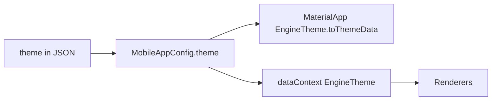

# JSON Source-of-Truth Compliance Audit

> **Generated:** 2026-05-23  
> **Config:** `mobile_production_v2` ([`assets/config/mobile_production_v2.json`](../../assets/config/mobile_production_v2.json))  
> **Registry:** 27 component renderers in [`lib/engine/screen_renderer/screen_renderer.dart`](../../lib/engine/screen_renderer/screen_renderer.dart)  
> **Type:** Compliance report only — **no code changes** in this audit.

**Related docs**

| Document | Role |
|----------|------|
| [`RENDERER_PRODUCTION_AUDIT.md`](RENDERER_PRODUCTION_AUDIT.md) | Per-renderer product UX (2026-05-20); theme/loading sections **stale** — see [§8](#8-delta-vs-renderer_production_auditmd) |
| [`LAYOUT_CONSTRAINT_AUDIT.md`](LAYOUT_CONSTRAINT_AUDIT.md) | Scroll, expand, flex, `layout:centered`, `LayoutConstraintValidator` (2026-05-23) |
| [`builder-specs/15-page-layout-preset.md`](builder-specs/15-page-layout-preset.md) | `pages[].layout: centered` builder contract |

---

## Executive summary

Merchant-visible UI is **predominantly JSON-driven**. The engine interprets `pages[]`, component trees, `theme`, and `navigation` from production config. Dart adds **documented engine-owned assembly** (synthetic page root), **safe defaults** when props are omitted, and **infrastructure primitives** (video/OTP error chrome, request-phase placeholders).

| Area | Verdict |
|------|---------|
| Page composition & routes | **Pass** — `VariantScreen` + JSON `pages[]` / `tap.route` |
| High-frequency props (`gap`, `valuePath`, `scroll`, `background`) | **Pass** when set in JSON |
| Theme bridge | **Partial** — parsed + `EngineTheme` in `dataContext`; not every renderer consumes it |
| Synthetic structure | **Documented** — every page wrapped in `scaffold` → `column` |
| Merchant-specific UI branches | **None** in renderers |
| Layer violations (`features/*` in renderers) | **None** |

**Production JSON compliance score (explicit merchant props): ~87–90%** — see [§5](#5-json-compliance-score).

---

## 1. Audit questions (answers)

### 1.1 Can a merchant change any visible screen element via JSON alone?

**Mostly yes**, for:

- Page body trees (`type`, `props`, `children`, `child`, `itemBuilder`)
- Copy (`value`, labels, `emptyMessage`, `errorMessage`, field messages)
- Per-node colors, radii, padding, layout alignments, `gap`
- Navigation (`tap.route`, `navigation.tabs`, `shellExcludeRoutes`)
- Page `background`, `scroll`, `layout`, `appBar`

**Not via JSON alone** (engine-owned or shell):

- Outer **synthetic** `scaffold` + root `column` on every page ([`variant_repository.dart`](../../lib/features/variantscreen/data/repos/variant_repository.dart) L216–229)
- **`layout: centered`** side effects: forces `pageScroll: none`, may inject `container.expand` on first body node (L194–206)
- **Tab bar** unselected color (`Colors.grey` in [`tab_shell_widget.dart`](../../lib/features/shell/presentation/views/tab_shell_widget.dart) L74)
- **List/grid request-phase** icon colors and message `TextStyle` ([`request_ui_state.dart`](../../lib/engine/request_ui_state.dart) L195–245)
- **Bound leaves** (`valuePath` / `urlPath`) render **empty** until `dataContext` resolves (no JSON placeholder prop today)
- **`videoPlayer`** error/loading UI (registry present; **0 usages** in prod JSON) — acceptable engine-owned primitive

### 1.2 Does any renderer ignore an explicit JSON prop?

| Finding | Severity | Notes |
|---------|----------|-------|
| Horizontal list/grid `compact` hides `emptyMessage` / `errorMessage` UI | **P0** | [`request_ui_state.dart`](../../lib/engine/request_ui_state.dart) L182–183; explicit JSON message not shown |
| `verticalDirection` in schema, not implemented on column/row | **P2** | Not used in prod |
| `loadingPlaceholder` / `errorPlaceholder` on `image` in schema, not implemented | **P2** | Not used in prod |
| `tabs` component `activeColor` omitted → fallback `#F97316` (orange) vs theme primary `#1D4ED8` | **P1** | Only if builder emits `tabs` without `activeColor`; **0 page-body `tabs` nodes** in prod today |
| `otpInput` primary accent fallback `#F97316` when theme used | **P3** | Prod has 1× `otpInput`; props override available |

Most prod props (`gap`, `valuePath`, `urlPath`, `scroll`, `background`, `border`, `shadow`, `emptyMessage`) are **honored when present**.

### 1.3 Does code inject structure not present in JSON?

**Yes — by design** ([`variant_repository.dart`](../../lib/features/variantscreen/data/repos/variant_repository.dart)):

| Injected | Source | Purpose |
|----------|--------|---------|
| Root `scaffold` | Dart | Page chrome bridge (`backgroundColor`, `pageScroll`, `pageLayout`, `pageRoute`) |
| Root `column` | Dart | `crossAxisAlignment: stretch`; `mainAxisSize: max` when `scroll: none` or `layout: centered` |
| `appBar` as first child | `pages[].appBar` | Optional; merged into column children |
| `container.expand` on first body child | `layout: centered` + no expand in subtree | Viewport fill for splash-style pages |
| `pageScroll: none` | `layout: centered` | Overrides `scroll` field (L190–192) |

[`variant_screen.dart`](../../lib/features/variantscreen/presentation/views/variant_screen.dart) adds **data only** (`EngineTheme`, `requests.*`, `loadingRequestKeys`, route params) — does not reshape component trees.

### 1.4 Is JSON `theme` the styling source?

**Partial.**

| Layer | Status |
|-------|--------|
| [`MobileAppConfig`](../../lib/config/mobile_app_config.dart) | Parses `theme` |
| [`main.dart`](../../lib/main.dart) L122–124 | `EngineTheme.toThemeData` — Tajawal via Google Fonts when `fontFamily: Tajawal` |
| [`variant_screen.dart`](../../lib/features/variantscreen/presentation/views/variant_screen.dart) L488 | `EngineTheme` in `dataContext` |
| Renderers using `EngineTheme` | `text`, `button`, `card`, `image`, `appBar`, `textFormField`, `form`, `container` (border), `imageSlider`, `tabs`, `otpInput` |
| Hex fallbacks when theme/props absent | Widespread `?? const Color(0x…)` aligned with default theme tokens |
| Bypass theme entirely | `videoPlayer`, `divider`, `icon` (no theme read), `request_ui_state` placeholders, shadow presets, tab shell grey |

**Conclusion:** JSON `theme` drives `MaterialApp` and many renderers; per-node `props.color` still wins when set. Dart hex fallbacks are **defaults**, not overrides, when JSON is silent.

### 1.5 Tenant / route / merchant conditionals in UI code?

**No merchant UI branching** in `lib/engine/tree/renderers/`.

| Pattern | Location | Assessment |
|---------|----------|------------|
| `tenantSlug` | `action_dispatcher.dart`, auth cubits, `variant_screen` `dataContext` | **Out of scope** — API/auth, not layout |
| `route ==` | `tab_shell_widget.dart` (tab match), `action_dispatcher` (empty route guard) | **Infrastructure**, not per-merchant UI |
| Hardcoded `/mvp2` → `HomeScreen` | [`app_router.dart`](../../lib/core/utils/app_router.dart) L101–106 | **Dev route**, not prod merchant UI |

### 1.6 Default vs override

Findings table ([§4](#4-findings-table)) includes a **Kind** column: `Default` (JSON silent), `Override` (JSON explicit ignored), `Engine-owned`, `Schema drift`.

---

## 2. Red-flag verification (from audit brief)

| Red flag | Status (2026-05-23) |
|----------|---------------------|
| `scaffold_renderer`: scroll always on; `scroll` ignored | **Fixed** — `pageScroll` `vertical` \| `none`; [`scaffold_renderer.dart`](../../lib/engine/tree/renderers/scaffold_renderer.dart) L41–51 |
| `Center` wrapper | **Fixed** — `Align(alignment: Alignment.topCenter, widthFactor: 1.0)` L95 |
| Feature imports in scaffold | **Fixed** — no `lib/features/*` imports in renderers |
| `column` / `row` `mainAxisSize` hardcoded | **Fixed** — read from JSON ([`column_renderer.dart`](../../lib/engine/tree/renderers/column_renderer.dart) L22–25, [`row_renderer.dart`](../../lib/engine/tree/renderers/row_renderer.dart) L23–26) |
| `image_renderer` theme fallbacks | **P3** — `EngineTheme` first, then hex ([`image_renderer.dart`](../../lib/engine/tree/renderers/image_renderer.dart) L194+) |
| `container_renderer` shadow palette | **P1** — fixed rgba steps L163–181; prod uses `"shadow": "lg"` once |
| `video_player_renderer` hardcoded copy | **Engine-owned** — no prod usage; see [§6.3](#63-videoPlayer) |
| `unsupported` dev UI in production | **Fixed** — `SizedBox.shrink()` when `!kDebugMode` |

---

## 3. Screen assembly (`lib/features/variantscreen/`)

### 3.1 `variant_repository.dart` — JSON vs Dart

| Field | In prod JSON | Applied by |
|-------|--------------|------------|
| `body[]` | Yes | Parsed to `ComponentConfig` children |
| `appBar` | Many pages | Prepended to column children |
| `background` | Yes | `scaffold.properties.backgroundColor` |
| `scroll` | `vertical` (22), `none` (2) | `pageScroll`; overridden to `none` when `layout: centered` |
| `layout` | `centered` (2: splash routes) | `pageLayout`; forces `pageScroll: none`; may inject expand wrapper |
| `route`, `title`, `id` | Yes | Metadata + `pageRoute` on scaffold |

Post-parse: [`LayoutConstraintValidator`](../../lib/engine/validation/layout_constraint_validator.dart) runs on synthetic root (debug throw / release log).

### 3.2 `variant_screen.dart`

- Merges cubit results into `dataContext` (`requests`, `loadingRequestKeys`, `loadingMoreRequests`)
- Injects `EngineTheme.fromConfig(config.theme)` — does **not** alter layout tree
- Auth feedback via `AppMessenger` (not renderer `SnackBar`)

---

## 4. Findings table

| File:line | JSON prop / area | Expected | Actual | Sev | Kind | Fix layer (if ever needed) |
|-----------|------------------|----------|--------|-----|------|---------------------------|
| `variant_repository.dart:216–229` | Page root | Body only | Synthetic `scaffold`→`column` | P3 | Engine-owned | Document / builder-spec |
| `variant_repository.dart:190–206` | `layout: centered` | Centered content | Forces `pageScroll: none`; may wrap first child in `expand` | P3 | Engine-owned | [`15-page-layout-preset.md`](builder-specs/15-page-layout-preset.md) |
| `scaffold_renderer.dart:34` | `background` / `backgroundColor` | Page/theme color | `#F8FAFC` if omitted | P3 | Default | `EngineTheme.surfaceColor` |
| `scaffold_renderer.dart:41–51` | `pageScroll: vertical` | Merchant chooses scroll model | Outer `SingleChildScrollView` | P3 | Engine-owned | Matches prod catalog pattern |
| `text_renderer.dart:19–24` | `valuePath` | Bound text | Empty string until path resolves | P2 | Override-ish UX | VariantScreen or placeholder prop |
| `image_renderer.dart:27–29` | `urlPath` | Bound image | Placeholder/empty until bound | P2 | Override-ish UX | Same |
| `request_ui_state.dart:182–183` | `emptyMessage` / `errorMessage` | Show message | Hidden when `compact: true` (horizontal lists) | **P0** | **Override** | `list_view_renderer` / `grid_view_renderer` |
| `request_ui_state.dart:200–243` | — | Theme colors | Fixed icon/message hex | P1 | Hardcoded | `request_ui_state` + theme |
| `list_view_renderer.dart:29–30` | `height` | From JSON | Default `72.0` if horizontal and omitted | P3 | Default | — |
| `container_renderer.dart:163–197` | `shadow: lg` | Theme or JSON object | Fixed rgba palette | P1 | Hardcoded | `container_renderer` |
| `app_bar_renderer.dart:49` | — | Configurable elevation | `elevation: 1` fixed | P1 | Hardcoded | `app_bar_renderer` + schema |
| `tab_shell_widget.dart:74` | Tab chrome | Theme unselected | `Colors.grey` | P1 | Hardcoded | Shell / `ThemeData` |
| `tabs_renderer.dart:37,42` | `activeColor` / `inactiveColor` | Theme primary/text | `#F97316` / `#0F172A` if omitted | P1 | Default | Only if `tabs` used without colors |
| `otp_input_renderer.dart:246` | — | Theme primary | `#F97316` fallback on focus border | P3 | Default | Prod node can set `border` |
| `video_player_renderer.dart:34,129–136` | — | (none in JSON) | English errors, dark chrome | — | **Engine-owned** | Intentional primitive |
| `image_renderer.dart:181` | `source: file` | — | English unsupported message | P2 | Engine-owned | Not in prod |
| `divider_renderer.dart:17–21` | `color` omitted | Theme | Material default | P3 | Default | — |
| `icon_renderer.dart:16–20` | `color` omitted | Theme | `null` | P3 | Default | — |
| `component_schemas.dart` | `verticalDirection` | Parsed | Not in column/row renderers | P2 | Schema drift | Renderers |
| `component_schemas.dart` | `loadingPlaceholder`, `errorPlaceholder` | Image UI | Not implemented | P2 | Schema drift | `image_renderer` |
| `app_router.dart:101–106` | — | JSON routes only | `/mvp2` → `HomeScreen` | — | Out of scope | Dev only |
| `row_renderer.dart:53–57` | `crossAxisAlignment: stretch` | Stretch in row | `center` if unbounded height | P3 | Engine guard | Prevents layout exception |

**Layer check:** No `import` of `lib/features/*` under `lib/engine/tree/renderers/`.

---

## 5. JSON compliance score

### 5.1 Method

Count **explicit** production-config keys that merchants/builders set, and whether the engine respects the value when set (not whether defaults exist).

### 5.2 Production prop frequency (grep, May 2026)

| Prop / page field | Approx. count | Honored when set? |
|-------------------|---------------|-------------------|
| `gap` | 59 | Yes |
| `valuePath` | 21 | Yes (value); blank while loading = partial |
| `urlPath` | 12 | Yes (value); blank while loading = partial |
| `pages[].scroll` | 24 | Yes (`pageScroll`) |
| `pages[].background` | 26+ | Yes |
| `pages[].layout: centered` | 2 | Yes (with engine side-effects) |
| `emptyMessage` | 9 | Yes, except horizontal **compact** |
| `errorMessage` | (paired with empty) | Same |
| `border` / `shadow` | 6+ | Yes (shadow uses engine palette) |
| `enableInnerScroll` | 11+ | Yes |
| `otpInput` | 1 | Yes (props + theme) |
| `tap` / routes | widespread | Yes |

### 5.3 Score

| Metric | Value |
|--------|-------|
| **Explicit prod props honored** | **~87–90%** |
| Partial (theme fallback, loading UX, shadow palette) | ~8–10% |
| Engine-owned structure (synthetic root) | ~2% (not a “violation” if documented) |
| **P0 overrides** | **1** — compact list/grid hides explicit `emptyMessage`/`errorMessage` |

`videoPlayer` hardcoding excluded from violation count (0 prod nodes; engine-owned).

---

## 6. Hardcoding inventory

### 6.1 Colors (hex / `Colors.*`)

| Location | Values | Theme-first? |
|----------|--------|--------------|
| [`engine_theme.dart`](../../lib/engine/theme/engine_theme.dart) | Default token hex | N/A (definition) |
| `scaffold_renderer.dart:34` | `#F8FAFC` | No — page `background` overrides |
| `image_renderer.dart` | Surface/muted/primary fallbacks | Yes, then hex |
| `button_renderer.dart:108` | Primary border fallback | Yes, then hex |
| `text_form_field_renderer.dart` | Fill, border, error, shadow presets | Yes, then hex |
| `container_renderer.dart` | Shadow steps, border `#E2E8F0` | Partial |
| `request_ui_state.dart` | Error/empty icon + text colors | No |
| `video_player_renderer.dart` | `#0F172A`, white70 | No — engine-owned |
| `tabs_renderer.dart` | `#F97316`, `#0F172A` defaults | Partial |
| `otp_input_renderer.dart` | `#F97316`, `#94A3B8`, white | Partial |
| `image_slider_renderer.dart` | `#0F172A` | Partial |
| `tab_shell_widget.dart:74` | `Colors.grey` | No |

### 6.2 Copy (not from JSON)

| String | File | Kind |
|--------|------|------|
| `Missing video url` | `video_player_renderer.dart:34` | Engine-owned |
| `Could not play video` / `Retry` | `video_player_renderer.dart:129–136` | Engine-owned |
| `File images not yet supported` | `image_renderer.dart:181` | Engine-owned |
| `لا توجد عناصر` / `تعذر تحميل المحتوى` | `request_ui_state.dart:138–139` | Default when JSON omits list messages |
| `هذا الحقل مطلوب` | `text_form_field_renderer.dart`, `otp_input_renderer.dart` | Default when JSON omits `requiredMessage` |
| `Unsupported: …` | `unsupported_component_renderer.dart` | Debug only |

### 6.3 `videoPlayer`

| Item | Detail |
|------|--------|
| Prod JSON usage | **0** nodes |
| JSON controls | `url`, `autoplay`, `showControls`, `height`, `borderRadius` |
| Dart-owned | Error copy, retry, loading spinner on `#0F172A` |
| Assessment | **Acceptable** — infrastructure primitive; merchants configure URL and dimensions in JSON |

### 6.4 Layout / behavior (non-color)

- Synthetic page wrapper on every route
- `layout: centered` → `pageScroll: none` + optional `expand` injection
- Scaffold load-more footer (`CircularProgressIndicator`) when `loadingMoreRequests` set
- Row stretch → center when height unbounded
- App bar fixed elevation `1`
- Horizontal list/grid: `compact` phase UI

### 6.5 Schema drift

| Item | In schema | In prod | Rendered |
|------|-----------|---------|----------|
| `gap`, `valuePath`, `urlPath`, `shadow`, `border` | Yes | Yes | Yes |
| `pageScroll`, `pageLayout` | scaffold schema | Via repository | Yes |
| `emptyMessage`, `errorMessage` | list/grid | Yes | Yes (except compact) |
| `verticalDirection` | column/row | No | **No** |
| `loadingPlaceholder`, `errorPlaceholder` | image | No | **No** |
| `appDrawer`, `tabs` (component) | Yes | `otpInput` only / 0 drawer | Renderer exists |

---

## 7. Per-renderer summary (27 types)

| Type | Prod usage | JSON compliance | Hardcoding / notes |
|------|------------|-----------------|---------------------|
| `scaffold` | Synthetic all pages | Good | Default BG; scroll via `pageScroll` |
| `singleChildScrollView` | Rare | Good | Nested-scroll debug assert |
| `column` | High | Good | `mainAxisSize`, `gap`; no `verticalDirection` |
| `row` | Medium | Good | Unbounded-height guard |
| `container` | High | Good | Shadow palette fixed |
| `listView` | Medium | Good | **P0** compact hides messages |
| `gridView` | High | Good | Same request-phase behavior |
| `text` | Very high | Good | `valuePath` + theme; blank on load |
| `textFormField` | Auth | Good | Theme + Arabic default required |
| `form` | Auth | Good | |
| `button` | High | Good | `enabled`, theme `buttonMd` |
| `card` | High | Good | Theme radius/surface |
| `image` | Medium | Good | `EngineNetworkImage`; file message EN |
| `appBar` | High | Good | Theme; fixed elevation |
| `divider` | Low | Fair | No theme fallback |
| `icon` | Medium | Fair | No theme fallback |
| `richtext` | Low | Good | |
| `videoPlayer` | **0** | N/A | Engine-owned error UI |
| `stack` | Splash | Good | |
| `imageSlider` | Low | Good | Hex fallback |
| `timer` | Low | Good | |
| `progressIndicator` | Low | Good | |
| `appDrawer` | **0** | N/A | Registered, not in prod JSON |
| `tabs` (component) | **0** in body | N/A | Orange default if colors omitted |
| `otpInput` | 1 | Good | Theme + props |
| `unsupported` | Runtime | OK | Debug amber only |

---

## 8. Theme bridge

| Check | Result |
|-------|--------|
| `theme` parsed? | Yes — [`mobile_app_config.dart`](../../lib/config/mobile_app_config.dart) |
| `main.dart` hardcodes `inter`? | **No** (stale in old audit) — uses `EngineTheme.toThemeData`, Tajawal |
| Renderers read `dataContext` theme? | Subset — see §6.1 |
| Per-node `props` override theme? | Yes — intentional |

---

## 9. Actions & routing

| Check | Result |
|-------|--------|
| Navigation from JSON `tap.route` | Yes — [`action_dispatcher.dart`](../../lib/engine/actions/action_dispatcher.dart) + `ScreenRenderer` |
| Prod routes → `VariantScreen` | Yes — [`app_router.dart`](../../lib/core/utils/app_router.dart) from `pageRoutes` |
| Hardcoded merchant screens | **No** (except dev `/mvp2`) |
| `tenantSlug` in UI | **No** — auth/API only |

---

## 10. Request / loading UI

| Check | Result |
|-------|--------|
| List/grid empty/error copy | JSON `emptyMessage` / `errorMessage` + Arabic fallbacks |
| English hardcoded empty strings | **Removed** (old audit stale) |
| Bound `text`/`image` during load | **Blank** — no skeleton; P2 UX gap |
| Placeholder colors | Hardcoded in `request_ui_state` — P1 |

---

## 11. Test coverage (engine)

**Present:** `column`, `row`, `scaffold`, `container`, `text`, `button`, `card`, `image`, `list_view`, `grid_view`, `form`, `text_form_field`, `app_bar`, `stack`, `timer`, `progress_indicator`, `image_slider`, `rich_text`, `request_ui_state`, `theme`, actions, `layout_constraint_validator`, `prod_layout_validator`, layout integration tests.

**No dedicated renderer widget tests observed:** `video_player`, `divider`, `icon`, `otp_input`, `tabs`, `app_drawer`, `unsupported`.

---

## 12. Delta vs `RENDERER_PRODUCTION_AUDIT.md`

| May 2026 claim | May 2026 actual |
|----------------|-----------------|
| Theme not parsed; `inter` in main | **False** — theme parsed; Tajawal via `EngineTheme` |
| No renderer reads theme | **False** — many renderers use `EngineTheme` |
| Page `scroll` ignored | **False** — `pageScroll` honored |
| `ProductCubit` in scaffold | **False** — removed |
| `Center` in scaffold | **False** — `Align` |
| `mainAxisSize` hardcoded column/row | **False** — from JSON |
| English list empty state | **False** — Arabic + JSON messages |
| `unsupported` in release | **False** — shrink in release |
| 0 renderer tests | **False** — broad `test/engine/renderers/` |
| 20 renderers | **Outdated** — **27** registered (+ layout validator) |

Use **this document** for JSON-source-of-truth / hardcoding compliance; use **`LAYOUT_CONSTRAINT_AUDIT.md`** for scroll/expand/flex; use **`RENDERER_PRODUCTION_AUDIT.md`** for historical per-renderer UX notes (verify dates).

---

## 13. Success criteria (audit)

| Criterion | Met? |
|-----------|------|
| Explicit JSON layout/style/action props documented | Yes — §4–§5 |
| No merchant-specific UI logic in renderers | Yes |
| Theme / scroll / synthetic assembly classified | Yes — engine-owned vs merchant |
| Violations have fix layer | Yes — §4 (informational; **no fixes applied**) |
| No drive-by refactors | Yes — report only |

---

## 14. References

- [`AGENTS.md`](../../AGENTS.md) · [`RULES.md`](../../RULES.md) §3.1–3.2  
- [`docs/engine/builder-specs/README.md`](builder-specs/README.md)  
- [`docs/ai/03-engine.md`](../../docs/ai/03-engine.md)
