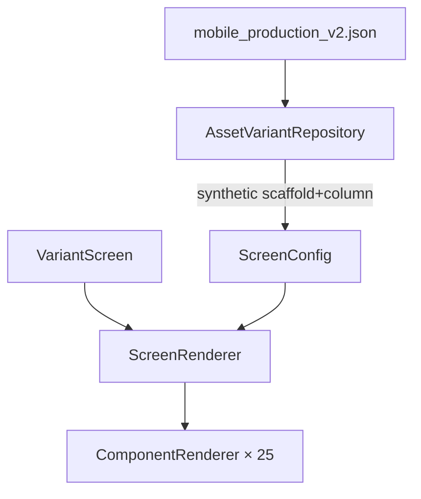

# JSON-Driven Layout & Constraint Audit

> **Generated:** 2026-05-23  
> **Config:** `mobile_production_v2` (`assets/config/mobile_production_v2.json`)  
> **Registry:** 25 renderers in [`ScreenRenderer`](../lib/engine/screen_renderer/screen_renderer.dart) (26 `GenericComponentType` values incl. `unsupported`)  
> **Supersedes** layout/scroll findings in [`RENDERER_PRODUCTION_AUDIT.md`](RENDERER_PRODUCTION_AUDIT.md) (2026-05-20) — see [corrections](#stale-production-audit-corrections) below.

---

## Executive summary

The engine uses a **synthetic page root** (`scaffold` → `column`) plus Flutter flex/scroll primitives. Layout is **production-viable** for current prod JSON when builders follow documented contracts (`scroll:none` + `expand` for splash, `scroll:vertical` + outer scroll + `enableInnerScroll:false` for catalog).

**Top risks**

| Risk | Severity | Mitigation |
|------|----------|------------|
| Viewport centering expected under `scroll:vertical` without `container.expand` | High | Use canonical splash pattern; `LayoutConstraintValidator` warns in debug |
| `spacer` in `mainAxisSize:min` column | Medium | **Resolved** — type removed; use `gap` / layout props |
| `scroll:none` page with non-scrollable overflowing body | Medium | Validator warns; add inner scroll or keep body short |
| Nested `singleChildScrollView` under scaffold scroll | Low–Medium | Debug assert only in renderer |
| Row `stretch` silently becomes `center` when height unbounded | Low | **Fixed (Phase 1):** falls back to `start`; full-width row when parent width finite |
| No percentage / fractional sizing | Low | Numeric px only |

**Delivered in this audit**

- Architecture inventory and JSON→widget traces  
- Per-renderer constraint-flow analysis  
- PASS / PARTIAL / FAIL matrix for nine layout scenarios  
- Schema drift table  
- [`LayoutConstraintValidator`](../lib/engine/validation/layout_constraint_validator.dart) (debug warnings)  
- Widget tests: `layout_combinations_test.dart`, `nested_flex_safety_test.dart`, `integration_variant_layout_test.dart`

---

## 1. Architecture

### 1.1 Pipeline



| Stage | File | Layout role |
|-------|------|---------------|
| Parse | [`variant_repository.dart`](../lib/features/variantscreen/data/repos/variant_repository.dart) | Merges `props` + `style`; `pages[].scroll` → `scaffold.pageScroll`; root `column` with `crossAxisAlignment: stretch`, `mainAxisSize: max` when `scroll:none` |
| Model | [`component_config.dart`](../lib/config/component_config.dart) | Tree: `child` / `children` / `itemBuilder` |
| Registry | [`screen_renderer.dart`](../lib/engine/screen_renderer/screen_renderer.dart) | Enum dispatch; debug layout validation |
| Host | [`variant_screen.dart`](../lib/features/variantscreen/presentation/views/variant_screen.dart) | No extra layout wrapper (auth/splash overlays only) |
| Shell | [`tab_shell_widget.dart`](../lib/features/shell/presentation/views/tab_shell_widget.dart) | Real `Scaffold` + bottom nav; **body = route child** |

### 1.2 Synthetic page root

Every builder page becomes:

```
scaffold (pageScroll, backgroundColor?)
  └── column (crossAxisAlignment: stretch; mainAxisSize: max if scroll:none)
        ├── appBar? (optional)
        └── body[] nodes
```

**Note:** Engine `scaffold` is **not** `Scaffold` — it is [`ColoredBox` + scroll/static body](../lib/engine/tree/renderers/scaffold_renderer.dart). Flutter `Scaffold` comes from `TabShellWidget`.

### 1.3 Layout renderer inventory

| `type` | Renderer | Flutter widgets | Constraint role |
|--------|----------|-----------------|-----------------|
| `scaffold` | `scaffold_renderer.dart` | `ColoredBox`, `SingleChildScrollView` or `LayoutBuilder`+`SizedBox`+`Expanded` | Page viewport contract |
| `column` | `column_renderer.dart` | `Column`, `LayoutBuilder`, `Expanded` | Vertical flex; **default `mainAxisSize: min`** |
| `row` | `row_renderer.dart` | `Row`, `LayoutBuilder` | Horizontal flex; **default `mainAxisSize: max`** |
| `container` | `container_renderer.dart` | `Container`, `LayoutBuilder`, `SizedBox` | Box; **`expand` / `expandAxis`** |
| `stack` | `stack_renderer.dart` | `Stack`, `Positioned`, `Align` | Overlays (splash) |
| `spacer` | `spacer_renderer.dart` | `Spacer` or `SizedBox` | Flex gap (**fragile**) |
| `singleChildScrollView` | `single_child_scroll_view_renderer.dart` | `SingleChildScrollView` | Nested scroll |
| `listView` | `list_view_renderer.dart` | `ListView` + `shrinkWrap` | Catalog lists |
| `gridView` | `grid_view_renderer.dart` | `GridView` + `shrinkWrap` | Product grids |
| `form` | `form_renderer.dart` | `Form` | Pass-through |
| `appBar` | `app_bar_renderer.dart` | Custom bar + `SafeArea` | Fixed header in root column |

**Constraint-affecting non-layout types:** `button` (`fullWidth` / `double.infinity`), `image` / `videoPlayer` / `imageSlider` (fixed dimensions), `card` (wraps child, no flex).

**No centralized responsive module** — ad-hoc `MediaQuery` in scaffold, container `expand`, stack.

### 1.4 JSON → prop → widget trace (layout props)

| JSON source | Normalization (`variant_repository`) | Renderer reads | Flutter |
|-------------|--------------------------------------|----------------|---------|
| `pages[].scroll` | → `scaffold.pageScroll` | `scaffold_renderer` | `vertical` → `SingleChildScrollView`; `none` → static `SizedBox` height |
| `props.mainAxis` | → `mainAxisAlignment` | `column` / `row` | `MainAxisAlignment` |
| `props.crossAxis` | → `crossAxisAlignment` | `column` / `row` | `CrossAxisAlignment` |
| `props.mainAxisSize` | as-is | `column` / `row` | `MainAxisSize` |
| `props.gap` | as-is | `column` / `row` | `SizedBox` between children |
| `props.expand` | as-is | `container`; detected by `column`/`row`/`scaffold` | `SizedBox` / `Expanded` / `minHeight` |
| `props.expandAxis` | as-is | `container` | horizontal / vertical / both fill |
| `style.padding` etc. | merged into props | `container`, `column` | `EdgeInsetsDirectional` |
| `props.stackLayer` etc. | as-is | `stack` child wrapper | `Positioned` / `Align` |

---

## 2. Constraint-flow analysis

### 2.1 `scaffold`

| Parent | Child receives | Engine behavior |
|--------|----------------|-----------------|
| `TabShellWidget` body: bounded width, max height = viewport minus nav | — | `ColoredBox` full bleed |
| `pageScroll: vertical` | Scroll axis: **unbounded max height** | `SingleChildScrollView` → `Column(mainAxisSize: min)` → `Align(widthFactor:1)` |
| `pageScroll: vertical` + subtree `expand` | `ConstrainedBox(minHeight: viewport - padding)` on scroll child | Enables viewport-tall content in scroll |
| `pageScroll: none` | `LayoutBuilder` → `SizedBox(height: maxHeight)` | `Expanded` child if `expand` in subtree |

**Flutter rule:** `SingleChildScrollView` gives child **unbounded** vertical max constraint → flex children must not use `Expanded` unless an ancestor provides finite height (`column_renderer` guards this).

### 2.2 `column`

| Parent | Default | Engine behavior |
|--------|---------|-----------------|
| Inside scroll | `mainAxisSize: min` | Shrink-wrap children |
| `mainAxisSize: max` + `container.expand` child | Bounded height from `LayoutBuilder` | Wraps expand child in `Expanded` |
| Unbounded height + expand | — | **Skips** `Expanded` (no exception) |

**Padding:** optional `padding` → `Padding` wrapping column.

### 2.3 `row`

| Parent | Default | Engine behavior |
|--------|---------|-----------------|
| Most contexts | `mainAxisSize: max` | Takes max width |
| Unbounded height + `crossAxisAlignment: stretch` | — | **Fallback to `center`** (debug log) |
| `container.expand` child | — | `Expanded` in row |

### 2.4 `container`

| Props | Behavior |
|-------|----------|
| `width` / `height` | Fixed box on `Container` |
| `expand: true` | `LayoutBuilder`: fill width and/or height per `expandAxis`; if both unbounded → `MediaQuery` viewport height |
| Request-bound | May short-circuit to loading/empty/error placeholder |

### 2.5 `listView` / `gridView`

| `enableInnerScroll` | `shrinkWrap` | `physics` | Prod pattern |
|---------------------|--------------|-----------|--------------|
| `false` (default) | `true` | `NeverScrollableScrollPhysics` | Outer scaffold scrolls |
| `true` | `false` | default | Full-screen inner scroll (`scroll:none` pages) |

### 2.6 `stack`

| `fit` | Behavior |
|-------|----------|
| `expand` (default) | `LayoutBuilder` + `SizedBox(width: ∞, height: viewport)` |
| `loose` | Intrinsic stack size |

Child props: `stackLayer`, `stackAlign`, `stackInsetBottom`, `stackWidthFactor` on **child** nodes.

### 2.7 `spacer`

Requires **Flex parent** with flex along spacer axis. `width`/`height` → fixed `SizedBox` (no flex).

---

## 3. Nine-scenario matrix (validated)

| # | Scenario | Result | Explanation |
|---|----------|--------|-------------|
| **1** | Full-screen vertical centering | **PARTIAL** | **PASS** only with `scroll:none` + `container.expand` + `column.mainAxisSize:max` + `mainAxisAlignment:center` (splash). Under `scroll:vertical` without `expand`, column centers within **scroll content height**, not viewport. With `expand`, scaffold `minHeight` hack → **PARTIAL→PASS** for typical splash-like trees. |
| **2** | Height / viewport expansion | **PASS** | `scroll:none` + root `mainAxisSize:max`; `container.expand`; catalog uses outer scroll. Unbounded flex guarded in `column_renderer`. |
| **3** | Stretch vs center | **PASS** | Root `crossAxisAlignment:stretch` + `Align(widthFactor:1)` (Center removed). **PARTIAL:** row `stretch` → `center` when height unbounded. |
| **4** | Nested layout chains | **PASS** | `column→row→button`, `scroll→column→gridView` (prod home). **PARTIAL** deep trees without `expand` expecting viewport fill. |
| **5** | Spacer / Expanded / Flexible | **PARTIAL** | `container.expand` in row/column: **PASS**. `spacer` in min column: **FAIL** (RenderFlex overflow). `spacer` unused in prod. No `Flexible` primitive. |
| **6** | Scroll + alignment | **PASS** | Dominant: outer scroll + inner `shrinkWrap` list/grid. **PARTIAL:** centered content in scroll = center of **content**, not viewport. **PARTIAL:** nested `singleChildScrollView` (debug print only). |
| **7** | Width / height handling | **PARTIAL** | Numeric px: **PASS**. `expand` / `expandAxis`: **PASS**. Percentage / infinity strings: **FAIL** (not parsed). `button.fullWidth`: **PASS**. |
| **8** | Padding / spacing | **PASS** | `style` merge; `gap`; `EdgeInsetsDirectional` on container/column; RTL row order tested. Nested padding accumulates by design. |
| **9** | Schema vs implementation | **PARTIAL** | See [§4](#4-schema-drift). `verticalDirection` in schema, not implemented. `expandAxis` in code + prod, missing from container schema until fixed. |

---

## 4. Schema drift

| Property | Schema | Renderer | Prod JSON |
|----------|--------|----------|-----------|
| `pageScroll` | scaffold optional | Yes (injected) | via `pages[].scroll` |
| `gap` | column/row | Yes | Heavy use |
| `expand` / `expandAxis` | expand only in schema | Both | splash, search |
| `padding` on column | Not listed | Yes | Rare |
| `verticalDirection` | column/row | **No** | — |
| `stackLayer`, `stackAlign`, … | stack only `fit` | On **children** | splash |
| `enableInnerScroll` | list/grid partial | Yes | grids/lists |
| `valuePath` | text strict `value` | Yes | 26+ |
| Scaffold “SafeArea” comment | schema doc | **appBar** only | — |

---

## 5. Production JSON spot-check (2026-05-23)

| Route | `scroll` | Layout pattern | Integration test |
|-------|----------|----------------|------------------|
| `/splash` | `none` | `expand` → `stack` overlays | PASS — no outer scroll |
| `/splash-carousel` | `none` | Same family | (same scaffold family) |
| `/auth/login` | `none` | Form column | PASS |
| `/home` | `vertical` | `gridView` `enableInnerScroll: false` | PASS — outer `SingleChildScrollView` |
| `/search` | `vertical` | Row + `expandAxis: horizontal` search field | PASS |

**Page scroll counts:** 4× `none`, 22× `vertical` (26 pages).

---

## 6. Fragile areas (ranked)

1. **Viewport centering contract** — builder must pair `scroll:none` + `expand` for true center.  
2. **`spacer` in min column** — runtime overflow.  
3. **`scroll:none` overflow** — static height pages need short body or inner scroll.  
4. **Nested scroll** — `singleChildScrollView` under scaffold scroll.  
5. **Row stretch fallback** — silent `center` when height unbounded.  
6. **Asymmetric defaults** — column `min` vs row `max` surprises authors.  

---

## 7. Recommended fixes

### P0 (layout correctness)

| Fix | Where | Action |
|-----|-------|--------|
| Document canonical patterns | `docs/ai/03-engine.md` | Splash / catalog / auth patterns |
| Debug validator | Done — `layout_constraint_validator.dart` + `ScreenRenderer` assert | Extend rules as needed |

### P1

| Fix | Action |
|-----|--------|
| `spacer` guard | Return `SizedBox(height: 8 * flex)` when parent not Flex (optional) |
| Nested scroll | Block or wrap in release like debug policy |
| Schema | Add `expandAxis`, column `padding`, stack child props |
| Implement or remove `verticalDirection` | |

### P2

| Fix | Action |
|-----|--------|
| Percentage sizing | Parser + builder-spec if required |
| `LayoutConstraintValidator` strict mode in CI | Done — `prod_layout_validator_test.dart`; parse-time in `VariantRepository` |

---

## 8. Canonical JSON patterns

### Viewport-centered splash (`layout: centered`)

```json
{
  "layout": "centered",
  "body": [{
    "type": "container",
    "props": { "expand": true },
    "child": {
      "type": "column",
      "props": {
        "mainAxisSize": "max",
        "mainAxisAlignment": "center",
        "crossAxisAlignment": "stretch"
      },
      "children": [{ "type": "text", "props": { "value": "…" } }]
    }
  }]
}
```

### Catalog page (`scroll:vertical`)

- Page `scroll: vertical` (default).  
- `gridView` / `listView` with `enableInnerScroll: false`.  
- Do **not** expect viewport vertical centering on empty space below grid.

### Toolbar row with flexible field

```json
{
  "type": "row",
  "children": [
    { "type": "icon", "props": { "name": "search" } },
    {
      "type": "container",
      "props": { "expand": true, "expandAxis": "horizontal" },
      "child": { "type": "textFormField", "props": { "…": "…" } }
    }
  ]
}
```

---

## 9. Defensive architecture

[`LayoutConstraintValidator`](../lib/engine/validation/layout_constraint_validator.dart) walks `ComponentConfig` before render (debug). Codes:

| Code | Severity |
|------|----------|
| `spacer_outside_flex` | error |
| `spacer_in_min_column` | error |
| `viewport_center_without_expand` | warning |
| `expand_in_scroll_without_contract` | warning |
| `nested_scrollable` | warning |
| `static_page_overflow_risk` | warning |

**Fail-fast vs warn:** errors for illegal flex; warnings for misleading but common mistakes.

---

## 10. Test coverage (layout)

| File | Covers |
|------|--------|
| `scaffold_renderer_test.dart` | pageScroll, expand + none |
| `column_renderer_test.dart` | mainAxisSize, stretch, expand |
| `row_renderer_test.dart` | RTL, Expanded expand |
| `container_renderer_test.dart` | expand, scroll minHeight, expandAxis |
| `layout_combinations_test.dart` | scroll × flex × expand matrix |
| `nested_flex_safety_test.dart` | spacer overflow, row expand height |
| `integration_variant_layout_test.dart` | prod routes smoke |
| `layout_constraint_validator_test.dart` | validator rules |

---

## Stale production audit corrections

| Claim in `RENDERER_PRODUCTION_AUDIT.md` (2026-05-20) | Current code (2026-05-23) |
|------------------------------------------------------|---------------------------|
| Page `scroll` ignored | **Fixed** — `pageScroll` on scaffold |
| `Center` breaks stretch | **Fixed** — `Align(widthFactor: 1)` |
| `ProductCubit` in scaffold | **Fixed** — removed |
| `mainAxisSize` hardcoded min on column | **Fixed** — honors JSON; default min |
| 0 renderer tests | **Outdated** — 20+ engine renderer tests |
| Always `SingleChildScrollView` | **Partial** — `pageScroll: none` omits scroll |

Theme, loading UX, and non-layout items in the production audit remain authoritative for those topics.

---

## Production-risk assessment

| Area | Risk | Notes |
|------|------|-------|
| Builder mistakes on centering | **High** | Validator + docs mitigate |
| Prod routes as committed | **Low** | Spot-check + integration tests pass |
| Invalid future JSON (spacer, nested scroll) | **Medium** | Validator + tests |
| Schema drift | **Low–Medium** | Documented; partial schema updates |
| Device size extremes | **Medium** | Tested 375×667; tablet untested |

**Overall layout system:** **Production-safe for current `mobile_production_v2.json`** when builders follow §8 patterns. General arbitrary JSON combinations remain **PARTIAL** until validator/CI enforcement expands.

**Next step:** actionable risk reduction (presets, parse gates, safe renderers) — see **[`LAYOUT_IMPROVEMENT_PLAN.md`](LAYOUT_IMPROVEMENT_PLAN.md)**.
