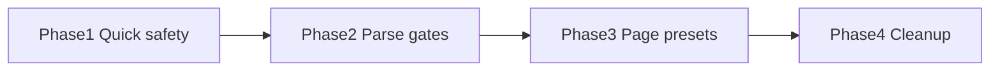

# Layout Engine — Improvement Plan

> **Based on:** [`LAYOUT_CONSTRAINT_AUDIT.md`](LAYOUT_CONSTRAINT_AUDIT.md) (2026-05-23)  
> **Goal:** Reduce layout risk by **narrowing what JSON can express**, **fixing at parse time**, and **sensible defaults** — not more runtime branches or a second layout framework.

---

## Philosophy

| Principle | What it means |
|-----------|----------------|
| **Fewer foot-guns** | If a prop combination often fails in Flutter, don’t expose it — or auto-correct in one place (`VariantRepository`). |
| **Presets over assembly** | Builders choose **page intent** (`scroll`, `layout`); engine injects a known-good shell instead of hand-wiring `expand` + `mainAxisSize`. |
| **Fail before render** | Run layout rules when JSON is loaded (and in CI on prod config), not only `debugPrint` in debug builds. |
| **One spacing primitive** | Prefer `gap` on `column`/`row`; `spacer` type **removed** from engine. |
| **No silent fixes** | Either apply a documented auto-fix at parse, or reject with a clear message — avoid “works differently in release”. |

**Explicitly out of scope (over-engineering):**

- A full layout DSL or constraint solver
- Percentage / fractional sizing until a real builder requirement exists
- Per-tenant layout policies in Dart
- Duplicate scroll systems (keep: page scroll + list/grid `enableInnerScroll`)

---

## Problem → solution map

### 1. Viewport centering under `scroll:vertical` (High)

**Why we keep the risk today:** `mainAxisAlignment: center` + `mainAxisSize: max` looks like viewport centering, but the page scroll child only grows with content unless `container.expand` + scaffold `minHeight` hacks apply.

**Recommendation — page layout preset (simple):**

Add optional `pages[].layout`:

| Value | Engine does (in `VariantRepository`) |
|-------|--------------------------------------|
| *(omit)* | Current behavior (`scroll` only) |
| `centered` | Force `scroll: none`, root `mainAxisSize: max`, wrap first body node (or whole body) in synthetic `container` with `expand: true` if missing |

Builder sets **one field** instead of remembering `scroll` + `expand` + `mainAxisSize` + `center`.

**Also:**

- Validator: upgrade `viewport_center_without_expand` to **error** when `layout` is not `centered`.
- Remove scaffold `ConstrainedBox(minHeight)` path once presets cover splash — **optional phase 2** (only if all centered pages use `layout: centered`).

**Files:** `variant_repository.dart`, `component_schemas` / builder-spec `layout-page-preset.md`, prod JSON splash pages.

**Effort:** S · **Risk reduction:** High

---

### 2. `spacer` in `mainAxisSize: min` column (Medium) — **Resolved**

**Was:** `spacer` mapped to Flutter `Spacer()`, invalid outside flex with bounded main axis.

| Option | Status |
|--------|--------|
| A. Remove `spacer` from engine | **Done** — prod/demo JSON migrated; type rejected at parse; use `gap` / layout props. |
| B. Safe renderer | **Removed** with type deletion. |

**Files:** (deleted) `spacer_renderer.dart`; `docs/ai/02-config-and-json.md`, builder docs.

**Effort:** Done · **Risk reduction:** High for arbitrary JSON

---

### 3. `scroll:none` with overflowing static body (Medium)

**Why we keep it:** `scroll: none` gives a fixed viewport height; tall content overflows with yellow/black stripes.

**Recommendation — parse-time gate:**

In `VariantRepository` after building root, run validator rule:

- If `pageScroll == none` and body has **no** `listView` / `gridView` (`enableInnerScroll: true`) / `singleChildScrollView` → **warning in dev**, and either:
  - **Strict (CI):** fail config load in tests for prod pages, or
  - **Auto-fix:** set `pageScroll` back to `vertical` unless `layout: centered` (centered pages are intentionally static).

Allowed `scroll: none` cases become explicit:

1. `layout: centered` (splash)
2. Inner scroll (`enableInnerScroll: true` or `singleChildScrollView`)
3. Short static forms (auth) — whitelist by route or max body depth

**Files:** `layout_constraint_validator.dart`, `variant_repository.dart` (call validate after parse).

**Effort:** S · **Risk reduction:** Medium

---

### 4. Nested `singleChildScrollView` under page scroll (Low–Medium)

**Why we keep it:** Scaffold always scrolls when `pageScroll: vertical`; JSON can add another scroll view.

**Recommendation — unwrap, don’t nest:**

In `single_child_scroll_view_renderer.dart` (already detects nested scroll in debug):

- **Release behavior = debug behavior:** return `buildChild(child)` only (no outer `SingleChildScrollView`).
- Optional: log once via `AppLogger.debug`.

**Longer term:** Mark `singleChildScrollView` **deprecated** in schema; page scroll + list/grid covers prod (0× explicit `singleChildScrollView` in prod).

**Files:** `single_child_scroll_view_renderer.dart`.

**Effort:** XS · **Risk reduction:** Medium

---

### 5. Row `crossAxisAlignment: stretch` → silent `center` (Low)

**Why we keep it:** Flutter forbids stretch when max height is infinite; renderer swaps to `center` without telling the builder.

**Recommendation — predictable width, honest alignment:**

1. Wrap `Row` in `SizedBox(width: double.infinity)` when parent max width is finite (most page content).
2. When height is still unbounded and JSON says `stretch`, use **`start`** (or `baseline`) instead of `center`, and document that vertical stretch on row needs explicit child heights.

Remove silent `center` fallback; optional debug log if we change alignment.

**Files:** `row_renderer.dart`, `LAYOUT_CONSTRAINT_AUDIT.md` matrix update, one widget test.

**Effort:** XS · **Risk reduction:** Low (clarity)

---

### 6. Column `min` vs row `max` defaults (Low)

**Why we keep it:** Different defaults match Flutter idioms but confuse JSON authors.

**Recommendation — don’t change defaults; clarify shell:**

- **No change** to column `min` / row `max` (prod depends on full-width rows).
- Document: *“Page root column is `stretch`; rows fill width; columns inside scroll shrink-wrap unless `mainAxisSize: max`.”*
- Optional: when `column` is **direct child of page root column**, default `mainAxisSize` to `max` if `pageScroll == none` only (repository injects — already partially done).

**Effort:** Docs only · **Risk reduction:** Low

---

### 7. `expand` / `expandAxis` / MediaQuery fallbacks (Medium complexity)

**Why we keep it:** Needed for splash and search bar; implementation is spread across scaffold, column, container.

**Recommendation — consolidate behind presets, keep escape hatch:**

- **`layout: centered`** handles vertical fill (reduces raw `expand` on splash).
- Keep `expand` + `expandAxis` for **row children** (search) — single well-tested path in `container_renderer`.
- Avoid new expand semantics; no `expand: true` on arbitrary deep nodes without validator allow-list.

**Do not:** Add more `LayoutBuilder` + `MediaQuery` branches unless a preset cannot cover a route.

**Effort:** S (with preset #1) · **Risk reduction:** Medium

---

### 8. Schema drift (`verticalDirection`, etc.) (Low–Medium)

**Recommendation:**

| Item | Action |
|------|--------|
| `verticalDirection` | **Remove** from `component_schemas.dart` until implemented |
| `stackLayer`, `stackAlign`, … | **Add** to schema (done partially) — document on stack **child** nodes |
| Scaffold “SafeArea” comment | Fix comment → “SafeArea on `appBar`” |
| Unknown `width`/`height` strings | **Parse reject** in `PropertyParsers.parseDouble` path for container — ignore invalid, no infinity |

**Effort:** XS · **Risk reduction:** Low (fewer false expectations)

---

### 9. Validator only in debug (Medium)

**Why we keep the risk:** Invalid trees render in release and fail at runtime.

**Recommendation:**

```text
VariantRepository.loadVariant → parse tree → LayoutConstraintValidator.validate
  → errors: throw in debug + fail CI tests on prod JSON
  → warnings: AppLogger.warning (always)
```

- Add test: `test/engine/validation/prod_layout_validator_test.dart` — load all `pages[]` from `mobile_production_v2.json`, assert **zero errors**.
- Keep `ScreenRenderer` assert as duplicate safety net.

**Effort:** S · **Risk reduction:** High for future JSON

---

### 10. Percentage / fractional sizing (Low, deferred)

**Recommendation:** **Do not implement** until builder requests it. Reject non-numeric `width`/`height` at parse with optional schema note “number only”.

---

## Implementation phases



| Phase | Scope | Deliverables | Est. |
|-------|--------|--------------|------|
| **1 — Quick safety** | Renderers only, no JSON change | Safe `spacer`; nested scroll unwrap in release; row stretch behavior fix | 0.5–1 day |
| **2 — Parse gates** | Repository + tests | Validator on every load; prod JSON CI test (0 errors); `scroll:none` rules | 1 day |
| **3 — Page presets** | Repository + builder-spec + prod JSON | `pages[].layout: centered`; migrate `/splash*` routes; builder-spec | 1–2 days |
| **4 — Cleanup** | Docs + removal | Remove `spacer` from engine; deprecate `singleChildScrollView` in docs; trim scaffold `minHeight` hack if presets prove enough | 0.5 day — **`spacer` removal done** |

**Total:** ~3–4 days focused work, split into 4 small PRs.

---

## Per-file checklist (Phase 1–2)

| File | Change |
|------|--------|
| ~~`spacer_renderer.dart`~~ | **Removed** — use `gap` / layout props |
| [`single_child_scroll_view_renderer.dart`](../lib/engine/tree/renderers/single_child_scroll_view_renderer.dart) | Unwrap nested scroll in release |
| [`row_renderer.dart`](../lib/engine/tree/renderers/row_renderer.dart) | `SizedBox(width: ∞)` + honest alignment when unbounded |
| [`variant_repository.dart`](../lib/features/variantscreen/data/repos/variant_repository.dart) | Call validator after parse; optional strict mode |
| [`layout_constraint_validator.dart`](../lib/engine/validation/layout_constraint_validator.dart) | Tighten severities; `scroll:none` rules |
| `test/engine/validation/prod_layout_validator_test.dart` | **New** — all prod pages |
| [`component_schemas.dart`](../lib/engine/validation/component_schemas.dart) | Remove `verticalDirection`; deprecate notes |

---

## Builder contract (what we ask the website builder to do)

1. Use **`pages[].scroll`**: `vertical` (default catalog) or `none` only with **`layout: centered`** or inner scroll.
2. Use **`gap`** on `column`/`row` — `spacer` type removed from engine.
3. Do not nest `singleChildScrollView` under normal pages.
4. For full-screen centered splash: set **`layout: "centered"`** (once Phase 3 lands) instead of manual `expand` trees.
5. For catalog: `gridView` / `listView` with **`enableInnerScroll: false`** (unchanged).

Handoff spec when Phase 3 starts: `docs/engine/builder-specs/14-page-layout-preset.md` (from [`_TEMPLATE.md`](builder-specs/_TEMPLATE.md)).

---

## Success criteria

| Metric | Target |
|--------|--------|
| Prod JSON layout validator | 0 errors on `mobile_production_v2.json` |
| New invalid combos in tests | Caught at parse, not pumpWidget timeout |
| Documented high-risk combos | Removed or preset-backed, not “warn only” |
| Renderer `LayoutBuilder` count | No increase; optional decrease after presets |

---

## What we are not doing

- Replacing `scaffold` with Flutter `Scaffold` (tab shell stays separate).
- Auto-magic viewport centering inside `scroll: vertical` (keep scroll semantics honest).
- Adding `Flexible` / `Expanded` as JSON types.
- Building a visual layout debugger in-app.

---

## Related docs

| Doc | Role |
|-----|------|
| [`LAYOUT_CONSTRAINT_AUDIT.md`](LAYOUT_CONSTRAINT_AUDIT.md) | Findings and PASS/FAIL matrix |
| [`docs/ai/03-engine.md`](../ai/03-engine.md) | Canonical patterns (update as phases land) |
| [`RENDERER_AUDIT_IMPLEMENTATION_PLAN.md`](RENDERER_AUDIT_IMPLEMENTATION_PLAN.md) | Broader renderer work (theme, loading) — layout phases can run in parallel with Phase 8 |

---

## Decision log (fill as you implement)

| Date | Decision | Rationale |
|------|----------|-----------|
| 2026-05-23 | Plan created | Shift from “document + warn” to “narrow API + parse gates + presets” |
| 2026-05-23 | Phase 1 shipped (renderers) | Safe `_SafeSpacer` (SizedBox fallback); nested `singleChildScrollView` unwrap in release; row full-width + `stretch`→`start` when height unbounded. No prod JSON changes. |
| 2026-05-23 | Phase 2 shipped (parse gates) | `LayoutConstraintValidator` on every `loadVariant`; error severities; auth route whitelist; `prod_layout_validator_test.dart`. Release logs only; debug throws. |
| 2026-05-23 | Phase 3 shipped (presets) | `pages[].layout: centered`; splash routes migrated; builder-spec `15-page-layout-preset.md`. Scaffold `minHeight` hack kept. |
| 2026-05-23 | Phase 4 shipped (cleanup) | Schema deprecation notes; removed `verticalDirection`; docs updated. |
