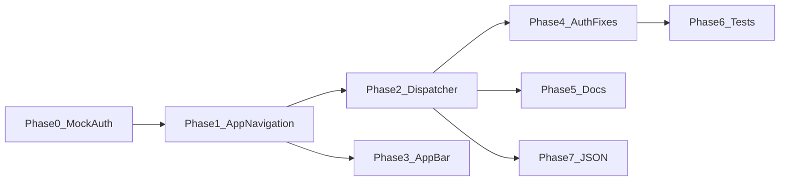

# Navigation Architecture — Phased Implementation Plan

**Source audit:** Cursor plan `navigation_architecture_audit_f17ac62e.plan.md` (audit sections retained in that file)  
**Standards:** [AGENTS.md](../../AGENTS.md) · [RULES.md](../../RULES.md) · [docs/ai/README.md](../../docs/ai/README.md)

Use **one phase per chat/session**. Copy the phase block below as the task prompt. Do not skip prerequisites.

---

## Overview

| Phase | Title | Status |
|-------|--------|--------|
| **0** | Temporary mock auth (backend offline) | Implement first |
| **1** | Central `AppNavigation` helper | After Phase 0 removed or left enabled |
| **2** | JSON `navigation_type` in `EngineActionDispatcher` | Requires Phase 1 |
| **3** | AppBar back aligned with GoRouter | Requires Phase 1 |
| **4** | Auth navigation fixes (duplicate go, logout) | Can follow Phase 2 |
| **5** | Builder spec + AI docs | Requires Phase 2 |
| **6** | Tests for navigation modes | Requires Phases 1–4 |
| **7** | Prod JSON tap migration (optional) | Requires Phase 2 + builder approval |



---

## Phase 0 — Temporary mock auth (backend unavailable)

### Goal

Simulate the **exact JSON-driven auth flow** without HTTP:

`splash` → `/auth/login` → `requestOtp` → `/auth/otp-reset` → `verifyOtp` → `/home` (token persisted, `AuthRedirect` treats user as logged in).

### Prerequisites

- None (first phase).

### What was added (reference)

| Path | Role |
|------|------|
| `lib/dev/auth_mock/auth_mock_config.dart` | Single toggle `enabled` |
| `lib/dev/auth_mock/mock_auth_data.dart` | Mock OTP message + token payload |
| `lib/dev/auth_mock/mock_auth_repo.dart` | `AuthRepo` that skips Dio |
| `lib/dev/auth_mock/README.md` | How to use / remove |
| `scripts/remove_auth_mock.ps1` | Windows removal script |
| `scripts/remove_auth_mock.sh` | Unix removal script |
| `lib/core/utils/service_locator.dart` | Registers `MockAuthRepo` when enabled |
| `lib/main.dart` | Logs when mock is active |

### Manual test checklist

1. Cold start logged out → lands on `/splash` (or config `initialRoute`).
2. Navigate to `/auth/login`, enter phone `501234567` (8–15 digits), submit.
3. See info toast (OTP sent), navigate to `/auth/otp-reset`.
4. Enter OTP `123456` (or any 6 digits), submit.
5. See success toast, navigate to `/home`; back does not return to auth.
6. Kill app, relaunch → still logged in (`/home`) via saved token.
7. Set `AuthMockConfig.enabled = false` → real API used again.

### Disable without deleting (quick)

In `lib/dev/auth_mock/auth_mock_config.dart`:

```dart
static const bool enabled = false;
```

Hot restart / rebuild.

### Remove completely (when backend is ready)

**Windows (PowerShell, repo root):**

```powershell
.\scripts\remove_auth_mock.ps1
```

**macOS / Linux:**

```bash
chmod +x scripts/remove_auth_mock.sh
./scripts/remove_auth_mock.sh
```

Then run `flutter test` and verify login against real API.

### Copy-paste prompt for a new session

```
Implement nothing new for Phase 0 unless mock is missing.
Verify Phase 0 mock auth per docs/engine/NAVIGATION_IMPLEMENTATION_PHASES.md Phase 0 checklist.
Read AGENTS.md, RULES.md, docs/ai/README.md.
```

---

## Phase 1 — Central `AppNavigation` helper

### Goal

One GoRouter entry point for `push` vs `clear_stack` (`go`), used by engine and core later.

### Prerequisites

- Phase 0 mock can stay on or off; unrelated to this phase.

### Files to create

- `lib/core/navigation/app_navigation.dart`
- `test/core/navigation/app_navigation_test.dart`

### Implementation steps

1. Add enum `NavigationType { push, clearStack }`.
2. Add `NavigationType parseNavigationType(String? raw)` with aliases:
   - push: `push`, `stack`
   - clearStack: `clear_stack`, `clearstack`, `reset`, `go`
   - default: `clearStack`
3. Add `void AppNavigation.navigate(BuildContext context, { required String route, NavigationType type = NavigationType.clearStack })`:
   - `push` → `context.push(route)`
   - `clearStack` → `context.go(route)`
4. Unit-test alias parsing and default.

### Must not

- Change `EngineActionDispatcher` yet.
- Edit prod JSON.

### Verification

- `flutter test test/core/navigation/app_navigation_test.dart`

### Copy-paste prompt

```
Phase 1 of docs/engine/NAVIGATION_IMPLEMENTATION_PHASES.md:
Add lib/core/navigation/app_navigation.dart (push vs clear_stack/go) with alias parsing and tests.
Follow AGENTS.md, RULES.md. Do not wire dispatcher or JSON yet.
Run flutter test for new tests.
```

---

## Phase 2 — JSON `navigation_type` in `EngineActionDispatcher`

### Goal

`tap` / `onSuccess` / `onFailure` navigate actions accept optional `navigation_type` from JSON.

### Prerequisites

- **Phase 1 complete.**

### Files to modify

- `lib/engine/actions/action_dispatcher.dart` — `_handleNavigate` uses `AppNavigation`
- `lib/engine/validation/component_schemas.dart` — document field
- `lib/engine/tree/renderers/timer_renderer.dart` — no change if timer passes full `tap` map

### JSON contract (default = today’s behavior)

```json
{
  "type": "navigate",
  "route": "/home",
  "navigation_type": "clear_stack"
}
```

| Value | API |
|-------|-----|
| `push` / `stack` | `context.push` |
| `clear_stack` / `reset` / `go` | `context.go` |
| omitted | `clear_stack` |

### Implementation steps

1. In `_handleNavigate`, read `action['navigation_type']`.
2. Parse via `parseNavigationType`, call `AppNavigation.navigate`.
3. Add schema notes for navigate actions in `component_schemas.dart`.
4. Add widget test with `GoRouter` verifying push vs go (mock navigator).

### Must not

- Patch `mobile_production_v2.json` unless user explicitly allows (builder spec first in Phase 5).

### Verification

- `flutter test test/engine/actions/`
- Manual: temporary test button in dev only — optional

### Copy-paste prompt

```
Phase 2 of docs/engine/NAVIGATION_IMPLEMENTATION_PHASES.md:
Wire navigation_type in EngineActionDispatcher via AppNavigation (Phase 1).
Default clear_stack. Update component_schemas.dart. Add dispatcher navigation tests.
Follow AGENTS.md, RULES.md. No prod JSON edits unless I say so.
```

---

## Phase 3 — AppBar back aligned with GoRouter

### Goal

JSON app bar back uses `context.canPop()` / `context.pop()` instead of raw `Navigator`.

### Prerequisites

- **Phase 1 complete** (optional for implementation, required for consistent stack after Phase 2 JSON migration).

### Files to modify

- `lib/engine/tree/renderers/app_bar_renderer.dart`
- `test/engine/renderers/app_bar_renderer_test.dart`

### Implementation steps

1. Import `go_router`.
2. Replace `Navigator.canPop` → `context.canPop()` (GoRouter extension).
3. Replace `Navigator.pop` → `context.pop()`.
4. Update tests to use `GoRouter` parent.

### Verification

- `flutter test test/engine/renderers/app_bar_renderer_test.dart`
- Manual: open detail with `navigation_type: push` (after Phase 7) — back returns

### Copy-paste prompt

```
Phase 3 of docs/engine/NAVIGATION_IMPLEMENTATION_PHASES.md:
Fix app_bar_renderer.dart to use GoRouter canPop/pop. Update tests. AGENTS.md + RULES.md.
```

---

## Phase 4 — Auth navigation fixes

### Goal

- Remove duplicate post-login `context.go('/home')` when JSON already navigates.
- Fix logout: `cubitCall` logout + `onSuccess` navigate with `clear_stack` (after Phase 2) or `go` until Phase 2.

### Prerequisites

- Phase 2 recommended (for `navigation_type` on logout).
- Phase 0 mock can be off when testing real API.

### Files to modify

- `lib/features/variantscreen/presentation/views/variant_screen.dart` — `_AuthRequestHost` listener
- `assets/config/mobile_production_v2.json` — settings logout button only if JSON edits allowed
- `lib/engine/actions/action_dispatcher.dart` — add `logout` to `cubitCall` if not present

### Implementation steps

1. **Duplicate navigate:** On `AuthAuthenticated`, show success via `AppMessenger` only; **remove** `context.go(AuthRedirect.homeRoute)` — rely on JSON `verifyOtp` `onSuccess.navigate`.
2. **Logout cubitCall:** Extend `_handleCubitCall` for `method: logout` → `authCubit.logout()`.
3. **JSON logout** (if allowed):

```json
"tap": {
  "type": "cubitCall",
  "cubit": "auth",
  "method": "logout",
  "onSuccess": {
    "type": "navigate",
    "route": "/auth/login",
    "navigation_type": "clear_stack"
  }
}
```

4. Ensure `TokenRefreshListenable` refreshes router after logout.

### Verification

- Logout clears token; user stays on login (not bounced to `/home`).
- Login success reaches `/home` once (no double navigation flicker).

### Copy-paste prompt

```
Phase 4 of docs/engine/NAVIGATION_IMPLEMENTATION_PHASES.md:
Fix duplicate auth success navigation in variant_screen.dart; add cubitCall logout; update settings logout in JSON if allowed.
Use navigation_type clear_stack when Phase 2 exists.
```

---

## Phase 5 — Builder spec and documentation

### Goal

Document `navigation_type` for website builder; update AI docs.

### Prerequisites

- **Phase 2 complete.**

### Files to create/update

- `docs/engine/builder-specs/13-navigation-type.md` (from `_TEMPLATE.md`)
- `docs/engine/builder-specs/README.md` — index entry
- `docs/ai/04-actions-and-requests.md`
- `RULES.md` §2.3 (short paragraph)
- Optional: `docs/ai/12-production-status.md` gap row

### Copy-paste prompt

```
Phase 5 of docs/engine/NAVIGATION_IMPLEMENTATION_PHASES.md:
Create builder-spec 13-navigation-type.md, update README index, docs/ai/04, RULES §2.3.
Grep prod JSON for navigation_type (expect absent). No Dart behavior changes.
```

---

## Phase 6 — Navigation tests and regression

### Goal

Automated coverage for navigation modes, auth redirect + logout, app bar.

### Prerequisites

- Phases 1–4 complete.

### Tests to add/extend

| File | Covers |
|------|--------|
| `test/core/navigation/app_navigation_test.dart` | Aliases, default |
| `test/engine/actions/action_dispatcher_navigation_test.dart` | push vs go |
| `test/engine/renderers/app_bar_renderer_test.dart` | GoRouter pop |
| `test/core/navigation/auth_redirect_test.dart` | Logout + redirect matrix |

### Verification

```bash
flutter test
```

### Copy-paste prompt

```
Phase 6 of docs/engine/NAVIGATION_IMPLEMENTATION_PHASES.md:
Add/extend navigation tests per plan. Run full flutter test. Fix failures only in scope.
```

---

## Phase 7 — Production JSON migration (optional)

### Goal

Apply `navigation_type` to high-traffic taps in `mobile_production_v2.json`.

### Prerequisites

- Phases 2 and 5 complete.
- User explicitly allows prod JSON edits.

### Suggested mapping

| Flow | `navigation_type` |
|------|-------------------|
| List/grid → product detail | `push` |
| Splash, carousel, auth, checkout success, order success | `clear_stack` |
| Settings logout | `clear_stack` (with Phase 4 cubitCall) |
| Tab bar | unchanged (`go` in `TabShellWidget`) |

### Verification

- Manual walk: home → detail → back; login → home; logout → login.

### Copy-paste prompt

```
Phase 7 of docs/engine/NAVIGATION_IMPLEMENTATION_PHASES.md:
Patch mobile_production_v2.json taps per migration table. Do not change unrelated pages.
```

---

## Audit reference (current state)

### Navigation system

- **GoRouter** from `MobileAppConfig` via `AppRouter.setupRouter`.
- JSON `tap.type: navigate` → `EngineActionDispatcher` → **`context.go` only**.
- Tab shell: `TabShellWidget` uses `go`.
- App bar: **`Navigator.pop`** (inconsistent).
- Auth guard: `AuthRedirect` (hardcoded routes).

### Risks to fix in Phases 1–4

| Risk | Phase |
|------|-------|
| No push / clear_stack flag in JSON | 1–2 |
| App bar back broken after `go` | 3 |
| Logout navigates but token remains | 4 |
| Duplicate login → home navigation | 4 |
| Unresolved `:param` in URL | Future / separate task |

### Out of scope (all phases)

- Deep linking / universal links
- `pushReplacement`
- Auto-generate `AuthRedirect` from JSON
- `navigation.type: "stack"` router branch

---

## End-of-task checklist (every phase)

Per [RULES.md §5](../../RULES.md#5-final-validation-checklist-mandatory):

- [ ] Scope limited to phase files
- [ ] No `SnackBar` for user messages
- [ ] No feature imports in renderers
- [ ] `flutter test` run (phases with code changes)
- [ ] Builder spec if new JSON contract added (Phase 5+)
