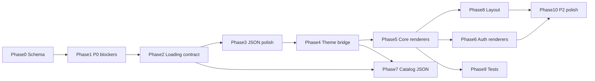

# Renderer Audit — Phased Implementation Plan

> **Purpose:** Turn [`RENDERER_PRODUCTION_AUDIT.md`](RENDERER_PRODUCTION_AUDIT.md) into **isolated phases** an AI (or human) can execute **one request at a time** without loading the full audit or breaking SOOQ layer rules.  
> **Source audit:** 2026-05-20 · config `mobile_production_v2` · 20 renderers.  
> **Do not edit** the audit file when completing a phase — update code/tests and optionally add a one-line “Done” note in this plan’s phase checklist.

---

## How to divide work for AI

### Principles

| Principle | Why it matters for AI |
|-----------|------------------------|
| **One phase = one PR-sized scope** | Fits context window; clear stop condition. |
| **One primary layer per phase** | Avoids mixing JSON-only edits with engine refactors in the same diff. |
| **Dependencies explicit** | Later phases assume earlier contracts (e.g. loading keys before list/grid UI). |
| **Fixed file allow-list** | Reduces accidental changes to unrelated features. |
| **Copy-paste prompt per phase** | Same instructions every run; link only the audit slices needed. |
| **No `semanticType` renderers** | Audit findings must stay primitive-based per [AGENTS.md](../../AGENTS.md). |
| **Builder spec for JSON gaps** | If a phase adds or relies on JSON shape **not in** `mobile_production_v2.json`, document it for the website builder — do not assume they know. |

### Builder spec rule (all phases)

**Reference:** [`docs/engine/builder-specs/README.md`](builder-specs/README.md) · template: [`builder-specs/_TEMPLATE.md`](builder-specs/_TEMPLATE.md)

During any phase:

1. **Verify in production JSON** — search [`assets/config/mobile_production_v2.json`](../../assets/config/mobile_production_v2.json) for every new or changed `props` key, page field (`scroll`, `background`, …), or `theme` path the engine expects.
2. **If missing** — create `docs/engine/builder-specs/<phase>-<slug>.md` using `_TEMPLATE.md`. Describe exactly what the **website builder** must support (field names, types, defaults, example nodes, routes to wire).
3. **If present** — no spec required for that item (note in PR description: “already in prod JSON”).
4. **Update** the index table in [`builder-specs/README.md`](builder-specs/README.md).
5. **JSON edits in this repo** only when the phase explicitly allows it (e.g. Phase 3, 7). Otherwise the spec is the handoff; do not silently require undeclared JSON.

**Phase completion is blocked if:** engine/code references a config contract that is neither in `mobile_production_v2.json` nor documented in `builder-specs/`.

**Append to every phase prompt:**

```text
Builder spec rule: Grep assets/config/mobile_production_v2.json for each new JSON prop/page/theme field.
If missing, create docs/engine/builder-specs/<phase>-<slug>.md from _TEMPLATE.md for the website builder.
Update builder-specs/README.md index. Do not add undeclared JSON to prod config unless this phase allows JSON edits.
```

### How the audit document maps to AI context

**Do not attach the full 461-line audit every request.**

The table below is a **lookup** (“if you need X, it lives at Y”) — **not** a checklist to paste all four slices into every phase.

| AI needs | Read from audit | Attach every phase? |
|----------|-----------------|---------------------|
| Rules & priority | **Executive summary** (lines 10–19) | Optional 1× at project start; skip if phase already lists slices |
| Shared contracts | **Cross-cutting findings** §1–5 (lines 61–125) | **Only the § listed** in that phase’s “Context to attach” |
| Type-specific work | **One or more** `### <type>` sections (lines 127–421) | **Only types named** in that phase — never lines 126–423 whole |
| Task ordering | **Prioritized roadmap** (lines 425–450) | Optional; or cite **one row** relevant to the phase |

**Always attach (every phase):**

1. [RENDERER_AUDIT_IMPLEMENTATION_PLAN.md](RENDERER_AUDIT_IMPLEMENTATION_PLAN.md) — **this phase’s section only** (Goal, Allowed/Forbidden, Tasks, Acceptance).
2. [AGENTS.md](../../AGENTS.md) — layer rules (short).
3. [builder-specs/README.md](builder-specs/README.md) — **if the phase introduces any JSON prop/page/theme key** not already in `mobile_production_v2.json`.

**Optionally attach:** [docs/ai/03-engine.md](../ai/03-engine.md) / [04-actions-and-requests.md](../ai/04-actions-and-requests.md) when the phase touches actions, requests, or registry.

### Per-phase: what to attach from the audit

| Phase | Attach from `RENDERER_PRODUCTION_AUDIT.md` | Do **not** attach |
|-------|---------------------------------------------|-------------------|
| **0** | Cross-cutting **§2** (lines 75–90); roadmap row “component_schemas” (line 436) | Executive summary, §1/§3/§4, per-component §§, full roadmap |
| **1** | `### scaffold`, `### videoPlayer`, `### unsupported`; P0 rows lines 429–430, 433, 442 | Other `###` types, Cross-cutting §1 theme |
| **2** | Cross-cutting **§1** Loading row (lines 69–70); `### listView`, `### gridView`, `### text`, `### image`; P0 rows 431–432, 437 | All 20 component sections |
| **3** | `### button`, `### card`; roadmap row 435; optional Executive summary bullet on JSON % | Any Dart/engine sections |
| **4** | Cross-cutting **§1** Theme (lines 67–68); Executive summary theme bullet | Per-component audits (except proof note in phase doc) |
| **5** | `### text`, `### card`, `### image`, `### button`, `### appBar`; P1 rows 439–441 | Other component types |
| **6** | `### form`, `### textFormField` | Catalog/grid sections |
| **7** | `### listView`, `### gridView`; Cross-cutting §3 empty-message row (line 100) | Theme §, scaffold § |
| **8** | `### column`, `### row`, `### container`, `### scaffold`; Cross-cutting RTL (line 71) | Auth, videoPlayer |
| **9** | Cross-cutting **§4** Tests (lines 103–107); inventory table (lines 23–47) | Full per-component body |
| **10** | P2 roadmap rows 445–450; only the `###` types named in the batch (e.g. richtext, icon) | Executive summary unless needed |
| **11** | Full plan checklists; `RENDERER_PRODUCTION_AUDIT.md` Executive summary; git diff of branch | Per-component deep dives unless fixing a specific renderer |

### Suggested division of the audit (reference index)

| Audit section | Implement in phase(s) |
|---------------|------------------------|
| Executive summary + roadmap P0 rows | 0, 1, 2 |
| Cross-cutting §2 Parser/schema | 0 |
| Cross-cutting §1 Theme | 4 |
| Cross-cutting §1 Loading contract | 2 |
| Cross-cutting §4 Tests | 9 |
| `### scaffold` | 1, 8 |
| `### listView` / `### gridView` | 2, 7 (JSON messages) |
| `### text` / `### image` / `### button` / `### card` | 5, 7 |
| `### appBar` | 5 |
| `### textFormField` / `### form` | 6 |
| `### videoPlayer` / `### unsupported` | 1 |
| `### column` / `### row` / `### container` | 8 |
| `### richtext` / `### icon` / `### divider` / `### spacer` / `### singleChildScrollView` | 10 |
| JSON-only quick wins (roadmap P0 JSON row) | 3 |

---

## Phase overview



| Phase | Name | Layer | Depends on | Est. |
|-------|------|-------|------------|------|
| **0** | Schema & docs alignment | schema / docs | — | S |
| **1** | P0 engine blockers | engine | 0 (optional) | S |
| **2** | Request loading / empty / error contract | engine + VariantScreen | 1 | M |
| **3** | JSON-only visual baseline | JSON | — (parallel after 1) | S |
| **4** | Theme bridge | config + core + engine | 0 | L |
| **5** | High-traffic renderers | engine | 4 | M |
| **6** | Auth form renderers | engine | 4 | S |
| **7** | Catalog list/grid JSON + messages | JSON + engine | 2, 3 | S |
| **8** | Layout & scroll | engine + parser | 1, 4 | M |
| **9** | Renderer tests (top 6) | test | 1, 2, 5 | M |
| **10** | P2 polish & a11y | engine | 5, 6, 8 | M |
| **11** | Post-implementation review | review only | 0–10 complete | S–M |

**S** ≈ half day · **M** ≈ 1–2 days · **L** ≈ 2–3 days

---

## Phase 0 — Schema & documentation alignment

**Goal:** Align validation catalog with production JSON so future AI edits get correct warnings and don’t invent invalid keys.

**Audit slices:** Cross-cutting §2; roadmap row “Update `component_schemas.dart`”.

**Allowed files**

- `lib/engine/validation/component_schemas.dart`
- `lib/engine/validation/component_schema.dart` (if needed)
- `docs/ai/02-config-and-json.md` (small additions only)
- `docs/ai/03-engine.md` (optional one paragraph)

**Forbidden**

- Any file under `lib/engine/tree/renderers/`
- `assets/config/*.json`
- Feature repos/cubits

**Tasks**

1. Add optional properties: `valuePath`, `urlPath`, `gap`, `shadow`, `border`, `aspectRatio`, `variant`, `id`, `onTap` (document as injected from `tap`).
2. Relax `text` required `value` when `valuePath` documented (schema comment or validation lenience note).
3. Add `width`/`height` to `spacer` schema.
4. Document page-level `scroll` as **not yet implemented** in config doc.

**Acceptance criteria**

- [x] `ComponentSchemas.getAll()` includes new keys for types that use them in prod.
- [x] `flutter test` still passes (no new tests required).
- [x] No renderer behavior change.
- [x] **Builder spec:** for each schema key **not** found in `mobile_production_v2.json`, add `docs/engine/builder-specs/00-<slug>.md` (or document “already in JSON” with grep evidence).

**AI prompt template**

```text
Implement Phase 0 from docs/engine/RENDERER_AUDIT_IMPLEMENTATION_PLAN.md (Phase 0 section only).
Follow AGENTS.md layer rules and the Builder spec rule (builder-specs/README.md).

Audit context (attach ONLY these slices from RENDERER_PRODUCTION_AUDIT.md):
- Cross-cutting §2 Parser/schema gaps (lines 75–90)
- Roadmap row: Update component_schemas.dart (line 436)

Do NOT attach: Executive summary, Cross-cutting §1/§3/§4, per-component sections (lines 127–421), full roadmap.

Tasks: Update component_schemas.dart per Phase 0. Do not change renderers or mobile_production_v2.json.
For every new schema property absent from mobile_production_v2.json, create docs/engine/builder-specs/00-<slug>.md for the website builder.
Update builder-specs/README.md index.
Run flutter test when done.
```

**Checklist:** [x] Phase 0 complete (P11: list/grid request UI keys + `pageScroll` on scaffold — see `PHASE_REVIEW_2026-05-21.md`)

---

## Phase 1 — P0 engine blockers (no new features)

**Goal:** Fix ship-blocking engine issues without changing JSON or adding domain logic to renderers.

**Audit slices:** `### scaffold`, `### videoPlayer`, `### unsupported`; roadmap P0 engine rows.

**Allowed files**

- `lib/engine/tree/renderers/scaffold_renderer.dart`
- `lib/engine/tree/renderers/video_player_renderer.dart`
- `lib/engine/tree/renderers/unsupported_component_renderer.dart`
- `lib/features/variantscreen/presentation/views/variant_screen.dart` (only if load-more must move here from scaffold)

**Forbidden**

- `assets/config/mobile_production_v2.json`
- New feature imports inside renderers (remove `ProductCubit` from scaffold, do not add others)
- `semanticType` renderers

**Tasks**

1. **scaffold:** Remove `ProductCubit` / `ProductListResponse` imports and load-more loop; rely on `VariantScreen` pagination only.
2. **scaffold:** Replace `Center(child: widget.child)` with full-width top-aligned layout (preserve stretch for page `column`).
3. **videoPlayer:** On init failure, show error text + optional retry — not infinite `CircularProgressIndicator`.
4. **unsupported:** Release → log only + zero-size or minimal placeholder; keep visible amber box in debug/profile only.

**Acceptance criteria**

- [ ] `scaffold_renderer.dart` has zero imports from `lib/features/product/`.
- [ ] Home/catalog scroll still works; load-more still fires from `VariantScreen`.
- [ ] Video with bad URL shows error UI within 1 frame after failed init.
- [ ] Release build does not show amber unsupported banner (verify with `kReleaseMode` / `kDebugMode`).

**AI prompt template**

```text
Implement Phase 1 from docs/engine/RENDERER_AUDIT_IMPLEMENTATION_PLAN.md.
Read audit sections: scaffold, videoPlayer, unsupported. Follow AGENTS.md layer rules.
Remove ProductCubit from scaffold_renderer; fix Center width; fix video error state; fix unsupported release behavior.
```

**Checklist:** [x] Phase 1 complete

---

## Phase 2 — Request loading / empty / error contract

**Goal:** Define how `listView` / `gridView` / bound `text` / `image` know a `requestKey` is loading, empty, or failed.

**Audit slices:** Cross-cutting §1 Loading; `### listView`, `### gridView`, `### text`, `### image`; roadmap P0 contract row.

**Allowed files**

- `lib/features/variantscreen/presentation/views/variant_screen.dart`
- `lib/engine/tree/renderers/list_view_renderer.dart`
- `lib/engine/tree/renderers/grid_view_renderer.dart`
- `lib/engine/tree/renderers/text_renderer.dart` (optional placeholder)
- `lib/engine/tree/renderers/image_renderer.dart` (optional placeholder)
- New small helper under `lib/engine/` only (e.g. `request_ui_state.dart`) — no feature imports

**Forbidden**

- Product business rules in renderers (only read maps/flags from `dataContext`)
- Hardcoded merchant copy (messages from JSON props or theme)

**Contract to implement (document in code comment)**

| `dataContext` key | Meaning |
|-------------------|---------|
| `requests.{requestKey}` | Existing API payload map |
| `loadingRequestKeys` or `loadingRequestKeys.{key}` | Initial load in progress (align with existing `VariantScreen` sets) |
| Props `requestKey`, `emptyMessage`, `errorMessage` on list/grid | JSON-driven copy |

**Tasks**

1. Ensure `VariantScreen` exposes stable loading flags per `requestKey` (may already exist — normalize naming).
2. **listView / gridView:** If `requestKey` set and loading → skeleton or progress; if error → message widget; if empty list → `emptyMessage` prop (fallback allowed).
3. **listView:** Switch item source resolution to `resolveDataContextPath` (parity with gridView).
4. Remove hardcoded `'No items available'` as default when `emptyMessage` provided.

**Acceptance criteria**

- [ ] `/home` grids show loading state before products appear (no flash of empty).
- [ ] Failed API shows error UI on grid/list without crashing.
- [ ] Empty category shows JSON-configurable message when wired.

**AI prompt template**

```text
Implement Phase 2 from docs/engine/RENDERER_AUDIT_IMPLEMENTATION_PLAN.md.
Read audit: Cross-cutting Loading, listView, gridView. Define loading/error/empty contract in VariantScreen + renderers.
No ProductRepo in renderers. Support optional props: requestKey, emptyMessage, errorMessage.
```

**Checklist:** [x] Phase 2 complete

---

## Phase 3 — JSON-only visual baseline (no Dart)

**Goal:** Quick production polish using existing props — no engine changes.

**Audit slices:** Executive summary JSON %; roadmap P0 JSON row; `### button`, `### card`.

**Allowed files**

- `assets/config/mobile_production_v2.json` only

**Forbidden**

- All of `lib/`

**Tasks**

1. Normalize **card** `borderRadius` (e.g. 10), `elevation` (0–1), `color` `#FFFFFF` on product tiles.
2. Normalize **button** `borderRadius` (12), heights/padding to match JSON `theme.buttons.md`.
3. Align **text** muted colors to `#475569` / primary `#1D4ED8` where hardcoded in nodes.
4. Add `gap` on key **column** layouts instead of empty spacer containers.

**Acceptance criteria**

- [ ] Visual consistency on `/home`, `/search`, `/auth/login` without code changes.
- [ ] `flutter test` unchanged (config-only diff).

**AI prompt template**

```text
Implement Phase 3 from docs/engine/RENDERER_AUDIT_IMPLEMENTATION_PLAN.md (JSON-only).
Edit mobile_production_v2.json only. Apply card/button/text style tokens from theme section in same file.
Do not change Dart files.
```

**Checklist:** [x] Phase 3 complete

---

## Phase 4 — Theme bridge (foundation)

**Goal:** Parse JSON `theme` once; apply to `MaterialApp` and renderer defaults via `dataContext` or `Theme.of(context)`.

**Audit slices:** Cross-cutting §1 Theme; Executive summary theme bullet.

**Allowed files**

- `lib/config/mobile_app_config.dart`
- New `lib/config/models/` theme model (or extend existing `app_theme_model.dart`)
- `lib/engine/app_config_loader.dart`
- `lib/main.dart`
- `lib/core/utils/service_locator.dart` (register parsed theme if needed)
- `lib/features/variantscreen/presentation/views/variant_screen.dart` (inject theme into `dataContext` only)
- New `lib/engine/theme/engine_theme.dart` (recommended)

**Forbidden**

- Per-merchant `if (tenantSlug)` branches
- Changing all 20 renderers in this phase (only wire bridge + 1–2 proof renderers e.g. `text`, `button`)

**Tasks**

1. Parse `theme` from `mobile_production_v2.json` into config model (colors, typography, radius, spacing, buttons).
2. Build `ThemeData` (consider `useMaterial3: true`, fontFamily Tajawal).
3. Pass `EngineTheme` (or similar) in `dataContext` when `VariantScreen` renders.
4. Update **text** + **button** renderers to use theme defaults when props omitted (proof).

**Acceptance criteria**

- [ ] App uses Tajawal (or configured font) from JSON.
- [ ] Primary/surface colors match JSON `theme.colors`.
- [ ] Text without `color` uses theme text color.

**AI prompt template**

See **Phase 4 prompt** in chat / copy full block from latest plan revision (theme parse, ThemeData, EngineTheme in dataContext, text + button proof only).

**Checklist:** [x] Phase 4 complete

---

## Phase 5 — High-traffic renderers

**Goal:** Modern UX on types that dominate the UI: text, card, image, button, appBar.

**Audit slices:** respective `###` sections; roadmap P1 rows for these types.

**Prerequisite:** Phase 4 complete.

**Allowed files**

- `lib/engine/tree/renderers/text_renderer.dart`
- `lib/engine/tree/renderers/card_renderer.dart`
- `lib/engine/tree/renderers/image_renderer.dart`
- `lib/engine/tree/renderers/button_renderer.dart`
- `lib/engine/tree/renderers/app_bar_renderer.dart`
- `lib/engine/tree/parsers/property_parsers.dart` (if shared helpers)
- Remove `getIt` from image renderer if moving base URL to `dataContext`

**Forbidden**

- `lib/features/product/` imports in renderers

**Tasks**

| Type | Tasks |
|------|--------|
| **text** | `maxLines`, `overflow`; theme typography scale |
| **card** | `margin`, theme radius/elevation defaults |
| **image** | Loading placeholder; error widget; optional cache package (discuss in PR) |
| **button** | M3 Filled/Outlined; `enabled`; theme size tokens |
| **appBar** | Fix `color` vs `foregroundColor`; 48dp back; theme styles |

**Acceptance criteria**

- [ ] Product card layout on `/home` unchanged structurally; improved defaults.
- [ ] Images show loading shimmer or placeholder.
- [ ] Buttons respect `enabled: false` when prop added to JSON later.

**AI prompt template**

```text
Implement Phase 5 from docs/engine/RENDERER_AUDIT_IMPLEMENTATION_PLAN.md.
Read audit sections: text, card, image, button, appBar. Use EngineTheme defaults from Phase 4.
One PR: only these five renderer files + property_parsers if needed.
```

**Checklist:** [x] Phase 5 complete

---

## Phase 6 — Auth form renderers

**Goal:** OTP/login flows: forms and fields match theme; validation UX solid.

**Audit slices:** `### form`, `### textFormField`; routes `/auth/login`, `/auth/otp-reset`.

**Prerequisite:** Phase 4 (theme).

**Allowed files**

- `lib/engine/tree/renderers/form_renderer.dart`
- `lib/engine/tree/renderers/text_form_field_renderer.dart`
- `assets/config/mobile_production_v2.json` (auth pages only — optional Arabic messages)

**Tasks**

1. Theme-aware `InputDecoration`; min tap targets.
2. Localized `requiredMessage` via JSON on auth fields.
3. `form` empty-child → debug assert or log, not silent shrink in debug.

**Acceptance criteria**

- [ ] `/auth/login` fields validate; submit respects `requireValidForm`.
- [ ] No regression on `cubitCall` + navigate actions.

**AI prompt template**

```text
Implement Phase 6 from docs/engine/RENDERER_AUDIT_IMPLEMENTATION_PLAN.md.
Read audit: form, textFormField. Theme-aware inputs; JSON messages for auth pages only.
```

**Checklist:** [x] Phase 6 complete

---

## Phase 7 — Catalog list/grid JSON + engine props

**Goal:** Wire `requestKey`, `emptyMessage`, `errorMessage` on production catalog nodes.

**Audit slices:** `### listView`, `### gridView`; `/home`, `/search`, `/categories/:categorySlug/products`.

**Prerequisite:** Phase 2 (contract), Phase 3 optional.

**Allowed files**

- `assets/config/mobile_production_v2.json` (list/grid nodes)
- Minor prop handling in list/grid renderers if gaps found

**Tasks**

1. Add `emptyMessage` / `errorMessage` (Arabic) to each `gridView`/`listView` with `requestKey`.
2. Verify `itemBuilder.source` paths match `EngineRequestMapper` keys.
3. Confirm `enableInnerScroll: false` on all catalog lists.

**Acceptance criteria**

- [ ] Empty search and empty category show correct Arabic copy.
- [ ] No English `'No items available'` visible in prod when JSON message set.

**AI prompt template**

```text
Implement Phase 7 from docs/engine/RENDERER_AUDIT_IMPLEMENTATION_PLAN.md.
Wire requestKey, emptyMessage, errorMessage on catalog listView/gridView in mobile_production_v2.json.
Read audit listView and gridView sections.
```

**Checklist:** [x] Phase 7 complete

---

## Phase 8 — Layout & scroll

**Goal:** Page layout correctness: column/row props, container RTL, optional page `scroll` honor.

**Audit slices:** `### column`, `### row`, `### container`, `### scaffold`; Cross-cutting RTL.

**Prerequisite:** Phase 1 (scaffold), Phase 4 (theme defaults optional).

**Allowed files**

- `lib/engine/tree/renderers/column_renderer.dart`
- `lib/engine/tree/renderers/row_renderer.dart`
- `lib/engine/tree/renderers/container_renderer.dart`
- `lib/features/variantscreen/data/repos/variant_repository.dart` (page `scroll`)
- `lib/engine/tree/renderers/scaffold_renderer.dart` (scroll mode only)

**Tasks**

1. Honor `mainAxisSize`, `textDirection` from JSON when present.
2. `container`: `EdgeInsetsDirectional` for padding/margin.
3. **variant_repository:** Read page `scroll`; pass flag to scaffold (disable inner scroll when `none` if product needs it).

**Acceptance criteria**

- [x] Full-width grids on `/home` after Phase 1 + this phase.
- [x] RTL padding mirrors correctly on asymmetric containers.

**AI prompt template**

```text
Implement Phase 8 from docs/engine/RENDERER_AUDIT_IMPLEMENTATION_PLAN.md.
Read audit: column, row, container, scaffold. Honor mainAxisSize and page scroll in repository.
```

**Checklist:** [x] Phase 8 complete

---

## Phase 9 — Renderer tests (top 6)

**Goal:** Lock in behavior for highest-usage types.

**Audit slices:** Cross-cutting §4 Tests; inventory table.

**Prerequisite:** Phases 1, 2, 5 done for types under test.

**Allowed files**

- `test/engine/renderers/*.dart` (new)
- `test/fixtures/renderer/` (new JSON snippets)

**Tasks**

1. Add widget tests: `text`, `card`, `gridView`, `button`, `image`, `scaffold`.
2. Use minimal `ComponentConfig` trees (extracted from prod JSON snippets).
3. Test `valuePath`, empty list, theme default color, scaffold no ProductCubit import (static / structure test).

**Acceptance criteria**

- [x] `flutter test test/engine/renderers` passes in CI.
- [x] At least 2 tests per renderer file.

**AI prompt template**

```text
Implement Phase 9 from docs/engine/RENDERER_AUDIT_IMPLEMENTATION_PLAN.md.
Add widget tests for text, card, gridView, button, image, scaffold renderers.
Use minimal ComponentConfig fixtures; no full mobile_production_v2.json in tests.
```

**Checklist:** [x] Phase 9 complete

---

## Phase 10 — P2 polish & accessibility

**Goal:** Remaining audit items that are not ship-blocking.

**Audit slices:** `### richtext`, `### icon`, `### divider`, `### spacer`, `### singleChildScrollView`; roadmap P2 rows; Cross-cutting a11y.

**Allowed files**

- Renderers listed above only
- `lib/engine/tree/renderers/single_child_scroll_view_renderer.dart`

**Tasks (pick subset per PR)**

1. **Semantics** on button, image, tappable card, textFormField.
2. **richtext:** `Text.rich` or rename type in docs only.
3. **singleChildScrollView:** Consistent nested-scroll guard in release.
4. **icon:** Expand allow-list or document supported names in `docs/ai/02-config-and-json.md`.

**Acceptance criteria**

- [x] TalkBack/VoiceOver reads button labels.
- [x] No new P0 regressions from `flutter test`.

**AI prompt template**

```text
Implement Phase 10 (batch A: Semantics) from docs/engine/RENDERER_AUDIT_IMPLEMENTATION_PLAN.md.
Read audit P2 items. Add Semantics to button, image, card tap targets, textFormField only.
```

**Checklist:** [x] Phase 10 complete

---

## Phase 11 — Post-implementation review (after phases 0–10)

**Goal:** Verify all audit work is **correct**, **minimal**, and **aligned with SOOQ architecture** — not a new feature phase. Fix only clear bugs, layer violations, or dead code found in review; defer nice-to-haves to a short follow-up list.

**When to run:** All phase checklists **0–10** marked complete (or explicitly skipped with reason). Phases **1, 2, 4** are mandatory before sign-off if engine work was done.

**Prerequisite:** `flutter test` passes on the branch under review.

**Allowed actions**

- Read-only audit of changed files across phases
- Small targeted fixes (≤ ~50 lines per issue) for: layer violations, duplicate logic, broken contracts, failing tests
- Remove dead code, unused imports, over-abstracted helpers introduced during phases
- Update docs/checklists if drift found (implementation plan, builder-specs index, `docs/ai/12-production-status.md` one paragraph)

**Forbidden**

- New features, new component types, or `semanticType` renderers
- Large refactors “while we’re here”
- New dependencies without strong justification
- Rewriting `mobile_production_v2.json` structure (style-only consistency OK if ≤20 lines)

### Review checklist

#### Architecture & layers

- [x] No `lib/features/*` imports inside `lib/engine/tree/renderers/` (especially `scaffold_renderer`, `image_renderer`)
- [x] No product/auth/catalog logic in renderers; cubits only in `VariantScreen` / features
- [x] JSON-first: no new hardcoded merchant screens
- [x] No `if (tenantSlug == …)` UI branches

#### Phase deliverables (grep / spot-check)

| Phase | Verify |
|-------|--------|
| 0 | `component_schemas.dart` matches prod JSON props (`valuePath`, `gap`, …) |
| 1 | `scaffold_renderer` — no `ProductCubit`; no `Center` breaking stretch |
| 2 | `request_ui_state.dart` used; list/grid loading/empty/error; builder spec `02-list-grid-request-ui.md` |
| 3 | JSON tokens applied on `/home`, `/auth/login` (spot-check) |
| 4 | `theme` parsed; `main.dart` font/colors from JSON; `EngineTheme` in `dataContext`; text/button defaults |
| 5–10 | Per phase checklist in this doc |

#### Code quality (anti–over-engineering)

- [x] No duplicate pagination / request loading in both `scaffold` and `VariantScreen`
- [x] No parallel theme systems (`AppThemeModel` stale vs `EngineTheme`) — single source from JSON
- [x] Helpers used by ≥2 call sites (otherwise inline)
- [x] No speculative props/renderers “for future use”
- [x] `EngineTheme` / `request_ui_state` APIs are small and readable

#### Tests & config

- [x] `flutter test` green (`test/engine` + `test/config` 88/88; full suite: pre-existing `widget_test.dart` failure)
- [x] Renderer tests (phase 9) cover main contracts, not implementation details
- [x] Builder-specs index matches files in `docs/engine/builder-specs/`
- [x] Prod JSON: Phase 7 wired `emptyMessage` / `errorMessage` where engine expects them (or documented as pending)

#### Manual smoke (15 min)

- [ ] `/home` — grid load, load-more, card tap → detail (not run — tests/grep substitute; see `PHASE_REVIEW_2026-05-21.md`)
- [ ] `/search` — list/grid states (not run)
- [ ] `/auth/login` — form validate + submit (not run)
- [ ] RTL Arabic — layout not clipped; back button usable (not run)
- [ ] Invalid video URL (if used) — error, not infinite spinner (not run)
- [ ] Release/profile: unsupported type does not show amber banner (not run; `kDebugMode` guard verified)

### Output

1. **Review summary** (markdown in PR or `docs/engine/PHASE_REVIEW_<date>.md` optional): Pass / Pass with fixes / Blocked
2. **Fix list** — only items fixed in this pass; remaining → backlog table
3. Mark **Phase 11** checklist complete in this file

**AI prompt template**

```text
Run Phase 11 from docs/engine/RENDERER_AUDIT_IMPLEMENTATION_PLAN.md (Post-implementation review).

Do NOT add features. Review all work from phases 0–10 against AGENTS.md and RENDERER_PRODUCTION_AUDIT.md.

Steps:
1. git diff main...HEAD (or list files changed per phase) — inventory scope
2. Run flutter test
3. Grep lib/engine/tree/renderers for lib/features imports
4. Walk Phase 11 review checklist; note Pass/Fail per row
5. Fix only: layer violations, test failures, duplicate logic, clear over-engineering (remove dead helpers)
6. Write short review summary: what was correct, what was fixed, what is deferred (max 15 bullets)

Forbidden: new component types, semanticType renderers, large refactors, new packages unless critical bug.
Mark Phase 11 checklist when done.
```

**Checklist:** [x] Phase 11 complete — see [`PHASE_REVIEW_2026-05-21.md`](PHASE_REVIEW_2026-05-21.md) (verdict: Pass with fixes)

---

## Running one phase per AI chat (recommended workflow)

1. Open **this plan** → pick next unchecked phase.
2. Attach **only** the audit slices listed for that phase (not the whole audit).
3. Paste the phase **AI prompt template**; add: “Mark phase complete in IMPLEMENTATION_PLAN checklist when done.”
4. **Grep** `mobile_production_v2.json` for any new JSON contract; write **builder-specs** for gaps (see Builder spec rule).
5. Run `flutter test` before closing the phase.
6. Manual smoke: routes listed in that phase’s audit sections.

### Parallel tracks (safe)

| Track | Phases | Notes |
|-------|--------|-------|
| **Engine critical path** | 0 → 1 → 2 → 4 → 5 → 9 | Main quality uplift |
| **JSON-only** | 3 → 7 | Can run after 1; 7 needs 2 |
| **Layout** | 8 | After 1 and preferably 4 |
| **Polish** | 10 | Last |
| **Sign-off** | 11 | After all desired phases |

**Avoid parallelizing** two phases that edit the same renderer file (e.g. 1 and 8 both touch `scaffold_renderer.dart`).

**Final step:** Run **Phase 11** once before merge to main — review for correctness, cleanliness, and over-engineering.

---

## Phase ↔ audit roadmap mapping

| Roadmap priority | Phase |
|------------------|-------|
| P0 scaffold ProductCubit / Center | 1 |
| P0 list/grid loading empty error | 2, 7 |
| P0 JSON card/button radii | 3 |
| P0 video error UI | 1 |
| P1 theme bridge | 4 |
| P1 component_schemas | 0 |
| P1 listView path helper | 2 |
| P1 appBar, text, image, button | 5 |
| P1 unsupported release | 1 |
| P1 page scroll | 8 |
| P1 widget tests | 9 |
| P2 column/row/richtext/semantics/RTL | 8, 10 |

---

## References

- Full findings: [`RENDERER_PRODUCTION_AUDIT.md`](RENDERER_PRODUCTION_AUDIT.md)
- **Builder JSON gaps:** [`builder-specs/README.md`](builder-specs/README.md)
- Architecture: [`docs/ai/01-architecture.md`](../ai/01-architecture.md)
- Workflows: [`docs/ai/09-workflows.md`](../ai/09-workflows.md)
