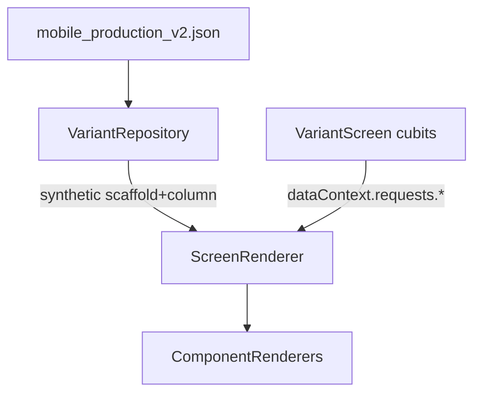

# Engine Renderer Production Audit

> **Generated:** 2026-05-20  
> **Config:** `mobile_production_v2` (`assets/config/mobile_production_v2.json`)  
> **Renderers:** 20 (19 primitives + `unsupported`)  
> **Registry:** [`lib/engine/screen_renderer/screen_renderer.dart`](../lib/engine/screen_renderer/screen_renderer.dart)

> **Layout / scroll / constraints:** Superseded for accuracy by **[`LAYOUT_CONSTRAINT_AUDIT.md`](LAYOUT_CONSTRAINT_AUDIT.md)** (2026-05-23). That document reflects current `scaffold_renderer` (`pageScroll`, no `Center`), `column` `mainAxisSize`, expand contracts, and layout tests. Keep this file for theme, loading UX, and per-renderer product findings not covered there.

---

## Executive summary

- **Theme is the largest systemic gap:** JSON defines rich `theme` (colors, typography Tajawal, radius, spacing, button sizes) but [`MobileAppConfig`](../lib/config/mobile_app_config.dart) does not parse it; [`main.dart`](../lib/main.dart) L110–114 hardcodes `ThemeData(useMaterial3: false, fontFamily: 'inter')`; **no renderer reads theme tokens** from `dataContext`.
- **Production scroll model works but is rigid:** Every page gets a synthetic `scaffold` root ([`variant_repository.dart`](../lib/features/variantscreen/data/repos/variant_repository.dart) L169–179) with always-on `SingleChildScrollView` ([`scaffold_renderer.dart`](../lib/engine/tree/renderers/scaffold_renderer.dart) L184–196). Page-level `scroll` in JSON is **ignored** by the repository.
- **P0 engine blockers:** `ProductCubit` imported in `scaffold_renderer` (layer violation); `Center` wrapper breaks stretch layouts; video init failure shows infinite spinner; `unsupported` shows amber UI in all builds despite release comment.
- **P0 UX blockers:** List/grid show hardcoded English empty state with no loading skeleton; bound `text`/`image` render blank while requests load; no per-`requestKey` error surface in renderers.
- **Schema drift is widespread:** `valuePath`, `urlPath`, `gap`, `shadow`, `border`, `aspectRatio`, `variant`, `id` used in production JSON/code but missing or wrong in [`component_schemas.dart`](../lib/engine/validation/component_schemas.dart).
- **JSON vs Dart split:** ~60–70% of visual polish can be improved **today via JSON** (per-component colors, radii, padding) but stays inconsistent without engine defaults from `theme`. Structural fixes (theme bridge, loading contract, layer cleanup) require **engine + VariantScreen** work.
- **Tests:** **0/20** renderer widget tests; only 4 engine tests (parsers, actions, request mapper).
- **Estimated effort:** P0 ~3–5 days · P1 ~1–2 weeks · P2 ongoing polish.

---

## Inventory table

| type | renderer file | schema optional keys (summary) | explicit JSON count | effective usage | test coverage |
|------|---------------|--------------------------------|--------------------:|-----------------|---------------|
| `scaffold` | `scaffold_renderer.dart` | `backgroundColor` | **0** | **26 pages** (synthetic root) | none |
| `singleChildScrollView` | `single_child_scroll_view_renderer.dart` | `axis` | **0** | unused in prod | none |
| `column` | `column_renderer.dart` | alignments, `mainAxisSize`, `textDirection` | **40** | every page body | none |
| `row` | `row_renderer.dart` | alignments, `mainAxisSize`, `textDirection` | **17** | toolbars, cards, auth | none |
| `container` | `container_renderer.dart` | padding, margin, color, radius, w/h | **43** | sections, chips | none |
| `listView` | `list_view_renderer.dart` | scroll, itemBuilder, items, enableInnerScroll | **5** | categories, lists | none |
| `gridView` | `grid_view_renderer.dart` | crossAxisCount, spacing, aspect, itemBuilder | **7** | product/category grids | none |
| `text` | `text_renderer.dart` | value, font*, color, align, maxLines… | **128** | dominant leaf | none |
| `textFormField` | `text_form_field_renderer.dart` | 40+ validation/input keys | **4** | `/auth/login`, OTP | none |
| `form` | `form_renderer.dart` | `formId`, child/children | **2** | auth pages | none |
| `button` | `button_renderer.dart` | label, variant, colors, radius… | **37** | CTAs, navigation | none |
| `card` | `card_renderer.dart` | elevation, radius, color, margin | **67** | product tiles | none |
| `image` | `image_renderer.dart` | url, source, fit, placeholders | **11** | product cards | none |
| `appBar` | `app_bar_renderer.dart` | title, backgroundColor, color | **20** | most pages | none |
| `divider` | `divider_renderer.dart` | thickness, color | **1** | rare | none |
| `icon` | `icon_renderer.dart` | name, size, color | **13** | splash, chrome | none |
| `richtext` | `rich_text_renderer.dart` | value, font*, height | **2** | `/splash` | none |
| `videoPlayer` | `video_player_renderer.dart` | url, autoplay, controls, height | **1** | media hero | none |
| `unsupported` | `unsupported_component_renderer.dart` | rawType, id, data | **0** | runtime fallback | none |

**Production JSON property frequency (cross-type):** `valuePath` ×26 · `urlPath` ×11 · `gap` ×50 · `enableInnerScroll: false` ×11 (all grids/lists sampled) · `tap` on cards/buttons throughout.

**Engine tests (shared, not per-type):**

| File | Covers |
|------|--------|
| `test/engine/tree/parsers/data_context_path_test.dart` | path resolution |
| `test/engine/actions/action_dispatcher_route_test.dart` | navigate |
| `test/engine/actions/action_dispatcher_cubit_call_test.dart` | cubitCall |
| `test/engine/requests/request_mapper_resolve_test.dart` | requestUrl mapping |

---

## Cross-cutting findings

### 1. Global gaps

| Gap | Detail | JSON-only mitigation | Engine fix |
|-----|--------|----------------------|------------|
| **Theme bridge** | `theme` in JSON L10–78; not in `MobileAppConfig`; renderers use hardcoded hex | Set colors/radii on every node | Parse theme → `ThemeData` + inject `EngineTheme` into `dataContext` |
| **M3 / modern components** | `useMaterial3: false` in `main.dart` L111 | N/A | Enable M3; map `button.variant` to Filled/Outlined |
| **Loading / error / empty** | `VariantScreen` sets `requests.{key}`; page spinner only for config load | Routes `/state/loading`, `/state/error` exist in `shellExcludeRoutes` | Contract: `requests.{key}.status` + renderer placeholders |
| **Accessibility** | Zero `Semantics` in `lib/engine/tree/renderers/` | N/A | Labels on buttons, images, fields, app bar |
| **RTL** | App `Directionality` from locale (`main.dart` L119–124) | Use symmetric padding in JSON | `EdgeInsetsDirectional`; honor `textDirection` on row/column |
| **Layer violation** | `scaffold_renderer` imports `ProductCubit` L6–7, L161 | N/A | Move load-more to `VariantScreen` only |

### 2. Parser / schema gaps

| Property / behavior | In production JSON | In schema | Parsed by renderer |
|-------------------|---------------------|-----------|-------------------|
| `valuePath` | yes (26) | **no** | `text` only |
| `urlPath` | yes (11) | **no** | `image` only |
| `gap` | yes (50) | **no** | `column`, `row` |
| `shadow`, `border` | yes | **no** | `container`, `textFormField` |
| `aspectRatio` | yes | **no** | `image` |
| `variant` (button) | yes | partial | `button` |
| `id` (field/form) | yes | **no** | `textFormField`, `form` |
| `tap` | yes | **no** (actions) | `ScreenRenderer` L177–188 |
| `data` / `requestUrl` | yes | partial | `EngineRequestMapper` (not renderers) |
| Page `scroll` | yes (many pages) | N/A | **ignored** by `VariantRepository` |
| `onPressed` vs `onTap` | — | `onPressed` in schema | renderer uses `onTap` |

**List vs grid path resolution:** `gridView` uses `resolveDataContextPath` ([`grid_view_renderer.dart`](../lib/engine/tree/renderers/grid_view_renderer.dart) L126–127); `listView` uses manual `_readPath` after stripping `dataContext.` prefix (L98–100) — functionally similar but inconsistent.

### 3. JSON-only vs engine improvements

| Improvement | JSON-only (today) | Engine required |
|-------------|-------------------|-----------------|
| Consistent card radius / elevation | Set `borderRadius`, `elevation` on all `card` nodes | Default from `theme.radius.md` |
| Brand colors on buttons/text | Per-node `color`, `backgroundColor` | Theme fallback when props omitted |
| Product grid spacing | `mainAxisSpacing`, `crossAxisSpacing`, `childAspectRatio` | Sensible defaults from `theme.spacing` |
| Auth field styling | `padding`, `borderRadius`, validation props | `InputDecorationTheme` from theme |
| Empty catalog message | Add `text` sibling above grid (static copy) | Configurable `emptyMessage` prop on list/grid |
| Loading UX | Navigate to `/state/loading` or static placeholder `container` | Skeleton + `requests.{key}.loading` binding |

### 4. Test gaps

- **Missing:** `test/engine/renderers/*_renderer_test.dart` for all 20 types.
- **Priority tests (by usage):** `text`, `card`, `gridView`, `button`, `image`, `scaffold` (scroll + stretch).
- **Golden samples:** Extract minimal trees from `/home` (gridView L820), `/auth/login` (form L350), `/product/details/:productId` (detail layout).

### 5. Data flow (reference)

---

## Per-component audits

### scaffold

- **Production usage:** 0 explicit nodes; **26/26 pages** via [`variant_repository.dart`](../lib/features/variantscreen/data/repos/variant_repository.dart) L169–179. Page `background` → `backgroundColor` on synthetic scaffold.
- **Findings:**
  - 🔴 **Blocker — layer violation:** Imports `ProductCubit`, `ProductListResponse`; calls `loadNextPage` (L6–7, L137–164). Duplicates pagination already in `VariantScreen`.
  - 🔴 **Blocker — layout:** `Center(child: widget.child)` (L191) prevents full-width stretch for `column` with `crossAxisAlignment: stretch`.
  - 🟡 **Important:** Not a Flutter `Scaffold`; no `SafeArea` despite schema doc (“SafeArea”). Tab shell provides outer chrome.
  - 🟡 **Important:** Always `SingleChildScrollView`; page JSON `scroll` unused.
  - 🟡 Default BG `#F8FAFC` (L33) vs JSON `theme.colors.surface` `#F8FAFC` — coincidental match, not wired.
  - 🟢 Load-more footer `CircularProgressIndicator` (L173–177) when `loadingMoreRequests` set.
- **JSON-only fixes:** Set per-page `background` on pages (maps to `backgroundColor`).
- **Engine fixes:** Remove feature imports; replace `Center` with `Align(alignment: Alignment.topCenter, widthFactor: 1)` or drop wrapper; honor page `scroll`; optional `SafeArea` prop.
- **Composition notes:** Wraps synthetic `column` (appBar + body). All list/grid use outer scroll + `enableInnerScroll: false`.
- **Priority:** **P0**

---

### singleChildScrollView

- **Production usage:** **0** (demo configs only: `mobile_component.json`).
- **Findings:**
  - 🟡 Nested scroll: debug shows warning widget; **release renders nested scrollable anyway** (L20–27).
  - 🟢 Missing child → `SizedBox.shrink()` (L18).
  - Schema `axis` implemented (L15–16, L36–38).
- **JSON-only fixes:** Avoid nesting under synthetic scaffold scroll.
- **Engine fixes:** Consistent nested-scroll policy in release; add `padding` prop.
- **Composition notes:** Redundant with scaffold scroll if used on production pages.
- **Priority:** **P2**

---

### column

- **Production usage:** **40** explicit + **26** synthetic page roots (`crossAxisAlignment: stretch`). Routes: `/home`, `/auth/login`, checkout flows.
- **Findings:**
  - 🟡 **`mainAxisSize` hardcoded `min`** (L29) — schema `mainAxisSize` ignored; conflicts with `Spacer` children.
  - 🟡 **`gap` used 50× in JSON** — not in schema; implemented (L22–26).
  - 🟡 `verticalDirection`, `textDirection` not implemented.
  - 🟢 `mainAxisAlignment`, `crossAxisAlignment` via `PropertyParsers`.
- **JSON-only fixes:** Use `gap` instead of empty `container` spacers; set alignments explicitly.
- **Engine fixes:** Honor `mainAxisSize` from JSON; add `gap` to schema; optional `textDirection`.
- **Composition notes:** Primary vertical stack under scaffold; pairs with `row`, `container`, `gridView`.
- **Priority:** **P1**

---

### row

- **Production usage:** **17** — `/splash` button row (L286), `/auth/login`, product card footers, `/search` toolbar (L632).
- **Findings:**
  - 🟡 **`mainAxisSize` hardcoded `max`** (L51) — asymmetric with column `min`.
  - 🟡 Unbounded-height guard: stretch → center fallback (L33–48) — good for scroll parents.
  - 🟡 `gap` in JSON, not in schema.
  - 🟢 Debug logging via `_enginePath` (L31).
- **JSON-only fixes:** Prefer `gap` over zero-width containers; avoid `crossAxisAlignment: stretch` inside scroll column without fixed height.
- **Engine fixes:** Honor `mainAxisSize`; schema `gap`; RTL `textDirection`.
- **Composition notes:** Often wraps `button` + `text`; inside `card` for product metadata.
- **Priority:** **P1**

---

### container

- **Production usage:** **43** — splash hero (L142), section wrappers, chips.
- **Findings:**
  - 🟡 **`shadow`, `border` in code** (L38–39, L65–104) — not in schema.
  - 🟡 Physical `EdgeInsets` — RTL asymmetric padding won’t flip.
  - 🟢 padding, margin, color, borderRadius, width, height implemented.
- **JSON-only fixes:** Use `style.shadow`: `"md"`, `style.border` for cards-as-container; set `padding` via `style` merge.
- **Engine fixes:** Schema update; `EdgeInsetsDirectional`; theme default border color from `theme.colors`.
- **Composition notes:** Wraps `column` of `text`/`button`; under `appBar` siblings.
- **Priority:** **P1**

---

### listView

- **Production usage:** **5** — `/home` categories (L1080), `/search` (L1779, L1945), `/categories` (L3011, L3346). All sampled use `enableInnerScroll: false`.
- **Findings:**
  - 🔴 **Blocker — empty/loading UX:** Hardcoded `'No items available'` (L160–163); no loading skeleton; blank when `requests.{key}` not yet populated.
  - 🟡 Path resolution differs from `gridView` (manual vs `resolveDataContextPath`).
  - 🟢 `shrinkWrap` + `NeverScrollableScrollPhysics` when `enableInnerScroll: false` (L20–24) — correct for scaffold scroll.
  - 🟢 Injects `item` + `index` into child context (L131–157).
- **JSON-only fixes:** Add static empty-state `column` above list; ensure `itemBuilder.source` paths match `requestKey` (e.g. `dataContext.requests.home-categories.data`).
- **Engine fixes:** Configurable `emptyMessage`; bind to `loadingRequestKeys`; use `resolveDataContextPath` consistently.
- **Composition notes:** `itemBuilder` → `card` → `image` + `text` with `valuePath`.
- **Priority:** **P0** (empty/loading); **P1** (path helper)

---

### gridView

- **Production usage:** **7** — `/home` product grids (L820, L920), `/search` (L1233, L1831), category products (L1636, L3158, L3833).
- **Findings:**
  - 🔴 Same empty/loading gaps as `listView` (L200–203).
  - 🟡 Missing/`crossAxisCount <= 0` → empty state, not error (L41–42).
  - 🟢 `childAspectRatio`, spacing, `enableInnerScroll` implemented; uses `resolveDataContextPath` (L126–127).
- **JSON-only fixes:** Set `crossAxisCount: 2`, `childAspectRatio` for product tiles; `mainAxisSpacing`/`crossAxisSpacing` from theme spacing tokens manually.
- **Engine fixes:** Loading shimmer; error widget when `requests.{key}.success == false`; theme defaults.
- **Composition notes:** Primary catalog primitive; `tap` on `card` → `/product/details/:productId`.
- **Priority:** **P0**

---

### text

- **Production usage:** **128** — every page; `valuePath` on product/category cards (26 bindings).
- **Findings:**
  - 🟡 **Schema requires `value`** but production uses `valuePath` alone — validator lenient, schema strict (L141–163 schema vs L16–21 renderer).
  - 🟡 **`maxLines`, `overflow`, `fontStyle`, `letterSpacing`, `wordSpacing`** in schema — not implemented.
  - 🟡 Default `fontSize: 16` (L22–23) ignores `theme.typography.scale`.
  - 🟢 `valuePath` + `resolveDataContextPath` (L16–21).
  - 🟡 Blank string when path missing during load — no placeholder.
- **JSON-only fixes:** Duplicate static `value` as fallback; set `fontSize`/`color` per role (title vs muted).
- **Engine fixes:** Theme text roles; `maxLines`/`overflow`; optional skeleton when path unresolved and request loading.
- **Composition notes:** Leaf inside `card`, `column`, `appBar` titles (static `value`).
- **Priority:** **P0** (data binding UX) · **P1** (typography)

---

### textFormField

- **Production usage:** **4** — `/auth/login` (L394, L421), `/auth/otp-reset` (L520).
- **Findings:**
  - 🟡 **`error` prop static** in `InputDecoration` (L137) — not tied to live validation display beyond `validator`.
  - 🟡 `id` used for actions (L17) — not in schema.
  - 🟢 Broad validation suite (L60–158); `FormStateStore` integration (L89–93, L159–174).
  - 🟢 `onChanged` / `onSubmitted` → `EngineActionDispatcher` (L73–75, L163–180).
  - 🟡 English `'Required'` default (L70–71).
  - 🟡 Creates standalone `FormStateStore` if missing (L214–220) — can desync from form.
- **JSON-only fixes:** Set `keyboardType`, `validatePhone`, `inputFormatters`, Arabic `requiredMessage` in JSON.
- **Engine fixes:** Theme `InputDecoration`; min tap target 48dp; semantics labels; RTL-aware prefix icons.
- **Composition notes:** Inside `form` → `column` on auth routes.
- **Priority:** **P1**

---

### form

- **Production usage:** **2** — `/auth/login` (L350), `/auth/otp-reset` (L492).
- **Findings:**
  - 🟡 Empty child → `SizedBox.shrink()` (L21) — silent failure.
  - 🟢 `formKeyFor` + Flutter `Form` (L18, L23).
  - 🟡 `id` fallback for `formId` (L15–17) — not in schema.
- **JSON-only fixes:** Always provide `children` with fields; set `formId` matching `tap.requireValidForm`.
- **Engine fixes:** `AutovalidateMode` prop; theme spacing between fields.
- **Composition notes:** Wraps `column` of `textFormField` + `button` with `requireValidForm` on submit.
- **Priority:** **P1**

---

### button

- **Production usage:** **37** — splash, auth, product CTAs, `tap.type: navigate|cubitCall`.
- **Findings:**
  - 🟡 **No disabled state** — `onTap ?? () {}` (L46, L64, L85) still shows enabled button.
  - 🟡 Legacy `ElevatedButton` / M2 styling; default radius **8** (L39) vs JSON `theme.buttons.md.radius` **12**.
  - 🟡 Outlined default border `#1D4ED8` (L71) — hardcoded, matches theme primary by accident.
  - 🟢 `variant`: elevated | outlined | secondary | text (L43–100).
  - 🟢 `tap` → `onTap` via `ScreenRenderer` (no double `GestureDetector`).
- **JSON-only fixes:** Set `variant`, `backgroundColor`, `borderRadius`, `maxWidth` per CTA; use `theme.buttons.md` values manually.
- **Engine fixes:** M3 `FilledButton`; `enabled` prop; theme defaults; loading indicator prop.
- **Composition notes:** In `row` on splash; submit at bottom of `form`.
- **Priority:** **P0** (visual consistency) · **P1** (disabled/loading)

---

### card

- **Production usage:** **67** — product tiles, settings sections; `tap` → product detail.
- **Findings:**
  - 🟡 **`margin`, `shadowColor` in schema** — not implemented (L16–33).
  - 🟡 Default `elevation: 1`, `borderRadius: 4` (L16–17, L30) vs JSON theme `radius.md: 10`.
  - 🟢 `color`, child tree, `ScreenRenderer` wraps with `GestureDetector` when `tap` set.
- **JSON-only fixes:** Set `borderRadius: 10`, `elevation: 0`, `color: "#FFFFFF"` on all product cards for consistency.
- **Engine fixes:** Theme defaults; optional `margin` from JSON; semantics for tappable card (“Product {name}”).
- **Composition notes:** `gridView` item → `card` → `column` → `image` + `text`.
- **Priority:** **P1**

---

### spacer (removed)

- **Production usage:** **0** — type removed from engine.
- **Replacement:** `gap` on column/row, `mainAxisAlignment: spaceBetween`, or fixed `container` height/width.
- **Stale JSON:** `"type": "spacer"` rejected at parse (`Unsupported component type`).
- **Priority:** **Done**

---

### image

- **Production usage:** **11** — product grids; `urlPath: "item.image"` pattern.
- **Findings:**
  - 🟡 **`getIt<NetworkConfig>()` in renderer** (L88–91) — DI in engine layer.
  - 🟡 **`errorPlaceholder`, `loadingPlaceholder`** in schema — not implemented.
  - 🟡 Error UI: grey box + `Icons.broken_image` (L128–134); no cached network image.
  - 🟢 `urlPath`, relative URL resolution, `aspectRatio` (L43–48, L55–77).
  - 🟡 Empty URL → `Image.network('')` still attempted.
- **JSON-only fixes:** Set `width`, `height`, `fit: cover`, `aspectRatio` on product images.
- **Engine fixes:** `loadingBuilder`; configurable error widget; `cached_network_image`; remove `getIt` via injected base URL in `dataContext`.
- **Composition notes:** Inside `card` on `/home` gridView (L820).
- **Priority:** **P0** (loading polish) · **P1** (caching)

---

### appBar

- **Production usage:** **20** — nearly every routed page (auth, home, search, checkout).
- **Findings:**
  - 🟡 **Doc says `color` = foreground** but code uses `color` as **background** fallback (L23–26).
  - 🟡 Title style hardcoded `Colors.black87`, 18px (L52–56) — ignores theme.
  - 🟡 Back button **zero padding/constraints** (L45–46) — tap target &lt; 48dp.
  - 🟢 `SafeArea(bottom: false)` (L35–36).
  - 🟡 Not using Flutter `AppBar` / `NavigationBar` — no actions, search, or `surfaceTintColor`.
- **JSON-only fixes:** Set `backgroundColor` via `style.background`; static Arabic `title` in JSON.
- **Engine fixes:** Fix `color` vs `foregroundColor` props; `Theme.of(context).appBarTheme`; `IconButton` constraints; `valuePath` for dynamic titles.
- **Composition notes:** First child in synthetic page `column`.
- **Priority:** **P1**

---

### divider

- **Production usage:** **1**.
- **Findings:**
  - 🟢 `thickness`, `color` implemented (L14–21).
  - 🟢 Full schema coverage.
  - 🟢 No issues beyond theme fallback.
- **JSON-only fixes:** Set `color` from `theme.colors` muted.
- **Engine fixes:** Theme divider color default.
- **Composition notes:** Rare separator in forms/lists.
- **Priority:** **P2**

---

### icon

- **Production usage:** **13** — `/splash` (L160), `/search` (L641), tab-adjacent UI.
- **Findings:**
  - 🟡 Closed allow-list in `PropertyParsers.parseIconData` (L238–269) — unknown → `Icons.circle`.
  - 🟢 `size`, `color` optional — falls back to `IconTheme`.
  - 🟡 No semantics / decorative flag.
- **JSON-only fixes:** Use allowed names: `home`, `search`, `cart`, `person`, etc.
- **Engine fixes:** Expand map or accept Material icon codepoints; semantics when standalone tappable.
- **Composition notes:** Paired with `text` in splash `column`.
- **Priority:** **P2**

---

### richtext

- **Production usage:** **2** — `/splash` marketing copy (L278).
- **Findings:**
  - 🟡 **Misnamed:** renders plain `Text` + HTML strip (L27–37, L40–41) — no spans/links.
  - 🟡 No `valuePath` — static `value` only.
  - 🟡 HTML entities not decoded.
- **JSON-only fixes:** Plain text in `value` without HTML tags.
- **Engine fixes:** Real `Text.rich` / link recognition; `valuePath` binding.
- **Composition notes:** Splash `column` under `appBar`.
- **Priority:** **P2**

---

### videoPlayer

- **Production usage:** **1** — hero/media block (grep L1947 area / product marketing).
- **Findings:**
  - 🔴 **Blocker — init failure:** `catch` swallows error (L86–88); UI stays on spinner forever (L118–125).
  - 🟡 No `urlPath` — static URL only.
  - 🟡 Hardcoded dark placeholder `#0F172A` (L120–124).
  - 🟢 Tap play/pause overlay when `showControls` (L142–157).
- **JSON-only fixes:** Valid HTTPS `url`; set `height`, `borderRadius` to match design.
- **Engine fixes:** Error state widget + retry; `urlPath`; theme-aware chrome.
- **Composition notes:** Standalone in page `body` column.
- **Priority:** **P1** (P0 if that page ships video)

---

### unsupported

- **Production usage:** **0** explicit — used when parser maps unknown types.
- **Findings:**
  - 🔴 **Comment/code mismatch:** Says “release: logs only” (L9–10) but **always renders amber box** (L29–46).
  - 🟡 Emoji in user-visible text (L39) — poor for screen readers.
- **JSON-only fixes:** N/A — fix typos in `type` strings.
- **Engine fixes:** `kReleaseMode` → sizedbox.shrink + log; keep visible box in debug only.
- **Composition notes:** Fallback only.
- **Priority:** **P1**

---

## Prioritized roadmap

| Priority | item | type(s) | owner layer | effort |
|----------|------|---------|-------------|--------|
| **P0** | Remove `ProductCubit` from `scaffold_renderer`; keep load-more in `VariantScreen` only | `scaffold` | engine | S |
| **P0** | Fix scaffold `Center` → full-width stretch for page column | `scaffold` | engine | S |
| **P0** | Per-request loading + empty + error contract for `listView`/`gridView` | `listView`, `gridView` | engine + VariantScreen | M |
| **P0** | Configurable empty message; localize via JSON | `listView`, `gridView` | engine + JSON | S |
| **P0** | Video init failure UI (not infinite spinner) | `videoPlayer` | engine | S |
| **P0** | Align production card/button radii in JSON to design tokens | `card`, `button` | JSON | S |

| **P1** | Theme bridge: JSON `theme` → `ThemeData` + renderer defaults | all | engine + config | L |
| **P1** | Update `component_schemas.dart` (`valuePath`, `urlPath`, `gap`, etc.) | all | schema | S |
| **P1** | `listView` use `resolveDataContextPath`; match `gridView` | `listView` | engine | S |
| **P1** | `appBar`: fix color semantics; theme title style; 48dp back button | `appBar` | engine | S |
| **P1** | `text`: `maxLines`/`overflow`; theme typography defaults | `text` | engine | S |
| **P1** | `image`: loading placeholder; optional cache | `image` | engine | M |
| **P1** | `button`: M3 variants; `enabled`; theme height/radius | `button` | engine | M |
| **P1** | `unsupported`: release-silent / debug-visible | `unsupported` | engine | S |
| **P1** | Honor page `scroll` in `VariantRepository` | `scaffold` | parser/repo | M |
| **P1** | Widget tests for top 6 renderers | text, card, gridView, button, image, scaffold | test | M |
| **P2** | `column`/`row`: `mainAxisSize`, `textDirection`, schema `gap` | `column`, `row` | engine + schema | S |
| **P2** | `richtext`: real rich spans or rename to `plainText` | `richtext` | engine | M |
| **P2** | `singleChildScrollView` release nested-scroll guard | `singleChildScrollView` | engine | S |
| **P2** | `Semantics` pass on interactive primitives | button, image, card, textFormField | engine | M |
| **P2** | `container`: `EdgeInsetsDirectional` for RTL | `container` | engine | S |
| **P2** | `divider` — document unused | `divider` | docs | S |

---

## References

- Phase implementation: [`RENDERER_AUDIT_IMPLEMENTATION_PLAN.md`](RENDERER_AUDIT_IMPLEMENTATION_PLAN.md)
- Builder JSON handoffs: [`builder-specs/README.md`](builder-specs/README.md)
- Engine overview: [`docs/ai/03-engine.md`](../ai/03-engine.md)
- Actions & requests: [`docs/ai/04-actions-and-requests.md`](../ai/04-actions-and-requests.md)
- Production status: [`docs/ai/12-production-status.md`](../ai/12-production-status.md)
- JSON schema: [`docs/ai/02-config-and-json.md`](../ai/02-config-and-json.md)
- AGENTS rules: [`AGENTS.md`](../../AGENTS.md)
