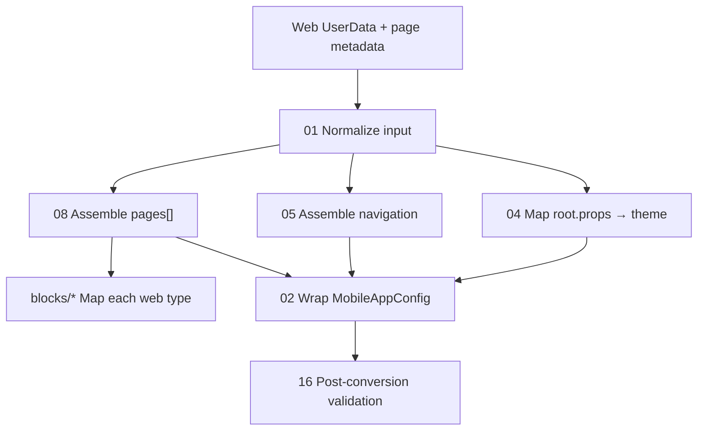

# Web → Mobile Converter Rules

Reference documentation for transforming **Erteqa (SOOQ) web Puck JSON** into **Flutter mobile SDUI JSON** (`MobileAppConfig`).

**Audience:** Web builder team, mobile engine maintainers, converter implementers.

**Status:** Reference docs + TypeScript converter in [lib/transformer.ts](../../../lib/transformer.ts) (`/converter` UI).

---

## Related docs

| Doc | Role |
|-----|------|
| [docs/BLOCKS.md](../../BLOCKS.md) | Web block catalog (input contract) |
| [docs/ai/02-config-and-json.md](../../ai/02-config-and-json.md) | Mobile JSON schema (output contract) |
| [docs/ai/03-engine.md](../../ai/03-engine.md) | Mobile renderers and layout |
| [docs/ai/04-actions-and-requests.md](../../ai/04-actions-and-requests.md) | `tap`, `cubitCall`, request binding |
| [v0 SDUI Transformer v1.0](https://v0-documentation-for-json-builder.vercel.app/converter) | Interactive prototype (5 rules only — superseded by this suite) |
| [assets/config/mobile_production_v2.json](../../../assets/config/mobile_production_v2.json) | Canonical mobile patterns |

---

## Source-of-truth precedence

1. Repo code + `mobile_production_v2.json`
2. `docs/ai/*`
3. This converter rules suite
4. v0 online converter (baseline only; known bugs documented in [00-overview.md](00-overview.md))

---

## Transformation pipeline

---

## File index

### Foundation

| File | Contents |
|------|----------|
| [00-overview.md](00-overview.md) | Goals, non-goals, terminology, v0 deltas |
| [01-web-input-schema.md](01-web-input-schema.md) | Puck `UserData`, page shell, block slots |
| [02-mobile-output-schema.md](02-mobile-output-schema.md) | Full `MobileAppConfig` envelope |
| [03-global-engine-rules.md](03-global-engine-rules.md) | **Strict rules for every conversion** |

### Cross-cutting

| File | Contents |
|------|----------|
| [04-theme-and-root-mapping.md](04-theme-and-root-mapping.md) | `root.props` → `theme` |
| [05-navigation-and-routes.md](05-navigation-and-routes.md) | Route table, tabs, `shellExcludeRoutes` |
| [06-layout-cross-cutting.md](06-layout-cross-cutting.md) | Web `layout` → mobile `style` / `stack` |
| [07-shared-fields.md](07-shared-fields.md) | Color, typography, links, button actions |
| [08-page-assembly.md](08-page-assembly.md) | Page shell, `appBar`, `scroll`, body |

### Block rules (43 web types)

| File | Web blocks |
|------|------------|
| [blocks/09-layout-blocks.md](blocks/09-layout-blocks.md) | Section, Group, Flex, Grid, Sidebar |
| [blocks/10-content-blocks.md](blocks/10-content-blocks.md) | Content* primitives, Accordion, ImageGallery, legacy Heading/Text/Hero/Card |
| [blocks/11-commerce-blocks.md](blocks/11-commerce-blocks.md) | ProductCard, ProductsGrid (+ metadata), CartSection, CheckoutForm, … |
| [blocks/12-testimonial-blocks.md](blocks/12-testimonial-blocks.md) | Testimonials (+ legacy TestimonialCard/Grid) |
| [blocks/13-shell-blocks.md](blocks/13-shell-blocks.md) | SiteHeader, SiteFooter, SiteDrawerShell (block-level props) |
| [blocks/14-utility-blocks.md](blocks/14-utility-blocks.md) | ContentHtml, legacy utility types |

### Data, validation, fixtures

| File | Contents |
|------|----------|
| [15-data-and-api-binding.md](15-data-and-api-binding.md) | API paths, field maps, `requestKey` |
| [16-post-conversion-validation.md](16-post-conversion-validation.md) | Checklist before shipping converted JSON |
| [17-blocks-gap-analysis.md](17-blocks-gap-analysis.md) | BLOCKS.md vs mobile coverage matrix |
| [fixtures/README.md](fixtures/README.md) | How to test with paired JSON |

---

## Testing converted output

1. Pick a fixture pair from [fixtures/](fixtures/) or paste web JSON into your converter.
2. Run output through [16-post-conversion-validation.md](16-post-conversion-validation.md) checklist.
3. Drop result into a test config asset (or replace `pages[]` slice) and `flutter run`.
4. Compare visually against web preview; log gaps in block rule **Gaps & fallback** sections.

---

## Per-block rule template

Every block section in `blocks/*.md` follows:

1. Web contract (`type`, props, child slot)
2. Mobile decomposition (primitive tree)
3. Prop mapping table
4. Layout constraints
5. Actions & data binding
6. Gaps & fallback
7. Before / after JSON
