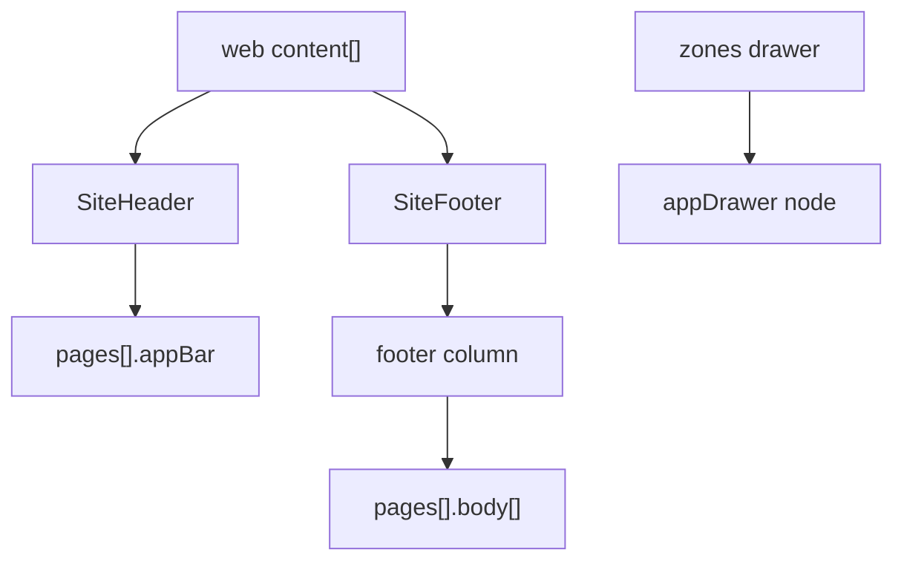

# 13 — Shell Blocks

Web shell blocks ([docs/blocks.md §5.5](../../BLOCKS.md)) map to page chrome, not repeated body widgets.

---

## SiteHeader

**No block-level props** — all config from `root.props.header*`.

### Mobile target

`pages[].appBar` (per page) + optional drawer trigger.

| Web `root.props` | Mobile `appBar.props` |
|------------------|----------------------|
| `headerBrandTitle` | `title` (if non-empty) |
| `headerBackgroundColor` | `backgroundColor` |
| `headerTextColor` | `foregroundColor` |
| `headerShowDrawerButton` | trailing action → `tap: openDrawer` |
| `headerLinks[]` | **Not** duplicated in appBar — use tab shell + drawer links |

### Rule

Convert SiteHeader **once** per page into `appBar`; remove SiteHeader node from `body[]`.

**Gap:** Web inline nav links → mobile bottom tabs or drawer menu items.

---

## SiteFooter

**No block-level props** — `root.props.footer*`.

### Mobile decomposition

Append to page `body[]` end:

```
container (footer background)
  └── column
        ├── text (tagline / taglineAr)
        ├── row or column (footerColumns links as buttons/text+tap)
        └── text (copyright)
```

| Web | Mobile |
|-----|--------|
| `footerColumns[]` | column of link `text` + `tap.navigate` |
| `footerTagline` / `footerTaglineAr` | single `text` |
| `footerVisible: false` | omit footer subtree |

**Gap:** No site-wide footer component — each page gets footer block if web had SiteFooter in content.

---

## SiteDrawerShell

Lives in Puck `zones.shell-left` / `shell-right`.

### Mobile decomposition

`appDrawer` node (typically on home/profile page) + `openDrawer`/`closeDrawer` actions.

| Web `root.props` | Mobile |
|------------------|--------|
| `drawerLinks[]` | drawer child menu items |
| `drawerSide`, `drawerWidthPx` | drawer width props |
| `drawerTitle` / `drawerTitleAr` | drawer header title |
| colors | drawer style props |

See [builder-spec 16-app-drawer-tabs-otp.md](../builder-specs/16-app-drawer-tabs-otp.md).

Block itself only has `id` — behavior from root props.

---

## Logo

### Decomposition

`image`

| Web | Mobile |
|-----|--------|
| `src` | `url` |
| `alt` | `alt` |
| `width`, `height` | numeric props |

Placement: inside `appBar` leading slot if supported, else first body child in header area.

---

## Shell assembly diagram



---

## Puck zones (web-only)

`shell-left` / `shell-right` are editor rails — extract `SiteDrawerShell` blocks into drawer config; ignore empty zones.
