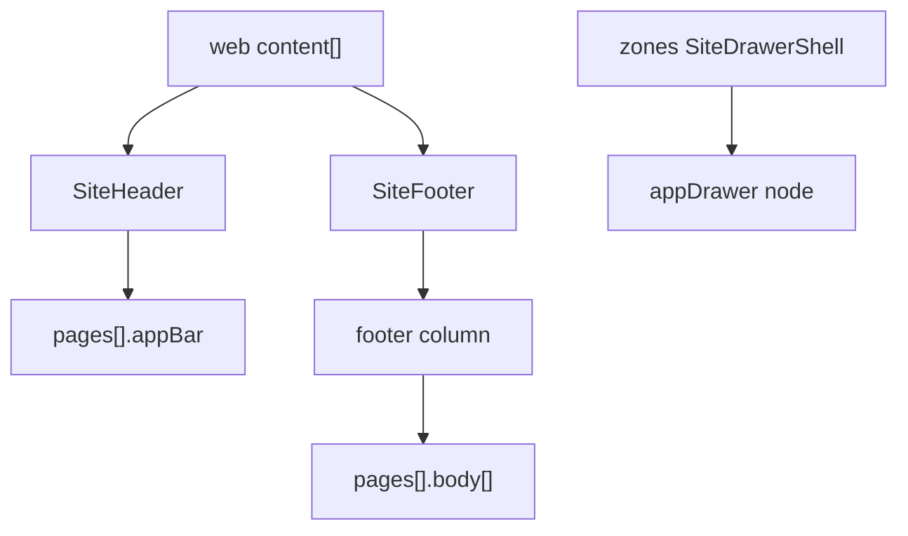

# 13 — Shell Blocks

Web shell blocks ([docs/BLOCKS.md](../../BLOCKS.md) **shell** group) map to page chrome, not repeated body widgets.

Shell blocks carry **block-level `props`** in current `store_config.json` (not only `root.props`). When both exist, **block props win** for that instance; `root.props` fills defaults for site-wide theme merge.

---

## SiteHeader

### Web contract (block-level)

| Prop | Default |
|------|---------|
| `title` | brand name |
| `variant` | commerce \| default |
| `language` | ar \| en |
| `visible` | true |
| `brandHref` | `/` |
| `links[]` | `{ label, labelAr, link: LinkValue }` |
| `backgroundColor`, `textColor` | empty = theme |
| `layoutMode` | split \| centered |
| `menuAlign` | start \| end (split layout) |
| `navStyle` | underline \| pill |
| `showDrawerButton` | false |
| `drawerButtonIcon` | menu \| filter \| cart \| user \| none |
| `drawerName` | `"site-drawer"` |

### Mobile target

`pages[].appBar` (per page) + optional drawer trigger.

| Web | Mobile `appBar.props` |
|-----|----------------------|
| `title` | `title` |
| `visible: false` | omit `appBar` |
| `backgroundColor` | `backgroundColor` |
| `textColor` | `foregroundColor` |
| `showDrawerButton` | trailing action → `tap: openDrawer` with `drawerName` |
| `links[]` | **Not** duplicated in appBar — bottom tabs + `appDrawer` links |
| `layoutMode`, `menuAlign`, `navStyle` | **Ignore** — mobile uses tabs/drawer, not inline nav pills |
| `brandHref` | logo/title `tap.navigate` to `/home` |

### Rule

Convert SiteHeader **once** per page into `appBar`; remove SiteHeader node from `body[]`.

### Before / after

**Web:**

```json
{
  "type": "SiteHeader",
  "props": {
    "title": "متجري",
    "language": "ar",
    "showDrawerButton": true,
    "drawerName": "site-drawer",
    "links": [
      { "label": "Home", "labelAr": "الرئيسية", "link": { "kind": "page", "pageId": "/" } }
    ]
  }
}
```

**Mobile `appBar` excerpt:**

```json
{
  "type": "appBar",
  "props": {
    "title": "متجري",
    "showBackButton": false
  }
}
```

Drawer links merged separately from `SiteDrawerShell`.

---

## SiteFooter

### Web contract (block-level)

| Prop | Notes |
|------|-------|
| `title` | brand name |
| `variant` | commerce \| default |
| `language` | ar \| en |
| `visible` | show/hide |
| `tagline`, `taglineAr` | subtitle |
| `showBottomBar` | copyright row |
| `bottomBarText`, `bottomBarTextAr` | copyright copy |
| `columns[]` | `{ title, titleAr, links[] }` |
| `bottomLinks[]` | footer bar links |
| `backgroundColor`, `textColor` | optional overrides |

### Mobile decomposition

Append to page `body[]` end:

```
container (footer background)
  └── column
        ├── text (tagline — prefer taglineAr when language ar)
        ├── column (per columns[]: title + link text+tap)
        └── text (bottomBarText)
```

| Web | Mobile |
|-----|--------|
| `visible: false` | omit footer subtree |
| `columns[].links` | `text` + `tap.navigate` per link |
| `bottomLinks` | row of link `text` nodes |

**Gap:** No site-wide footer component — each page gets footer block if web had SiteFooter in content.

---

## SiteDrawerShell

Singleton site drawer — lives in Puck `zones.shell-left` / `shell-right` or root content.

### Web contract (block-level)

| Prop | Notes |
|------|-------|
| `name` | drawer id (`site-drawer`) |
| `enabled` | master switch |
| `side` | left \| right |
| `widthPx` | 200–720 |
| `animation`, `animationDurationMs` | motion |
| `trigger` | external \| floating \| auto \| none |
| `triggerLabel`, `triggerLabelAr` | bilingual trigger |
| `title`, `titleAr` | header |
| `links[]` | `{ label, labelAr, link }` |
| color overrides | background, text, accent, trigger colors |
| `overlay`, `overlayOpacityPercent` | backdrop |
| `closeOnOverlayClick`, `closeOnEsc`, `showCloseButton` | UX |
| `showOnMobile`, `showOnDesktop` | on mobile, treat as always mobile |
| `openOnEdgeHover` | **Ignore** on mobile |
| `language` | ar \| en |

### Mobile decomposition

`appDrawer` node (typically on home/profile page) + `openDrawer`/`closeDrawer` actions.

| Web | Mobile |
|-----|--------|
| `enabled: false` | omit `appDrawer` |
| `links[]` | drawer child menu items with `tap.navigate` |
| `widthPx` | drawer width props |
| `title` / `titleAr` | drawer header (prefer AR when `language: ar`) |
| `side` | drawer edge |
| colors | drawer style props |

See [builder-spec 16-app-drawer-tabs-otp.md](../builder-specs/16-app-drawer-tabs-otp.md).

---

## SideDrawer (legacy)

Per-page drawer block — **unsupported** as body widget. Merge links into global `appDrawer` or emit warning + skip. Replaced by `SiteDrawerShell` in current shell architecture.

---

## Logo

Not a separate BLOCKS.md type — brand image inside header. If encountered as legacy utility:

| Web | Mobile |
|-----|--------|
| `src` | `image.url` in `appBar` leading slot |

---

## Shell assembly diagram



---

## Puck zones (web-only)

`shell-left` / `shell-right` are editor rails — extract `SiteDrawerShell` blocks into drawer config; ignore empty zones.
