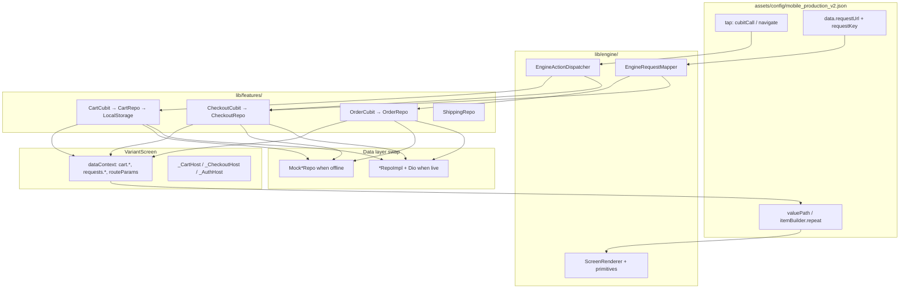

# Architectural Analysis: Order, Cart & Checkout Flow

I've read `AGENTS.md`, `RULES.md`, `MOBILE_CUSTOMER_PAGES.md`, the relevant `docs/ai/*` chapters, and traced the live wiring in `VariantScreen`, `EngineActionDispatcher`, `EngineRequestMapper`, and the auth/product feature modules. Below is my understanding and recommended plan — **no code yet**, as requested.

---

## Current Baseline (What Exists Today)

| Area | Status |
|------|--------|
| Cart / checkout / orders JSON pages | Present in `mobile_production_v2.json` (`/cart`, `/checkout`, `/checkout/address`, `/checkout/payment`, `/order/success`, `/orders`) but **static placeholder UI** — hardcoded line items, navigate-only taps |
| "Add to cart" on product detail | Only `navigate → /cart`; **does not mutate any cart state** |
| Cart / order feature modules | **None** — no repos, cubits, or models |
| Action dispatcher `cubitCall` | **Auth only** (`requestOtp`, `verifyOtp`, `logout`) |
| Request orchestration | Product/catalog patterns in `VariantScreen` + `EngineRequestMapper` |
| Tenant header | `ProductRepoImpl._buildHeaders` already sends `X-Tenant-ID`; `TenantResolver` + `NetworkConfig` exist |
| API envelope parsing | Product repo uses `_requireEnvelope()` + normalizes Spring `Page` shapes |
| Mock swap pattern | `ProductMockConfig` / `MockProductRepo`, `AuthMockConfig` / `MockAuthRepo` in `service_locator.dart` |
| Forms | `form` + `textFormField` + `FormStateStore` already wired; checkout address page uses this |
| Experimental types | `mobile_component.json` references `cartSummary` / `checkoutForm` — **not registered in engine, not in prod config** |

The architecture goal — **JSON UI unchanged when backend goes live, swap data layer only** — aligns perfectly with how auth and product already work. Cart is the one special case: Page 1 is explicitly **client-only with no API**, so it needs a local persistence layer, not a remote repo.

---

## 1. Bridging JSON Cart Actions → Local Persistent Cart Service

### Design principle

Follow the same three-layer bridge already used for auth and catalog:

```
JSON tap / data binding
  → Engine (action dispatch + path resolution only)
  → Feature cubit (business rules)
  → Repository (local persistence OR HTTP)
  → dataContext (reactive UI slice)
  → ScreenRenderer (primitives + valuePath)
```

Renderers must **never** import cart logic. `VariantScreen` is the orchestrator that injects cart state into `dataContext` and rebuilds when the cubit emits.

### Recommended cart stack

```
lib/features/cart/
  data/
    models/cart_line.dart          # matches spec CartLine shape
    models/cart.dart               # { items: CartLine[] }
    datasources/cart_local_storage.dart   # SharedPreferences / secure storage
    repos/cart_repo.dart           # interface
    repos/cart_repo_impl.dart      # local-only impl (no Dio)
  presentation/
    manager/cart_cubit/cart_cubit.dart
    manager/cart_cubit/cart_state.dart
```

**Why a repo for a local-only cart?** Clean Architecture symmetry: when cart-sync arrives later, you add `CartRemoteDataSource` behind the same interface without touching cubit, dispatcher, or JSON.

**Persistence key:** spec suggests web uses `sooq.storefront.cart.v1`; mobile should use the same JSON shape with a mobile-specific storage key (e.g. `sooq.mobile.cart.v1`) for forward compatibility.

**DI scope:** register `CartCubit` as a **lazy singleton** (cart survives tab switches and route changes). Product cubits are factories per page; cart is session-global.

### dataContext contract (mirrors `requests.{key}` pattern)

Extend `VariantScreen._buildRenderContext()` to always include:

| Key | Content |
|-----|---------|
| `cart.items` | `List<Map>` — serializable cart lines for `itemBuilder` repeat |
| `cart.itemCount` | Sum of quantities (for tab badge later) |
| `cart.subtotalSyp` | Integer sum of `unitPrice × quantity` (display only; server reprices at checkout) |
| `cart.isEmpty` | bool for empty-state rendering |

Subscribe via `BlocBuilder<CartCubit, CartState>` wrapping the render tree (same pattern as `_ProductRequestHost` / `_AuthRequestHost`).

### Action bridge — extend `cubitCall`

Today `_handleCubitCall` rejects anything except `cubit: "auth"`. Extend it generically:

```json
"tap": {
  "type": "cubitCall",
  "cubit": "cart",
  "method": "addItem",
  "params": {
    "variantId":  { "source": "item", "field": "variantId" },
    "quantity":   { "value": 1 },
    "productTitle": { "source": "item", "field": "productTitle" },
    "unitPrice":  { "source": "item", "field": "unitPrice" },
    "thumbnailUrl": { "source": "item", "field": "thumbnailUrl" }
  },
  "onSuccess": {
    "type": "navigate",
    "route": "/cart",
    "navigation_type": "push"
  }
}
```

Planned cart cubit methods (matching Page 1 spec):

| Method | Trigger | Behavior |
|--------|---------|----------|
| `addItem` | Product detail CTA | Upsert by `variantId`, increment qty, persist |
| `updateQuantity` | Cart +/- controls | Set qty ≥ 1 or remove at 0 |
| `removeItem` | Swipe/delete button | Remove line, persist |
| `clear` | Post-checkout success | Wipe storage |

Param resolution reuses existing `_resolveCubitParams` sources: `form`, `app`, `item`, `routeParams`, literal `value`. On product detail, bind from `dataContext.requests.product-detail.data` fields (`variants[0].variantId`, etc.) or from list `item` when adding from a grid.

### Product detail wiring

After cart exists, change `product-add-cart` from pure navigate to:

1. `cubitCall cart.addItem` with params resolved from loaded product detail
2. `onSuccess` → optional `AppMessenger.showSuccess` + navigate to `/cart`

Variant selection (M / Blue) requires an **explicit picker** (bottom sheet or validated `dropdown` in `FormStateStore`) before `addItem`. **Never** silently default to the first available variant — see [Implementation Decisions (locked)](#implementation-decisions-locked).

### JSON cart page migration

Replace static `cart-item-1`, `cart-item-2` cards with:

```json
{
  "type": "listView",
  "props": {
    "itemBuilder": {
      "type": "repeat",
      "source": "cart.items",
      "item": { /* card with valuePath: item.productTitle, item.unitPrice, … */ }
    },
    "emptyMessage": "السلة فارغة"
  }
}
```

Quantity steppers and remove buttons get `cubitCall` taps with `"source": "item"` for `variantId`.

**Builder-spec note:** new `cubitCall` cart methods must be grep'd in prod JSON or documented in `docs/engine/builder-specs/` per RULES §3.4 before engine reads them.

---

## 2. Abstract Repositories & Models — Mimicking Production Envelopes

### Shared infrastructure (extract once, reuse everywhere)

Create `lib/core/network/api_response.dart` (or `lib/features/commerce/data/` shared helpers):

```dart
// Conceptual — not code to implement yet
class ApiResponse<T> {
  final bool success;
  final String? message;
  final T? data;
  final String? errorCode;
  final List<FieldError>? fieldErrors;
  final int? timestamp;
}

class PagedApiResponse<T> { /* data + meta OR normalize Spring Page */ }
class FieldError { final String field; final String message; }
```

Mirror the parsing strategy already in `ProductRepoImpl`:
- `_requireEnvelope()` — reject `success: false`, surface `message` / `fieldErrors`
- `_normalizePagedEnvelope()` — accept both `PagedApiResponse` (`data[]` + `meta`) and Spring `Page` (`content`, `totalElements`, …)
- `ServerFailure.fromResponse()` for HTTP 400/404/409/422 with spec-appropriate UX rules (404 on shipment track = empty state, not toast)

### SYP money handling

Spec: all amounts are JSON numbers, **render as integers** (no fractional SYP).

| Layer | Rule |
|-------|------|
| DTO fields | `int` (not `double`) — `subtotal`, `shippingCostSyp`, `total`, `unitPrice`, `appliedAmount` |
| Display | Shared formatter: `125000 → "125,000 ل.س"` in a core util (not in renderers) |
| Checkout request | Send integers as JSON numbers; never send floats |
| Paymera poll `amountMinor` | Document as provider minor unit (SYP × 100) — separate field, don't mix with display ints |

Optional typed wrapper `SypAmount(int value)` in models to prevent accidental double math at compile time.

### X-Tenant-Id header

Do **not** duplicate per-repo header logic. Extract from `ProductRepoImpl._buildHeaders`:

```
lib/core/network/tenant_headers.dart
  Map<String, String> buildPublicHeaders({required String? tenantId})
    → { 'Accept': 'application/json', 'X-Tenant-Id': tenantId }
```

All public commerce repos (`checkout`, `shipping`, `payments`, guest lookup, shipment track) use this. Customer repos rely on `AuthInterceptor` for Bearer **plus** explicit tenant header for parity (spec §0.2).

Tenant UUID resolution: `TenantResolver` + config `tenantId` / post-login session — already wired in `VariantScreen._resolveTenantIdForRequests()`.

### Idempotency — `checkoutToken`

Spec requires UUIDv4 generated **once per checkout attempt**, persisted until terminal outcome:

```
lib/features/checkout/
  data/datasources/checkout_session_store.dart
    - checkoutToken: String (UUID)
    - draftAddress, selectedPaymentMethod, discountCode, guestEmail
    - regenerate only on explicit "start new checkout" or after success
```

`CheckoutCubit.placeOrder()` reads token from session store; on 409/422 conflict, retry with **same token** (server returns original order). On success → clear token + clear cart.

### Feature module split (Clean Architecture)

| Module | Repo interface | Endpoints (from spec) | Auth |
|--------|---------------|----------------------|------|
| `cart` | `CartRepo` | *(none — local only)* | — |
| `checkout` | `CheckoutRepo` | `GET /public/payments/methods`, `POST /public/shipping/calculate`, `GET /public/checkout/validate-discount`, `POST /public/checkout`, `GET /public/checkout/orders/lookup` | Public + optional Bearer on place order |
| `order` | `OrderRepo` | `GET /customer/orders`, `GET /customer/orders/{id}`, `POST .../cancel`, `GET .../invoice` | Bearer |
| `shipping` | `ShippingRepo` | `GET /public/shipping/track/{orderId}` | Public |
| `payment` | `PaymentRepo` | `GET /public/payments/{txnId}/status` | Public (future Paymera) |

You may colocate `checkout` + `order` + `shipping` under `lib/features/commerce/` with subfolders if you prefer one domain boundary — either way, **one interface + impl + mock per remote boundary**.

### Models (DTOs matching spec wire shapes)

**Cart (local):**
- `CartLine`: `variantId`, `quantity`, `productTitle`, `variantTitle?`, `unitPrice` (int), `thumbnailUrl?`
- `Cart`: `items: List<CartLine>`

**Checkout:**
- `PublicPaymentMethodDto`, `ShippingCostRequest/Response`, `ApplyDiscountResult`, `CheckoutRequest`, `ShippingAddress` (lat/lng + recipient + phone E.164 + addressLabel)

**Order:**
- `OrderSummaryDto` (list row — Page 5)
- `CustomerOrderDto` / `OrderDetailDto` (detail — Pages 3/4/6) including `items[]`, `timeline[]`, enums `OrderStatus`, `PaymentStatus`, `PaymentMethod`
- `InvoiceDto`, `CancelOrderRequest`
- `CustomerShipmentStatusDto` + `statusHistory[]`

Enums as Dart `enum` with `fromWire(String)` — strict parsing, no magic strings in cubits.

All repos return `Future<Either<Failure, T>>` per project standard.

### Mock layer (backend offline now)

Mirror the product mock pattern:

```
lib/dev/commerce_mock/
  commerce_mock_config.dart      # enabled = true
  mock_checkout_repo.dart
  mock_order_repo.dart
  mock_shipping_repo.dart
  mock_commerce_data.dart        # seeded orders, methods, shipment timelines
```

Register in `service_locator.dart`:

```dart
getIt.registerLazySingleton<CheckoutRepo>(() =>
  CommerceMockConfig.enabled ? MockCheckoutRepo() : CheckoutRepoImpl(getIt<Dio>()));
```

Mock repos must return JSON-shaped maps that parse through the **same** `fromJson` / envelope helpers as the real impl — this guarantees UI/cubit code never branches on mock vs real.

When backend goes live: flip `CommerceMockConfig.enabled = false`. No engine or JSON changes.

### Failure UX mapping (from spec)

| Scenario | Handling |
|----------|----------|
| Discount invalid | Inline on checkout page (`requests.discount-validation.message`), not global toast |
| Guest lookup 404 | Inline "تعذّر العثور على الطلب…" |
| Shipment track 404 | Calm empty card on order detail — **no toast** |
| Cancel 400 | `AppMessenger.showError` with server `message` |
| 401 on customer orders | Auth redirect / login |
| Paymera `requiresRedirect: true` | Filter out / show "قريباً" — **COD only until backend exposes redirect URL** |

---

## 3. Expanding JSON Primitives for Checkout, Pickers & Order Tracking

### Guiding rule (from RULES + production status)

> "Dedicated commerce widgets — composed from primitives in JSON only."

Default path: **compose existing 30 types**. Add new `type` only when primitives cannot express the interaction cleanly.

### What existing primitives already cover

| Screen | Composition strategy |
|--------|---------------------|
| Checkout address form | `form` + `textFormField` (already in prod JSON) + `requireValidForm` on continue button |
| Checkout wizard steps | Static `card` + `navigate` push (already in prod JSON) |
| Order success / failure | Static `column` + `text` + `button` — bind `valuePath` to `checkout.lastOrder.orderNumber` |
| My orders list | `listView` + `itemBuilder.repeat` on `requests.my-orders.data` + `requestKey` |
| Order detail | `column` of `text`/`card` with `valuePath` from `requests.order-detail.data.*` |
| Payment methods (COD MVP) | `listView` repeat on `requests.payment-methods.data` — tap `cubitCall checkout.selectPaymentMethod` |

### Gaps that likely need new engine work

| Gap | Recommendation | Priority |
|-----|----------------|----------|
| **GPS address picker** | Spec requires `latitude`/`longitude`, not just free-text. Use **OpenStreetMap** via `flutter_map` (Phase 3) — map picker writes lat/lng into `CheckoutSessionStore` / checkout draft; free-text `addressLabel` remains in JSON form. Google Maps excluded (Syria restrictions). | P0 |
| **Cart quantity stepper** | +/- controls with `cubitCall cart.updateQuantity`. Could be three `button`s in a `row`, or a dedicated `quantityStepper` type for cleaner JSON. | P0 |
| **Payment method selection state** | Static cards today. Need selectable state: extend `tabs` pattern, use `dropdown`, or add `radioGroup` / `selectableCardList` with `selectedValuePath`. | P0 |
| **SYP money display** | `text` + `valuePath` works if cubit pre-formats strings, **or** add `moneyText` renderer with `amountPath` + `currencyCode` for consistent formatting. Prefer pre-format in cubit for MVP. | P1 |
| **Order / shipment timeline** | `timeline[]` and `statusHistory[]` are repeating structured data. Use `listView` repeat, or add `timeline` renderer for vertical step indicator UX. | P1 |
| **Discount code inline validation** | `textFormField` + button with `cubitCall checkout.validateDiscount` → writes to `requests.discount-validation` | P1 |
| **Embedded shipment card on order detail** | Second `requestKey` on same page: `GET /public/shipping/track/{orderId}` with 404 → empty state component | P1 |
| **Guest order tracking form** | Standard `form` + `cubitCall order.lookupGuest` | P1 |

**Do not** revive undeclared `cartSummary` / `checkoutForm` types from `mobile_component.json` without registering them in `ScreenRenderer` + builder-spec. Prefer `dataContext.cart.*` + existing layout primitives.

### Checkout state machine (cross-page draft)

Checkout spans multiple JSON routes (`/checkout`, `/checkout/address`, `/checkout/payment`). Use a **session-scoped `CheckoutCubit`** (singleton) holding draft state, not `FormStateStore` alone (forms are page-local and don't survive all navigations cleanly):

```
CheckoutDraft {
  shippingAddress: ShippingAddress?
  paymentMethod: String?          // providerCode
  discountCode: String?
  discountResult: ApplyDiscountResult?
  shippingQuote: ShippingCostResponse?
  notesCustomer: String?
  guestEmail: String?
  checkoutToken: String           // UUID, persisted
}
```

Flow:
1. `/checkout/address` form submit → `cubitCall checkout.saveAddress` (not just navigate)
2. On lat/lng available → auto-fetch shipping cost via `CheckoutRepo.calculateShipping`
3. `/checkout/payment` → load methods via `requestKey`, select COD
4. Place order button → `cubitCall checkout.placeOrder` with `requireValidForm` + cart non-empty guard
5. `onSuccess.navigate` → `/order/success` with `clear_stack`; `onFailure` → `/order/failure`

Host widget `_CheckoutRequestHost` in `VariantScreen` (parallel to `_AuthRequestHost`) for loading overlay + `AppMessenger` on hard failures.

### Order detail + tracking composition

Single JSON page `/orders/:orderId` with **two request keys**:

```json
"data": { "requestKey": "order-detail", "requestUrl": "/api/v1/customer/orders/:orderId" }
"data": { "requestKey": "shipment-track", "requestUrl": "/api/v1/public/shipping/track/:orderId" }
```

Extend `EngineRequestMapper` + `VariantScreen` cubit routing for order/shipping URL patterns (same extension pattern used for product URLs today).

Conditional actions (cancel, invoice) via JSON is limited today — options:
- **MVP:** always show buttons; cubit validates `orderStatus` and shows error if not allowed
- **Later:** conditional visibility prop (`visibleWhenPath`) — needs builder-spec

### Paymera (explicitly deferred)

Per spec gap §Payment-Online: filter `requiresRedirect: true` methods, COD only, no redirect/poll flow until backend adds `paymentRedirectUrl` to checkout response.

---

## Implementation Decisions (locked)

These decisions are fixed for all commerce implementation phases. Do not revisit without explicit product approval.

| # | Topic | Decision |
|---|--------|----------|
| 1 | **Variant selection** | Multi-variant products require **explicit selection** (bottom sheet or validated form field) before `addItem`. **Never** silently default to the first available variant. |
| 2 | **GPS picker** | **OpenStreetMap** via [`flutter_map`](https://pub.dev/packages/flutter_map) for map rendering and geographic coordinate selection. Google Maps is excluded (Syria billing/service restrictions). Package added in Phase 3, not Phase 0. |
| 3 | **Checkout structure** | Build the **multi-route wizard** (`/checkout` → `/checkout/address` → `/checkout/payment`) with session-scoped `CheckoutCubit` persistence. Single-page checkout becomes a JSON layout variant later if needed. |
| 4 | **Feature layout** | Single domain module **`lib/features/commerce/`** with sub-areas: `cart/`, `checkout/`, `order/`, `shipping/`, `payment/` — each with `data/models`, `data/repos`, `presentation/manager`. Shared commerce enums/DTOs live under `commerce/data/`. |

---

## Step-by-Step Implementation Plan

### Phase 0 — Foundation (no UI changes yet)
1. Add `lib/core/network/api_envelope.dart` + `tenant_headers.dart` + `syp_formatter.dart`
2. Add commerce enums (`OrderStatus`, `PaymentStatus`, `ShipmentStatus`, `PaymentMethod`)
3. Add all DTO models with `fromJson` matching spec field names exactly
4. Add builder-spec docs for new JSON contracts (`cubitCall` cart/checkout, cart dataContext keys) — grep prod JSON first

### Phase 1 — Local Cart (Page 1)
1. Implement `CartRepo` + local storage + `CartCubit` singleton
2. Register in `service_locator.dart`
3. Extend `EngineActionDispatcher` for `cubit: "cart"`
4. Wire `VariantScreen` — inject `cart.*` into `dataContext`, `BlocBuilder` rebuild
5. Update prod JSON: product add-to-cart tap, dynamic cart list, checkout button guard (empty cart)
6. Tests: cart cubit + storage + action dispatcher cart calls

### Phase 2 — Mock Commerce Repos (offline backend)
1. `CommerceMockConfig` + `MockCheckoutRepo`, `MockOrderRepo`, `MockShippingRepo`
2. Seed realistic SYP integer data, envelope-shaped responses
3. Register mock/real swap in DI

### Phase 3 — Checkout flow (Pages 2–3)
1. `CheckoutCubit` + `CheckoutSessionStore` (checkoutToken persistence)
2. `CheckoutRepoImpl` (real) using shared envelope + tenant headers
3. Extend `EngineRequestMapper` for payment methods + shipping calculate URLs
4. Extend `VariantScreen` request routing for checkout cubit
5. Extend `cubitCall` for `cubit: "checkout"` methods (`saveAddress`, `selectPaymentMethod`, `validateDiscount`, `placeOrder`)
6. Add `_CheckoutRequestHost`
7. Update JSON: wire forms, payment picker, place-order button, success page `valuePath`s
8. GPS: map picker integration (native plugin) writing lat/lng to checkout draft
9. Tests: checkout cubit, mock repo, place-order idempotency (same token → same order)

### Phase 4 — Orders & tracking (Pages 4–8 + shipment embed)
1. `OrderCubit` + `OrderRepo` (+ mock)
2. Mapper routes for `/customer/orders`, `/customer/orders/{id}`, guest lookup
3. Update JSON: orders list (repeat), order detail, guest track form, cancel + invoice actions
4. `ShippingRepo` for track endpoint; 404 → empty shipment card
5. Post-login vs guest navigation on success page (track → `/orders/:id` vs guest lookup)
6. Tests: paging, guest lookup 404 UX, shipment 404 empty state

### Phase 5 — Backend cutover
1. Set `CommerceMockConfig.enabled = false`
2. Verify real endpoints against spec table
3. Confirm `X-Tenant-Id` on all public calls
4. Confirm optional Bearer on `POST /public/checkout` when logged in
5. Run full `flutter test`

### Phase 6 — Optional engine enhancements (post-MVP)
1. `quantityStepper` renderer
2. `timeline` renderer for order/shipment history
3. `locationPicker` renderer (if map-via-cubit feels too opaque for builders)
4. Tab badge for `cart.itemCount`
5. Paymera when backend contract is ready

---

## Architecture Diagram



---

## Key Constraints I'll Honor When Implementing

1. **No feature imports in renderers** — all cart/checkout logic stays in features + `VariantScreen`
2. **No hardcoded merchant screens** — JSON owns layout; Dart owns data + actions only
3. **Builder-spec rule** for any new JSON fields the engine reads that aren't already in prod JSON
4. **`AppMessenger`** for transient errors — not `SnackBar`; inline states for 404 lookup/shipment
5. **COD-only** until Paymera redirect URL is exposed
6. **SYP as int** end-to-end in models; format only at display boundary
7. **Same envelope parsers** for mock and real repos so cutover is a DI one-liner

---

